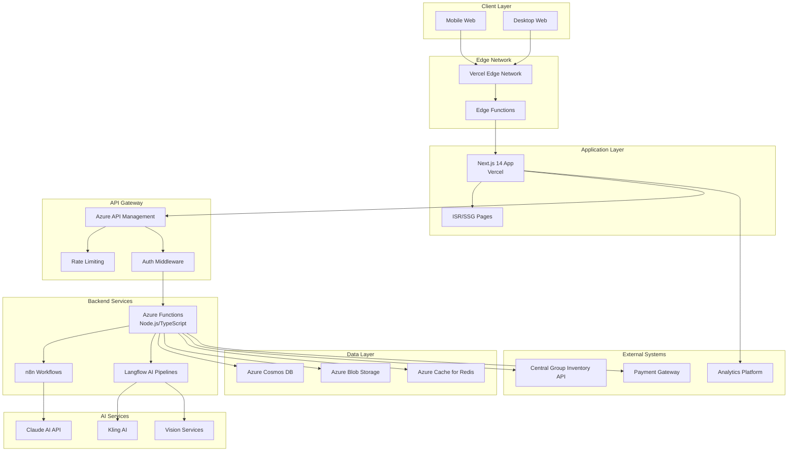
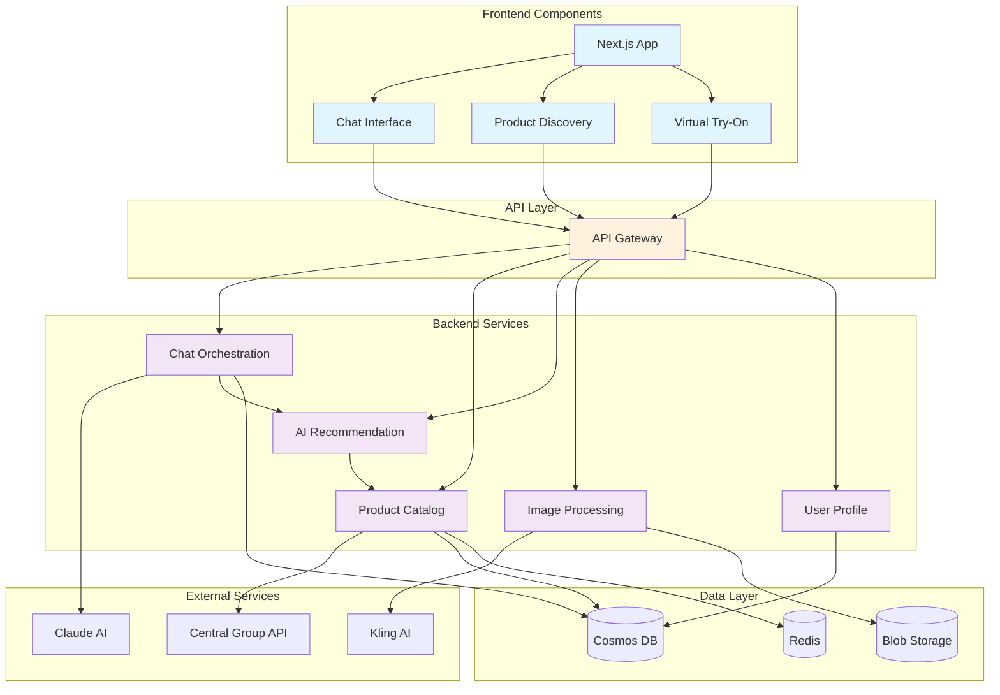
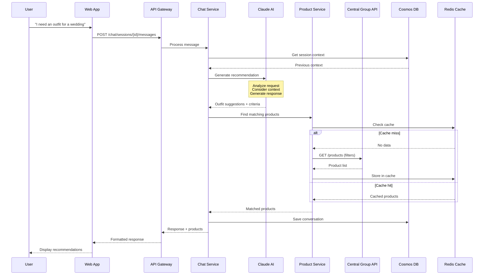
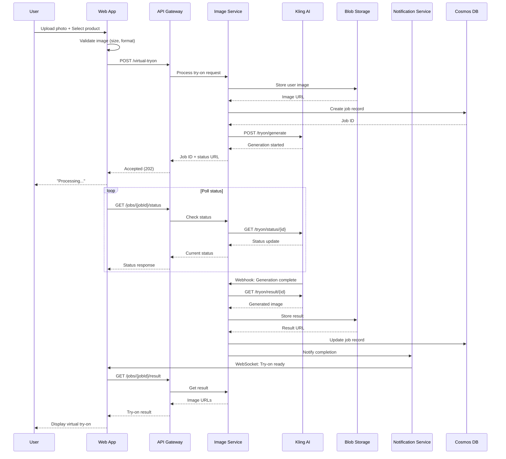
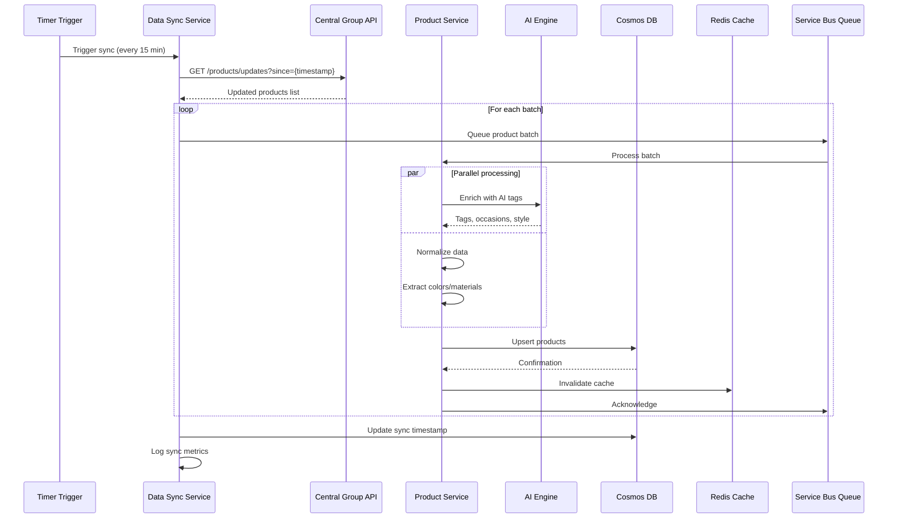
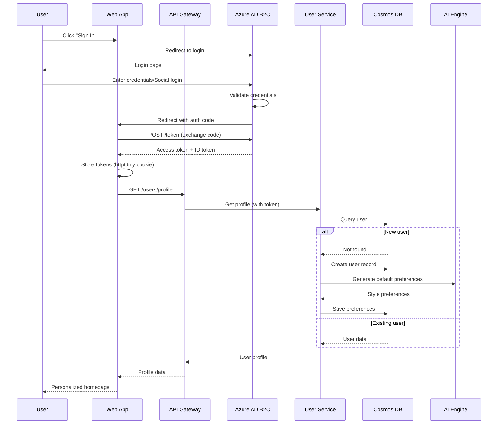
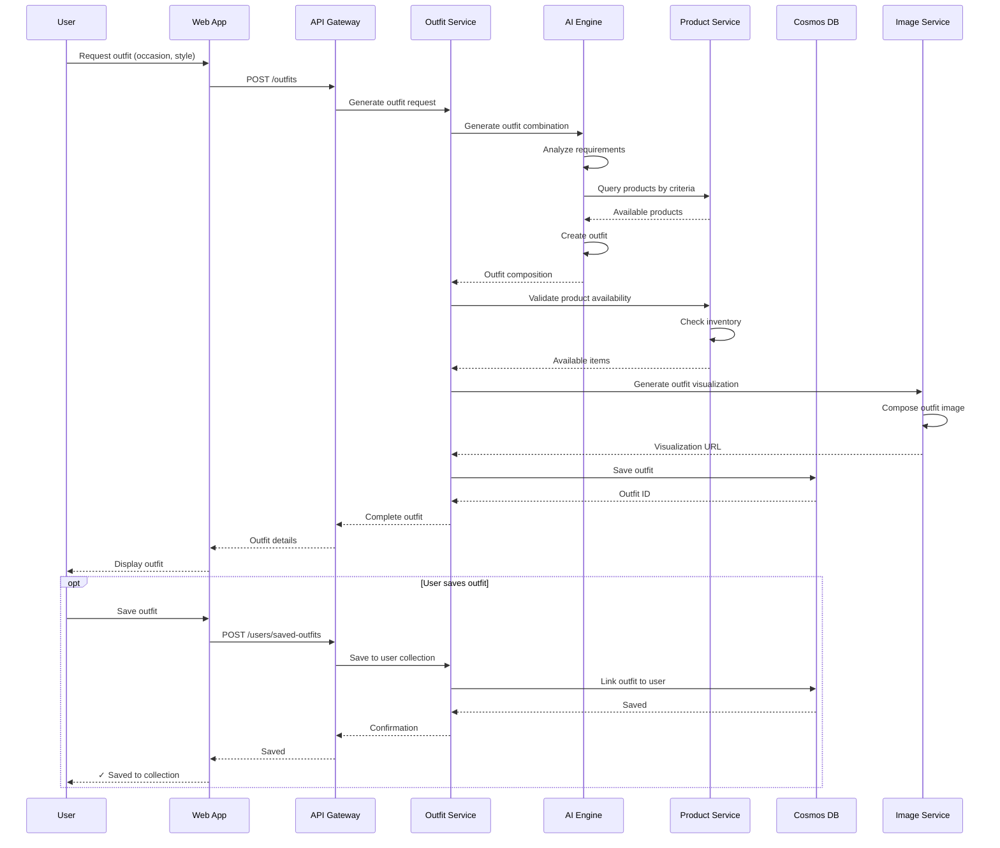
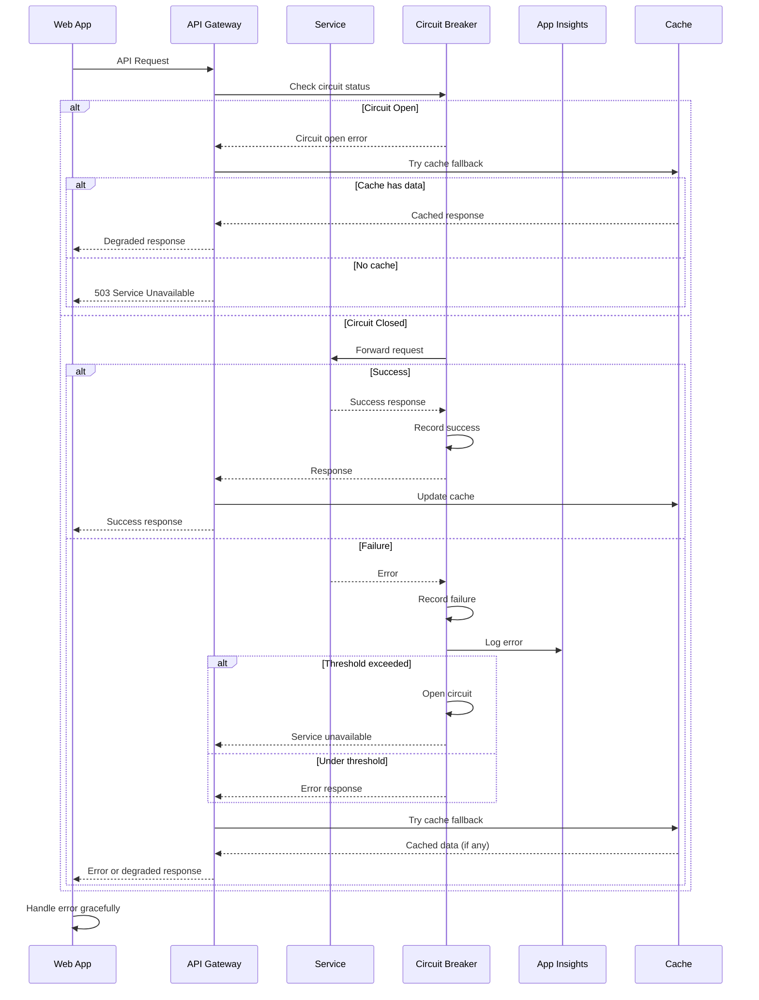

# OOTDay AI Fashion Assistant Fullstack Architecture Document

## Introduction

This document outlines the complete fullstack architecture for OOTDay AI Fashion Assistant, including backend systems, frontend implementation, and their integration. It serves as the single source of truth for AI-driven development, ensuring consistency across the entire technology stack.

This unified approach combines what would traditionally be separate backend and frontend architecture documents, streamlining the development process for modern fullstack applications where these concerns are increasingly intertwined.

### Starter Template or Existing Project

Based on CLAUDE.md, the project uses an existing Next.js 14 frontend application located in `v0-ootd-ay-ai-fashion-assistant/`. This starter includes:
- Next.js 14 with TypeScript
- Radix UI components with shadcn/ui
- Tailwind CSS v4
- Pre-configured component structure

**Constraints from existing codebase:**
- Must maintain current Next.js 14 architecture
- Keep existing component organization
- Preserve current UI component library choices

### Change Log
| Date | Version | Description | Author |
|------|---------|-------------|---------|
| 2025-09-26 | v1.0 | Initial architecture document | Winston (Architect) |

## High Level Architecture

### Technical Summary

The OOTDay AI Fashion Assistant employs a modern Jamstack architecture with Next.js 14 as the frontend framework deployed on Vercel, complemented by serverless Azure Functions for backend API services. The system integrates Claude AI for fashion recommendations through managed API endpoints, with n8n and Langflow orchestrating complex AI workflows. The frontend communicates with backend services via a RESTful API Gateway pattern, ensuring secure integration with Central Group's inventory systems. This architecture achieves the PRD goals of rapid MVP development, seamless AI-powered recommendations, and scalable infrastructure while maintaining cost efficiency through serverless compute and edge caching strategies.

### Platform and Infrastructure Choice

**Platform:** Vercel (Frontend) + Azure (Backend/AI Services)
**Key Services:** Vercel Hosting, Azure Functions, Azure Cosmos DB, Azure API Management, Azure Cognitive Services
**Deployment Host and Regions:** Vercel Global CDN, Azure Southeast Asia (Singapore) primary, East Asia (Hong Kong) failover

### Repository Structure

**Structure:** Monorepo with pnpm workspaces
**Monorepo Tool:** pnpm workspaces (already in use based on CLAUDE.md)
**Package Organization:**
- `apps/` - Main applications (web frontend, api backend)
- `packages/` - Shared code (types, utils, UI components)
- `infrastructure/` - Azure IaC definitions

### High Level Architecture Diagram



### Architectural Patterns

- **Jamstack Architecture:** Static site generation with serverless APIs - _Rationale:_ Optimal performance, scalability, and cost-efficiency for consumer-facing fashion platform
- **Component-Based UI:** Atomic design with Radix/shadcn components - _Rationale:_ Maintainable, accessible, and consistent UI across all features
- **BFF (Backend for Frontend):** Dedicated API layer for frontend needs - _Rationale:_ Optimizes data fetching and shields frontend from backend complexity
- **Event-Driven AI Processing:** Async processing for AI recommendations - _Rationale:_ Prevents UI blocking during complex AI operations
- **Repository Pattern:** Abstract data access for all entities - _Rationale:_ Enables testing and future database migration flexibility
- **API Gateway Pattern:** Centralized entry point via Azure API Management - _Rationale:_ Unified auth, rate limiting, and monitoring across all services
- **Edge Caching Strategy:** Aggressive caching at CDN edge - _Rationale:_ Reduces latency for global users and API costs
- **Microservices for AI:** Separate services for different AI capabilities - _Rationale:_ Independent scaling and failure isolation for AI workloads

## Tech Stack

This is the DEFINITIVE technology selection for the entire OOTDay project. All development must use these exact versions.

| Category | Technology | Version | Purpose | Rationale |
|----------|------------|---------|---------|-----------|
| Frontend Language | TypeScript | 5.3+ | Type-safe frontend development | Already in use, prevents runtime errors, excellent IDE support |
| Frontend Framework | Next.js | 14.2.x | React framework with SSR/SSG | Existing codebase, optimal SEO, excellent performance |
| UI Component Library | Radix UI + shadcn/ui | Latest | Accessible, customizable components | Already implemented, great DX, highly customizable |
| State Management | Zustand | 4.5+ | Lightweight state management | Simple API, TypeScript support, perfect for fashion selections |
| Backend Language | TypeScript | 5.3+ | Type-safe backend development | Code sharing with frontend, consistent developer experience |
| Backend Framework | Azure Functions | v4 | Serverless compute | Auto-scaling for AI workloads, cost-effective for MVP |
| API Style | REST | OpenAPI 3.0 | API communication protocol | Simple Central Group integration, better caching |
| Database | Azure Cosmos DB | NoSQL | Product catalog & user data | Flexible schema for 2,871+ products, global distribution |
| Cache | Azure Cache for Redis | 6.x | Session & API caching | Fast product lookups, recommendation caching |
| File Storage | Azure Blob Storage | Latest | Image & media storage | Product images, user uploads for virtual try-on |
| Authentication | Azure AD B2C | Latest | User authentication | Enterprise-grade, social login support, Thai localization |
| Frontend Testing | Vitest + Testing Library | Latest | Unit & integration tests | Fast, Next.js compatible, good DX |
| Backend Testing | Jest | 29.x | API & function tests | Azure Functions compatible, wide ecosystem |
| E2E Testing | Playwright | 1.40+ | End-to-end testing | Cross-browser, reliable, good debugging |
| Build Tool | Turborepo | 1.13+ | Monorepo build orchestration | Fast builds, intelligent caching |
| Bundler | Webpack (via Next.js) | 5.x | Asset bundling | Built into Next.js, optimized defaults |
| IaC Tool | Terraform | 1.7+ | Infrastructure as Code | Azure provider mature, team familiarity |
| CI/CD | GitHub Actions | Latest | Continuous deployment | Free for public repos, Azure integration |
| Monitoring | Azure Application Insights | Latest | APM & logging | Native Azure integration, AI-powered insights |
| Logging | Winston + Azure | 3.x | Structured logging | Flexible, Azure integration |
| CSS Framework | Tailwind CSS | v4 | Utility-first CSS | Already configured, excellent DX, small bundle |

## Data Models

### Product Model
**Purpose:** Represents fashion items from Central Group inventory

**TypeScript Interface:**
```typescript
interface Product {
  productId: string;
  productName: string;
  category: 'Men' | 'Women';
  subCategory: string | null;
  brand: string;
  description: string;
  imageUrl: string;
  sizes: string[];
  originalPrice: number | null;
  currentPrice: number | null;
  discount: number | null;
  saleLink: string | null;
  colors: string[];
  materials: string[];
  occasion: ('casual' | 'formal' | 'sport' | 'party' | 'work')[];
  searchTags: string[];
  metadata: {
    lastUpdated: Date;
    availability: 'in_stock' | 'low_stock' | 'out_of_stock';
  };
}
```

**Relationships:**
- Belongs to multiple Outfits
- Can be in multiple UserWishlists
- Has many ProductRecommendations

### User Model
**Purpose:** Represents OOTDay platform users

**TypeScript Interface:**
```typescript
interface User {
  userId: string;
  email: string;
  displayName: string;
  profileImage: string | null;
  preferences: {
    favoriteStyles: StyleType[];
    favoriteBrands: string[];
    preferredSizes: {
      top: string;
      bottom: string;
      shoes: string;
    };
    budgetRange: {
      min: number;
      max: number;
    };
    avoidColors: string[];
  };
  measurements: {
    height: number | null;
    weight: number | null;
    bodyType: string | null;
  } | null;
  createdAt: Date;
  lastActive: Date;
}
```

**Relationships:**
- Has many ChatSessions
- Has many SavedOutfits
- Has one Wishlist

### ChatSession Model
**Purpose:** Tracks AI fashion consultation sessions

**TypeScript Interface:**
```typescript
interface ChatSession {
  sessionId: string;
  userId: string;
  messages: ChatMessage[];
  context: {
    occasion: string | null;
    weather: string | null;
    mood: string | null;
    colorPreference: string | null;
    currentOutfitId: string | null;
  };
  recommendedProducts: string[]; // Product IDs
  createdAt: Date;
  lastMessageAt: Date;
}

interface ChatMessage {
  messageId: string;
  role: 'user' | 'assistant';
  content: string;
  timestamp: Date;
  attachments?: {
    type: 'image' | 'product' | 'outfit';
    url: string;
    metadata: Record<string, any>;
  }[];
}
```

**Relationships:**
- Belongs to one User
- References multiple Products
- Can generate multiple Outfits

### Outfit Model
**Purpose:** Represents a complete outfit combination

**TypeScript Interface:**
```typescript
interface Outfit {
  outfitId: string;
  name: string;
  products: {
    productId: string;
    category: 'top' | 'bottom' | 'shoes' | 'accessory';
    position: number;
  }[];
  occasion: string;
  season: 'summer' | 'winter' | 'spring' | 'fall' | 'all';
  style: string;
  aiScore: number;
  generatedBy: 'ai' | 'user';
  totalPrice: number;
  imageUrl: string | null; // Generated outfit visualization
  createdAt: Date;
  metadata: {
    colorPalette: string[];
    tags: string[];
  };
}
```

**Relationships:**
- Contains multiple Products
- Belongs to many Users (via SavedOutfits)
- Generated from ChatSessions

### UserActivity Model
**Purpose:** Tracks user interactions for personalization

**TypeScript Interface:**
```typescript
interface UserActivity {
  activityId: string;
  userId: string;
  activityType: 'view' | 'like' | 'save' | 'share' | 'purchase' | 'try_on';
  targetType: 'product' | 'outfit';
  targetId: string;
  metadata: {
    source: string; // Where action originated
    sessionId: string | null;
    duration?: number; // For view events
  };
  timestamp: Date;
}
```

**Relationships:**
- Belongs to one User
- References Products or Outfits
- Used for AI recommendation training

## API Specification

### REST API Specification

```yaml
openapi: 3.0.0
info:
  title: OOTDay AI Fashion Assistant API
  version: 1.0.0
  description: Backend API for AI-powered fashion recommendations and outfit management
servers:
  - url: https://api.ootday.centralgroup.com/v1
    description: Production API Gateway
  - url: https://api-staging.ootday.centralgroup.com/v1
    description: Staging environment

paths:
  /chat/sessions:
    post:
      summary: Create new chat session
      tags: [Chat]
      security:
        - bearerAuth: []
      requestBody:
        content:
          application/json:
            schema:
              type: object
              properties:
                initialContext:
                  type: object
                  properties:
                    occasion: { type: string }
                    weather: { type: string }
                    mood: { type: string }
      responses:
        201:
          description: Session created
          content:
            application/json:
              schema:
                type: object
                properties:
                  sessionId: { type: string }
                  createdAt: { type: string, format: date-time }

  /chat/sessions/{sessionId}/messages:
    post:
      summary: Send message to AI assistant
      tags: [Chat]
      security:
        - bearerAuth: []
      parameters:
        - name: sessionId
          in: path
          required: true
          schema: { type: string }
      requestBody:
        content:
          application/json:
            schema:
              type: object
              required: [message]
              properties:
                message: { type: string }
                attachments:
                  type: array
                  items:
                    type: object
                    properties:
                      type: { enum: [image, product_link] }
                      url: { type: string }
      responses:
        200:
          description: AI response with recommendations
          content:
            application/json:
              schema:
                type: object
                properties:
                  messageId: { type: string }
                  response: { type: string }
                  recommendations:
                    type: array
                    items:
                      $ref: '#/components/schemas/ProductRecommendation'
                  suggestedOutfits:
                    type: array
                    items:
                      $ref: '#/components/schemas/OutfitPreview'

  /products:
    get:
      summary: Search and filter products
      tags: [Products]
      parameters:
        - name: q
          in: query
          description: Search query (Thai or English)
          schema: { type: string }
        - name: category
          in: query
          schema: { enum: [Men, Women] }
        - name: brands
          in: query
          style: form
          explode: true
          schema:
            type: array
            items: { type: string }
        - name: minPrice
          in: query
          schema: { type: number }
        - name: maxPrice
          in: query
          schema: { type: number }
        - name: sizes
          in: query
          style: form
          explode: true
          schema:
            type: array
            items: { type: string }
        - name: occasion
          in: query
          schema: { enum: [casual, formal, sport, party, work] }
        - name: page
          in: query
          schema: { type: integer, default: 1 }
        - name: limit
          in: query
          schema: { type: integer, default: 20, maximum: 100 }
      responses:
        200:
          description: Product search results
          content:
            application/json:
              schema:
                type: object
                properties:
                  total: { type: integer }
                  page: { type: integer }
                  products:
                    type: array
                    items:
                      $ref: '#/components/schemas/Product'

  /products/{productId}:
    get:
      summary: Get product details
      tags: [Products]
      parameters:
        - name: productId
          in: path
          required: true
          schema: { type: string }
      responses:
        200:
          description: Product details
          content:
            application/json:
              schema:
                $ref: '#/components/schemas/Product'

  /products/match:
    post:
      summary: AI-powered product matching
      tags: [Products, AI]
      security:
        - bearerAuth: []
      requestBody:
        content:
          application/json:
            schema:
              type: object
              properties:
                imageUrl: { type: string }
                description: { type: string }
                filters:
                  type: object
                  properties:
                    category: { enum: [Men, Women] }
                    maxPrice: { type: number }
      responses:
        200:
          description: Matched products
          content:
            application/json:
              schema:
                type: object
                properties:
                  matches:
                    type: array
                    items:
                      type: object
                      properties:
                        product:
                          $ref: '#/components/schemas/Product'
                        matchScore: { type: number, minimum: 0, maximum: 100 }
                        matchReasons:
                          type: array
                          items: { type: string }

  /outfits:
    post:
      summary: Generate AI outfit
      tags: [Outfits, AI]
      security:
        - bearerAuth: []
      requestBody:
        content:
          application/json:
            schema:
              type: object
              required: [occasion]
              properties:
                occasion: { type: string }
                style: { type: string }
                colorPreference: { type: string }
                budgetMax: { type: number }
                includeProducts:
                  type: array
                  items: { type: string }
                excludeProducts:
                  type: array
                  items: { type: string }
      responses:
        201:
          description: Generated outfit
          content:
            application/json:
              schema:
                $ref: '#/components/schemas/Outfit'

  /outfits/{outfitId}:
    get:
      summary: Get outfit details
      tags: [Outfits]
      parameters:
        - name: outfitId
          in: path
          required: true
          schema: { type: string }
      responses:
        200:
          description: Outfit details
          content:
            application/json:
              schema:
                $ref: '#/components/schemas/Outfit'

  /users/profile:
    get:
      summary: Get user profile
      tags: [Users]
      security:
        - bearerAuth: []
      responses:
        200:
          description: User profile
          content:
            application/json:
              schema:
                $ref: '#/components/schemas/UserProfile'
    patch:
      summary: Update user preferences
      tags: [Users]
      security:
        - bearerAuth: []
      requestBody:
        content:
          application/json:
            schema:
              $ref: '#/components/schemas/UserPreferences'
      responses:
        200:
          description: Updated profile
          content:
            application/json:
              schema:
                $ref: '#/components/schemas/UserProfile'

  /users/saved-outfits:
    get:
      summary: Get user's saved outfits
      tags: [Users, Outfits]
      security:
        - bearerAuth: []
      parameters:
        - name: page
          in: query
          schema: { type: integer, default: 1 }
        - name: limit
          in: query
          schema: { type: integer, default: 20 }
      responses:
        200:
          description: Saved outfits list
          content:
            application/json:
              schema:
                type: object
                properties:
                  total: { type: integer }
                  outfits:
                    type: array
                    items:
                      $ref: '#/components/schemas/OutfitPreview'

  /users/activities:
    post:
      summary: Track user activity
      tags: [Users, Analytics]
      security:
        - bearerAuth: []
      requestBody:
        content:
          application/json:
            schema:
              type: object
              required: [activityType, targetType, targetId]
              properties:
                activityType: { enum: [view, like, save, share, purchase, try_on] }
                targetType: { enum: [product, outfit] }
                targetId: { type: string }
                metadata:
                  type: object
      responses:
        201:
          description: Activity tracked
          content:
            application/json:
              schema:
                type: object
                properties:
                  activityId: { type: string }
                  timestamp: { type: string, format: date-time }

  /virtual-tryon:
    post:
      summary: Generate virtual try-on
      tags: [AI, Virtual Try-On]
      security:
        - bearerAuth: []
      requestBody:
        content:
          multipart/form-data:
            schema:
              type: object
              required: [userImage, productId]
              properties:
                userImage:
                  type: string
                  format: binary
                productId: { type: string }
                outfitId: { type: string }
      responses:
        202:
          description: Try-on generation started
          content:
            application/json:
              schema:
                type: object
                properties:
                  jobId: { type: string }
                  estimatedTime: { type: integer }
                  statusUrl: { type: string }

  /health:
    get:
      summary: API health check
      tags: [System]
      responses:
        200:
          description: Service healthy
          content:
            application/json:
              schema:
                type: object
                properties:
                  status: { type: string, enum: [healthy] }
                  version: { type: string }
                  timestamp: { type: string, format: date-time }

components:
  securitySchemes:
    bearerAuth:
      type: http
      scheme: bearer
      bearerFormat: JWT

  schemas:
    Product:
      type: object
      properties:
        productId: { type: string }
        productName: { type: string }
        category: { enum: [Men, Women] }
        subCategory: { type: string, nullable: true }
        brand: { type: string }
        description: { type: string }
        imageUrl: { type: string }
        sizes:
          type: array
          items: { type: string }
        originalPrice: { type: number, nullable: true }
        currentPrice: { type: number, nullable: true }
        discount: { type: number, nullable: true }
        saleLink: { type: string, nullable: true }
        colors:
          type: array
          items: { type: string }
        materials:
          type: array
          items: { type: string }
        occasion:
          type: array
          items: { enum: [casual, formal, sport, party, work] }
        searchTags:
          type: array
          items: { type: string }

    Outfit:
      type: object
      properties:
        outfitId: { type: string }
        name: { type: string }
        products:
          type: array
          items:
            type: object
            properties:
              productId: { type: string }
              category: { enum: [top, bottom, shoes, accessory] }
              product:
                $ref: '#/components/schemas/Product'
        occasion: { type: string }
        season: { enum: [summer, winter, spring, fall, all] }
        style: { type: string }
        aiScore: { type: number }
        totalPrice: { type: number }
        imageUrl: { type: string, nullable: true }
        createdAt: { type: string, format: date-time }

    UserProfile:
      type: object
      properties:
        userId: { type: string }
        email: { type: string }
        displayName: { type: string }
        profileImage: { type: string, nullable: true }
        preferences:
          $ref: '#/components/schemas/UserPreferences'
        createdAt: { type: string, format: date-time }

    UserPreferences:
      type: object
      properties:
        favoriteStyles:
          type: array
          items: { type: string }
        favoriteBrands:
          type: array
          items: { type: string }
        preferredSizes:
          type: object
          properties:
            top: { type: string }
            bottom: { type: string }
            shoes: { type: string }
        budgetRange:
          type: object
          properties:
            min: { type: number }
            max: { type: number }
```

## Components

### Frontend Components

#### Next.js Web Application
**Responsibility:** Main user-facing web application providing fashion assistant interface

**Key Interfaces:**
- Server-side rendering for SEO-optimized pages
- Client-side routing for SPA experience
- Real-time chat interface with AI assistant
- Product browsing and filtering UI

**Dependencies:** API Gateway, CDN, Authentication Service

**Technology Stack:** Next.js 14, TypeScript, Tailwind CSS v4, Radix UI/shadcn

#### Chat Interface Component
**Responsibility:** Real-time conversational interface for AI fashion recommendations

**Key Interfaces:**
- WebSocket connection for real-time messaging
- Message history with context preservation
- Rich media support (images, product cards, outfit grids)
- Voice input capability (future)

**Dependencies:** Chat API Service, Product Service, AI Recommendation Engine

**Technology Stack:** React components, Zustand for chat state, Socket.io client

#### Product Discovery Component
**Responsibility:** Browse, search, and filter Central Group product catalog

**Key Interfaces:**
- Advanced search with Thai/English support
- Multi-faceted filtering (brand, size, price, occasion)
- Infinite scroll pagination
- Quick view product modals

**Dependencies:** Product API Service, Search Service, User Preferences

**Technology Stack:** React Query for data fetching, Fuse.js for client-side search

#### Virtual Try-On Component
**Responsibility:** AR/AI-powered virtual fitting room experience

**Key Interfaces:**
- Camera/image upload interface
- Real-time preview generation
- Share and save try-on results
- Side-by-side comparisons

**Dependencies:** Virtual Try-On Service, Image Processing Service, Product Service

**Technology Stack:** React, Canvas API, Progressive image loading

### Backend Components

#### API Gateway Service
**Responsibility:** Single entry point for all client requests with cross-cutting concerns

**Key Interfaces:**
- REST API endpoints as defined in OpenAPI spec
- Rate limiting per user/IP
- Request/response transformation
- API versioning support

**Dependencies:** All backend services, Azure AD B2C

**Technology Stack:** Azure API Management, custom policies for routing

#### Chat Orchestration Service
**Responsibility:** Manages chat sessions and coordinates AI responses

**Key Interfaces:**
- Session management APIs
- Message processing pipeline
- Context preservation between messages
- Response formatting and enrichment

**Dependencies:** Claude AI Service, Product Matching Service, Database

**Technology Stack:** Azure Functions (Node.js/TypeScript), LangChain for AI orchestration

#### Product Catalog Service
**Responsibility:** Manages product data synchronization and serving

**Key Interfaces:**
- Product CRUD operations
- Batch import from Central Group
- Real-time inventory checks
- Product enrichment APIs

**Dependencies:** Central Group Inventory API, Database, Cache

**Technology Stack:** Azure Functions, Cosmos DB change feed, Redis cache

#### AI Recommendation Engine
**Responsibility:** Generates personalized fashion recommendations and outfits

**Key Interfaces:**
- Outfit generation API
- Style matching algorithms
- Preference learning endpoints
- Trend analysis APIs

**Dependencies:** Claude AI, Product Catalog, User Activity Service

**Technology Stack:** Azure Functions, Python for ML operations, n8n workflows

#### Image Processing Service
**Responsibility:** Handles image operations for virtual try-on and visual search

**Key Interfaces:**
- Image upload and validation
- Background removal
- Product extraction from images
- Outfit visualization generation

**Dependencies:** Kling AI, Azure Blob Storage, Computer Vision API

**Technology Stack:** Azure Functions, Sharp for image processing, Azure Cognitive Services

#### User Profile Service
**Responsibility:** Manages user accounts, preferences, and personalization

**Key Interfaces:**
- Profile CRUD operations
- Preference management
- Activity tracking
- Saved items management

**Dependencies:** Azure AD B2C, Database, Cache

**Technology Stack:** Azure Functions, TypeScript, Cosmos DB

### Data & Infrastructure Components

#### Data Synchronization Service
**Responsibility:** Keeps product catalog in sync with Central Group systems

**Key Interfaces:**
- Scheduled sync jobs
- Delta update processing
- Conflict resolution
- Data validation

**Dependencies:** Central Group API, Product Catalog Service, Database

**Technology Stack:** Azure Functions with Timer triggers, Azure Service Bus for queuing

#### Analytics Pipeline
**Responsibility:** Collects and processes user behavior data for insights

**Key Interfaces:**
- Event ingestion API
- Real-time analytics dashboard
- Custom report generation
- ML model training data export

**Dependencies:** All services, Azure Application Insights

**Technology Stack:** Azure Event Hubs, Stream Analytics, Power BI

### Component Interaction Diagram



## External APIs

### Claude AI API
- **Purpose:** Power conversational AI for fashion recommendations and natural language understanding
- **Documentation:** https://docs.anthropic.com/claude/reference/getting-started
- **Base URL(s):** https://api.anthropic.com/v1
- **Authentication:** API Key in headers (x-api-key)
- **Rate Limits:** Based on tier - typically 1000 requests/minute for production

**Key Endpoints Used:**
- `POST /messages` - Send user queries and receive fashion recommendations
- `POST /completions` - Generate outfit descriptions and styling tips

**Integration Notes:** Use streaming responses for better UX in chat interface. Implement retry logic with exponential backoff. Cache common fashion queries to reduce API calls.

### Central Group Inventory API
- **Purpose:** Real-time product catalog synchronization and inventory checks
- **Documentation:** [To be provided by Central Group IT team]
- **Base URL(s):** https://api.centralgroup.com/inventory/v2
- **Authentication:** OAuth 2.0 with client credentials flow
- **Rate Limits:** 100 requests/second, bulk operations limited to 1000 items

**Key Endpoints Used:**
- `GET /products` - Fetch product catalog with filters
- `GET /products/{sku}` - Get single product details
- `GET /inventory/{sku}` - Check real-time stock availability
- `POST /products/bulk` - Batch fetch multiple products
- `GET /products/updates` - Delta sync for catalog changes

**Integration Notes:** Implement webhook listener for inventory changes. Cache product data aggressively with 15-minute TTL. Use bulk endpoints during initial catalog sync.

### Kling AI API
- **Purpose:** Generate virtual try-on visualizations and outfit combinations
- **Documentation:** [Kling AI platform documentation]
- **Base URL(s):** https://api.kling.ai/v1
- **Authentication:** Bearer token with API key
- **Rate Limits:** 50 requests/minute for image generation

**Key Endpoints Used:**
- `POST /tryon/generate` - Create virtual try-on with user photo and product
- `GET /tryon/status/{jobId}` - Check generation status
- `GET /tryon/result/{jobId}` - Retrieve generated image

**Integration Notes:** Image generation is async - implement polling mechanism. Store generated images in Azure Blob for 30 days. Resize user images before submission to optimize processing time.

### Azure Cognitive Services - Computer Vision API
- **Purpose:** Extract fashion attributes from user-uploaded images for visual search
- **Documentation:** https://docs.microsoft.com/azure/cognitive-services/computer-vision/
- **Base URL(s):** https://ootday-vision.cognitiveservices.azure.com/
- **Authentication:** Subscription key in headers
- **Rate Limits:** 10 TPS for S1 tier

**Key Endpoints Used:**
- `POST /vision/v3.2/analyze` - Extract image features and tags
- `POST /vision/v3.2/detect` - Detect clothing items in images
- `POST /vision/v3.2/tag` - Generate descriptive tags for fashion items

**Integration Notes:** Pre-process images to max 4MB. Use analyze endpoint with visualFeatures=Tags,Objects,Description for comprehensive fashion analysis.

### Azure AD B2C
- **Purpose:** User authentication and identity management
- **Documentation:** https://docs.microsoft.com/azure/active-directory-b2c/
- **Base URL(s):** https://ootday.b2clogin.com/ootday.onmicrosoft.com/
- **Authentication:** OAuth 2.0 / OpenID Connect flows
- **Rate Limits:** Based on Azure AD B2C tier

**Key Endpoints Used:**
- `GET /authorize` - Initiate login flow
- `POST /token` - Exchange code for access token
- `GET /userinfo` - Retrieve user profile
- `POST /logout` - Sign out user

**Integration Notes:** Implement PKCE flow for SPA security. Support social login providers (Google, Facebook, Line). Store tokens securely in httpOnly cookies.

### n8n Workflow API
- **Purpose:** Orchestrate complex AI workflows and data pipelines
- **Documentation:** https://docs.n8n.io/api/
- **Base URL(s):** https://n8n.ootday.centralgroup.com/
- **Authentication:** API key authentication
- **Rate Limits:** Depends on self-hosted instance configuration

**Key Endpoints Used:**
- `POST /webhook/{workflow-id}` - Trigger outfit generation workflow
- `GET /executions/{id}` - Check workflow execution status
- `POST /workflow/fashion-trends` - Run trend analysis workflow

**Integration Notes:** Use webhooks for async workflow execution. Implement circuit breaker for workflow failures. Monitor execution times for performance optimization.

### Langflow API
- **Purpose:** Advanced AI pipeline for fashion understanding and recommendations
- **Documentation:** https://docs.langflow.org/
- **Base URL(s):** https://langflow.ootday.centralgroup.com/
- **Authentication:** Bearer token
- **Rate Limits:** Configured per deployment

**Key Endpoints Used:**
- `POST /api/v1/process` - Process fashion queries through AI pipeline
- `GET /api/v1/flows` - List available AI flows
- `POST /api/v1/flows/{id}/run` - Execute specific fashion AI flow

**Integration Notes:** Flows are pre-configured for different fashion scenarios (casual, formal, seasonal). Cache flow configurations locally. Implement fallback to direct Claude API if Langflow is unavailable.

### Payment Gateway API (Future)
- **Purpose:** Process purchases when users buy recommended outfits
- **Documentation:** [To be determined - likely Central Group payment system]
- **Base URL(s):** TBD
- **Authentication:** TBD
- **Rate Limits:** TBD

**Key Endpoints Used:**
- `POST /payments/initiate` - Start payment flow
- `GET /payments/status/{id}` - Check payment status
- `POST /payments/confirm` - Confirm payment

**Integration Notes:** Will integrate with Central Group's existing payment infrastructure. Implement tokenization for secure card storage. Support multiple payment methods including PromptPay.

## Core Workflows

### User Chat & AI Recommendation Workflow



### Virtual Try-On Workflow



### Product Sync & Enrichment Workflow



### User Authentication & Profile Setup Workflow



### Outfit Generation & Save Workflow



### Error Handling & Recovery Flow



---

*Document saved to: /Users/naruechon/Library/CloudStorage/OneDrive-CentralGroup/Project/OOTDay/docs/architecture.md*

*Note: This is a work-in-progress document. Remaining sections to complete:*
- Database Schema
- Frontend Architecture Details
- Backend Architecture Details
- Project Structure
- Development Workflow
- Deployment Architecture
- Security & Performance
- Testing Strategy
- Coding Standards
- Error Handling Strategy
- Monitoring & Observability