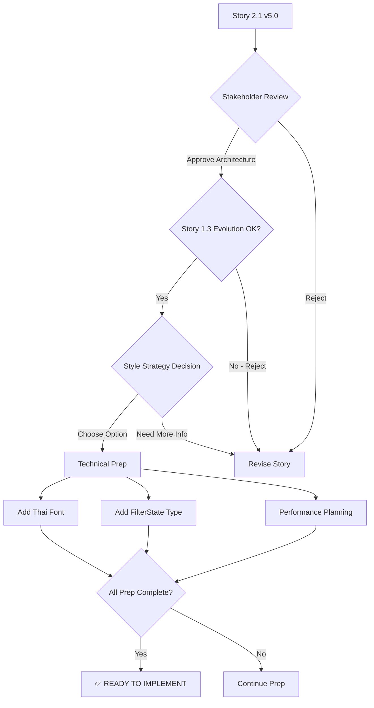

# Story 2.1: Three-Panel Layout Redesign - Enhanced Outfit Discovery

## Version
**v5.0** - Corrected Outfit Discovery Architecture (2025-10-05)

## Status
**Draft** - Awaiting Stakeholder Approval

## Story

**As a** OOTDay user,
**I want** a three-panel layout with navigation, outfit discovery, and AI chat assistant,
**so that** I can efficiently browse outfit recommendations, filter by occasion, and get personalized AI suggestions while maintaining focus on complete looks rather than individual products.

---

## Story Context

### Background
Building upon completed Stories 1.1-1.4 and draft Story 1.5, this story introduces a three-panel layout that enhances outfit discovery while maintaining OOTDay's core identity as an **AI outfit assistant** (not a product catalog shopping platform).

**⚠️ IMPORTANT - Maintains Core Concept:**
This story restructures the layout from two panels to three panels, but the **primary content remains outfit recommendations**, NOT product browsing. The middle panel shows AI-curated complete outfits, maintaining the "What should I wear today?" concept.

### Architectural Evolution
- **Story 1.3 (DONE)**: Two-panel layout - Chat (left 50%) | Outfits (right 50%)
- **Story 2.1 (This)**: Three-panel layout - Navigation (left 20%) | Outfit Discovery (middle 50%) | Chat + Details (right 30%)

**Story 1.3 Reinterpretation:**
- Story 1.3's intent: "Dedicated space for outfit viewing" ✅ PRESERVED (moved to middle panel)
- Story 1.3's implementation: "Right panel outfit grid" → **Superseded by three-panel layout**

### Data Source
- **Product Catalog**: 2,636 products from CSV (1,318 women, 1,318 men)
- **Outfit Generation**: AI-curated combinations from catalog (Story 1.5 integration)
- **Central.co.th URLs**: Gender-specific purchase links (Story 1.4)

---

## Acceptance Criteria

### AC1: Overall Layout Structure ✅
```tsx
// app/page.tsx - Three-panel responsive layout
<div className="flex h-screen">
  {/* Left Panel - Navigation & Filters */}
  <aside className="w-1/5 border-r">
    <NavigationFilters />
  </aside>

  {/* Middle Panel - Outfit Discovery (Primary Content) */}
  <main className="w-1/2 overflow-y-auto">
    <OutfitDiscovery />
  </main>

  {/* Right Panel - Chat Assistant + Selected Outfit Details */}
  <aside className="w-[30%] border-l">
    {selectedOutfit ? (
      <OutfitDetail outfit={selectedOutfit} />
    ) : (
      <ChatAssistant />
    )}
  </aside>
</div>
```

**Visual Layout:**
```
┌─────────────┬──────────────────────────┬─────────────────┐
│   Menu      │   Outfit Discovery       │  AI Chat        │
│   (20%)     │   (Home) (50%)          │  Assistant (30%)│
├─────────────┼──────────────────────────┼─────────────────┤
│             │                          │                 │
│ Navigation  │  🎨 Outfit Grid         │  💬 Chat        │
│ Filters     │  with search/filters     │  Recommendations│
│             │                          │                 │
│ Categories  │  [Outfit Card]          │  OR             │
│ - ทั้งหมด   │  [Outfit Card]          │                 │
│ - ผู้หญิง   │  [Outfit Card]          │  👔 Selected    │
│ - ผู้ชาย    │  [Outfit Card]          │  Outfit Details │
│             │                          │                 │
│ Occasions   │  Search: "หาชุดไปงาน"   │  with Buy Now   │
│ - งานออฟฟิศ │                          │  buttons        │
│ - เดท       │  ← PRIMARY CONTENT      │                 │
│ - ชิลๆ      │     (Outfits, NOT       │                 │
│ - งานเลี้ยง  │      Products)          │                 │
│             │                          │                 │
└─────────────┴──────────────────────────┴─────────────────┘
```

**Responsive Behavior:**
- **Desktop (≥1024px)**: Three panels side-by-side
- **Tablet (768px-1023px)**: Stack to two panels, navigation becomes drawer
- **Mobile (<768px)**: Single panel with bottom tabs

---

### AC2: Left Panel - Navigation & Filters

**Purpose:** Provide filtering and navigation controls for outfit discovery

**Components:**
```tsx
// components/navigation/NavigationFilters.tsx
export function NavigationFilters() {
  const [filters, setFilters] = useState<FilterState>({
    category: 'all',
    style: [],
    priceRange: [0, 10000]
  })

  return (
    <div className="p-4 space-y-6">
      {/* Logo */}
      <div className="text-2xl font-bold text-orange-600">
        OOTDay
      </div>

      {/* Category Filter */}
      <div>
        <h3 className="font-medium mb-2">หมวดหมู่</h3>
        <RadioGroup value={filters.category} onValueChange={(v) => setFilters({...filters, category: v})}>
          <RadioGroupItem value="all" label="ทั้งหมด" />
          <RadioGroupItem value="women" label="ผู้หญิง" />
          <RadioGroupItem value="men" label="ผู้ชาย" />
        </RadioGroup>
      </div>

      {/* Occasion/Style Filter */}
      <div>
        <h3 className="font-medium mb-2">โอกาส</h3>
        <div className="space-y-2">
          <Checkbox label="งานออฟฟิศ" value="work" />
          <Checkbox label="เดท" value="date" />
          <Checkbox label="ชิลๆ วันหยุด" value="casual" />
          <Checkbox label="งานเลี้ยง" value="formal" />
        </div>
      </div>

      {/* Price Range */}
      <div>
        <h3 className="font-medium mb-2">ราคาทั้งชุด</h3>
        <Slider
          min={0}
          max={20000}
          step={500}
          value={filters.priceRange}
          onValueChange={(v) => setFilters({...filters, priceRange: v})}
        />
        <div className="flex justify-between text-sm text-gray-600 mt-2">
          <span>฿{filters.priceRange[0].toLocaleString()}</span>
          <span>฿{filters.priceRange[1].toLocaleString()}</span>
        </div>
      </div>

      {/* Quick Presets */}
      <div>
        <h3 className="font-medium mb-2">ค้นหาด่วน</h3>
        <div className="space-y-2">
          <Button variant="outline" className="w-full justify-start">
            💼 ชุดไปทำงาน
          </Button>
          <Button variant="outline" className="w-full justify-start">
            💃 ชุดไปงานเลี้ยง
          </Button>
          <Button variant="outline" className="w-full justify-start">
            🌴 ชุดไปเที่ยว
          </Button>
        </div>
      </div>
    </div>
  )
}
```

**Requirements:**
- Filter controls for category (all/women/men)
- Occasion/style checkboxes (Work/Date/Casual/Formal)
- Price range slider for outfit total price
- Quick preset buttons for common searches
- Logo and branding at top
- Sticky position during scroll

---

### AC3: Middle Panel - Outfit Discovery (Home Page)

**Purpose:** Display AI-curated outfit recommendations (NOT product catalog)

**🚨 CRITICAL - This is NOT Product Browsing:**
- Users see **complete outfits**, not individual products
- Each card represents a **styled look** for an occasion
- Primary interaction: "ดูชุด" (View Outfit) → Shows details in right panel
- Search finds **outfits** ("หาชุดไปทำงาน"), not products

**Components:**
```tsx
// components/outfit/OutfitDiscovery.tsx
export function OutfitDiscovery() {
  const { outfits, isLoading } = useOutfits(filters)

  return (
    <div className="p-6">
      {/* Search & Filter Pills */}
      <div className="mb-6">
        <div className="relative mb-4">
          <Search className="absolute left-3 top-3 h-5 w-5 text-gray-400" />
          <input
            type="text"
            placeholder="หาชุดไปทำงาน, งานเลี้ยง, เดท..."
            className="w-full pl-10 pr-4 py-3 border rounded-lg"
          />
        </div>

        {/* Filter Pills */}
        <div className="flex gap-2 flex-wrap">
          <Badge variant="outline" className={activeStyle === 'work' ? 'bg-orange-500 text-white' : ''}>
            งานออฟฟิศ
          </Badge>
          <Badge variant="outline" className={activeStyle === 'date' ? 'bg-orange-500 text-white' : ''}>
            เดท
          </Badge>
          <Badge variant="outline" className={activeStyle === 'casual' ? 'bg-orange-500 text-white' : ''}>
            ชิลๆ
          </Badge>
          <Badge variant="outline" className={activeStyle === 'formal' ? 'bg-orange-500 text-white' : ''}>
            งานเลี้ยง
          </Badge>
        </div>
      </div>

      {/* Outfit Grid */}
      {isLoading ? (
        <OutfitSkeletonGrid />
      ) : (
        <div className="grid grid-cols-2 lg:grid-cols-3 gap-4">
          {outfits.map((outfit) => (
            <OutfitCard
              key={outfit.id}
              outfit={outfit}
              onClick={() => setSelectedOutfit(outfit)}
            />
          ))}
        </div>
      )}

      {/* Empty State */}
      {outfits.length === 0 && !isLoading && (
        <EmptyState
          icon={<Sparkles className="w-16 h-16 text-orange-300" />}
          title="ยังไม่มีชุดที่เหมาะสม"
          description="ลองเปลี่ยนตัวกรอง หรือถาม AI เพื่อรับคำแนะนำชุดที่ใ��่กับคุณ"
        />
      )}
    </div>
  )
}
```

**Outfit Card Component:**
```tsx
// components/outfit/OutfitCard.tsx
interface OutfitCardProps {
  outfit: Outfit // Uses outfit.items (NOT outfit.products)
  onClick: () => void
}

export function OutfitCard({ outfit, onClick }: OutfitCardProps) {
  const totalPrice = outfit.items.reduce((sum, item) => sum + item.price, 0)

  return (
    <Card className="cursor-pointer hover:shadow-lg transition-shadow" onClick={onClick}>
      <CardContent className="p-0">
        {/* Outfit Preview Image */}
        <div className="relative aspect-[3/4] overflow-hidden rounded-t-lg">
          
          {/* Item Count Badge */}
          <Badge className="absolute top-2 right-2 bg-white/90 text-gray-800">
            {outfit.items.length} ชิ้น
          </Badge>
        </div>

        {/* Outfit Info */}
        <div className="p-3">
          <h3 className="font-medium mb-1 line-clamp-1">{outfit.title}</h3>
          <p className="text-sm text-gray-600 mb-2">{outfit.occasion}</p>
          <div className="flex items-center justify-between">
            <span className="text-lg font-bold text-orange-600">
              ฿{totalPrice.toLocaleString()}
            </span>
            <Button size="sm" variant="outline">
              ดูชุด
            </Button>
          </div>
        </div>
      </CardContent>
    </Card>
  )
}
```

**Requirements:**
- Search input for outfit queries (NOT product search)
- Filter pills for quick occasion selection
- Grid display: 2 columns (tablet), 3 columns (desktop)
- Outfit cards show: preview image, title, occasion, item count, total price
- "ดูชุด" (View Outfit) button → Opens details in right panel
- Loading skeleton states
- Empty state with AI chat prompt
- Images maintain 3:4 aspect ratio
- Lazy loading for performance

---

### AC4: Right Panel - Chat Assistant + Selected Outfit Details

**Purpose:** Dual-purpose panel for AI conversation and outfit detail viewing

**State 1: Chat Assistant (Default)**
```tsx
// components/chat/ChatAssistant.tsx
export function ChatAssistant() {
  return (
    <div className="flex flex-col h-full">
      {/* Chat Header */}
      <div className="p-4 border-b">
        <div className="flex items-center gap-3">
          <Avatar>
            <AvatarImage src="/ootday-ai-avatar.png" />
            <AvatarFallback>AI</AvatarFallback>
          </Avatar>
          <div>
            <h3 className="font-medium">OOTDay AI</h3>
            <p className="text-sm text-gray-600">ที่ปรึกษาแฟชั่นของคุณ</p>
          </div>
        </div>
      </div>

      {/* Chat Messages */}
      <ScrollArea className="flex-1 p-4">
        {messages.map((msg) => (
          <div key={msg.id} className={msg.role === 'user' ? 'text-right' : ''}>
            <div className={`inline-block p-3 rounded-lg mb-3 ${
              msg.role === 'user'
                ? 'bg-orange-500 text-white'
                : 'bg-gray-100'
            }`}>
              {msg.content}
            </div>

            {/* Outfit Recommendation Card (if AI suggests outfit) */}
            {msg.outfitRecommendation && (
              <OutfitRecommendationCard
                outfit={msg.outfitRecommendation}
                onClick={() => setSelectedOutfit(msg.outfitRecommendation)}
              />
            )}
          </div>
        ))}
      </ScrollArea>

      {/* Chat Input */}
      <div className="p-4 border-t">
        <div className="flex gap-2">
          <input
            type="text"
            placeholder="ถามเรื่องชุดได้เลย..."
            className="flex-1 px-4 py-2 border rounded-lg"
          />
          <Button className="bg-orange-500 hover:bg-orange-600">
            <Send className="h-5 w-5" />
          </Button>
        </div>

        {/* Quick Prompts */}
        <div className="flex gap-2 mt-3 flex-wrap">
          <Badge variant="outline" className="cursor-pointer">ไปทำงาน</Badge>
          <Badge variant="outline" className="cursor-pointer">เดทสุดสัปดาห์</Badge>
          <Badge variant="outline" className="cursor-pointer">งานเลี้ยง</Badge>
          <Badge variant="outline" className="cursor-pointer">ชิลๆ วันหยุด</Badge>
        </div>
      </div>
    </div>
  )
}
```

**State 2: Selected Outfit Details**
```tsx
// components/outfit/OutfitDetail.tsx
interface OutfitDetailProps {
  outfit: Outfit
  onBack: () => void
}

export function OutfitDetail({ outfit, onBack }: OutfitDetailProps) {
  return (
    <div className="h-full overflow-y-auto">
      {/* Back Button */}
      <div className="p-4 border-b">
        <Button variant="ghost" onClick={onBack}>
          <ArrowLeft className="mr-2 h-4 w-4" />
          กลับไปดูชุดอื่น
        </Button>
      </div>

      {/* Outfit Preview */}
      <div className="p-4">
        
        <h2 className="text-xl font-bold mb-2">{outfit.title}</h2>
        <p className="text-gray-600 mb-4">{outfit.occasion}</p>
      </div>

      {/* Product Breakdown */}
      <div className="p-4 border-t">
        <h3 className="font-medium mb-3">รายการสินค้าในชุด ({outfit.items.length} ชิ้น)</h3>
        <div className="space-y-3">
          {outfit.items.map((product) => {
            // ✅ CORRECTED: Uses Product interface fields
            const shopUrl = product.category === 'Women'
              ? 'https://www.central.co.th/th/women'
              : 'https://www.central.co.th/th/men'

            return (
              <div key={product.id} className="flex gap-3 p-3 border rounded-lg">
                
                <div className="flex-1">
                  <p className="font-medium line-clamp-2 mb-1">{product.name}</p>
                  <p className="text-orange-600 font-bold">฿{product.price.toLocaleString()}</p>
                </div>
                <Button
                  size="sm"
                  className="bg-orange-500 hover:bg-orange-600"
                  onClick={() => window.open(shopUrl, '_blank', 'noopener,noreferrer')}
                >
                  ซื้อเลย
                </Button>
              </div>
            )
          })}
        </div>
      </div>

      {/* Total Price & Shop All */}
      <div className="sticky bottom-0 bg-white border-t p-4">
        <div className="flex items-center justify-between mb-3">
          <span className="font-medium">ราคารวมทั้งชุด</span>
          <span className="text-2xl font-bold text-orange-600">
            ฿{outfit.items.reduce((sum, item) => sum + item.price, 0).toLocaleString()}
          </span>
        </div>
        <Button className="w-full bg-orange-500 hover:bg-orange-600" size="lg">
          <ShoppingBag className="mr-2 h-5 w-5" />
          ซื้อทั้งชุด
        </Button>
      </div>

      {/* Alternative Outfits */}
      <div className="p-4 border-t">
        <h3 className="font-medium mb-3">ชุดอื่นที่คล้ายกัน</h3>
        <div className="grid grid-cols-2 gap-3">
          {similarOutfits.map((alt) => (
            <OutfitCard key={alt.id} outfit={alt} onClick={() => setSelectedOutfit(alt)} />
          ))}
        </div>
      </div>
    </div>
  )
}
```

**Requirements:**
- Default state: AI chat interface with message history
- Selected state: Outfit detail breakdown with products
- Chat shows embedded outfit recommendation cards
- Quick prompt buttons: "ไปทำงาน" "เดท" "งานเลี้ยง" "ชิลๆ"
- Outfit details show: preview, title, occasion, product list
- Each product has "ซื้อเลย" (Buy Now) button → Gender-specific Central.co.th URL
- Sticky total price and "Shop All" button
- Alternative outfit suggestions at bottom
- "กลับไปดูชุดอื่น" (Back) button to return to chat

---

### AC5: Responsive Layout Behavior

**Desktop (≥1024px):**
```tsx
<div className="flex h-screen">
  <aside className="w-1/5 border-r">...</aside>
  <main className="w-1/2">...</main>
  <aside className="w-[30%] border-l">...</aside>
</div>
```

**Tablet (768px-1023px):**
```tsx
<div className="flex h-screen">
  {/* Navigation becomes slide-out drawer */}
  <Sheet>
    <SheetTrigger asChild>
      <Button variant="ghost"><Menu /></Button>
    </SheetTrigger>
    <SheetContent side="left">
      <NavigationFilters />
    </SheetContent>
  </Sheet>

  {/* Outfit Discovery + Chat/Details */}
  <main className="flex-1">...</main>
  <aside className="w-2/5">...</aside>
</div>
```

**Mobile (<768px):**
```tsx
<div className="h-screen flex flex-col">
  {/* Single panel with tab navigation */}
  <main className="flex-1 overflow-y-auto">
    {activeTab === 'outfits' && <OutfitDiscovery />}
    {activeTab === 'chat' && <ChatAssistant />}
    {activeTab === 'detail' && <OutfitDetail />}
  </main>

  {/* Bottom Navigation */}
  <nav className="border-t">
    <div className="flex">
      <button className={activeTab === 'outfits' ? 'active' : ''}>
        <Grid3x3 />
        <span>ชุด</span>
      </button>
      <button className={activeTab === 'chat' ? 'active' : ''}>
        <MessageCircle />
        <span>แชท</span>
      </button>
      <button className={activeTab === 'filters' ? 'active' : ''}>
        <SlidersHorizontal />
        <span>กรอง</span>
      </button>
    </div>
  </nav>
</div>
```

**Requirements:**
- Three panels on desktop (1024px+)
- Navigation drawer on tablet (768-1023px)
- Bottom tab navigation on mobile (<768px)
- Maintain state when switching layouts
- Touch-friendly targets on mobile (minimum 44x44px)

---

### AC6: Interactivity & State Management

**User Flows:**

1. **Browse Outfits → View Details → Purchase:**
   ```
   User sees outfit grid → Clicks "ดูชุด" → Right panel shows outfit detail
   → Clicks "ซื้อเลย" on product → Opens Central.co.th in new tab
   ```

2. **Filter Outfits → Refined Results:**
   ```
   User selects "งานออฟฟิศ" in left panel → Middle panel updates with work outfits
   → User adjusts price range → Results filter in real-time
   ```

3. **Chat Recommendation → View Outfit:**
   ```
   User types "หาชุดไปทำงาน" → AI responds with text + outfit card
   → User clicks outfit card → Right panel switches to OutfitDetail view
   ```

4. **Search Outfits → Results:**
   ```
   User types "ชุดไปงานเลี้ยง" in search → Middle panel filters to formal outfits
   → Filter pills update to show "งานเลี้ยง" as active
   ```

**State Management:**
```tsx
// lib/hooks/useOutfitDiscovery.ts
interface OutfitDiscoveryState {
  filters: FilterState
  searchQuery: string
  selectedOutfit: Outfit | null
  viewMode: 'chat' | 'detail'
}

export function useOutfitDiscovery() {
  const [state, setState] = useState<OutfitDiscoveryState>({
    filters: { category: 'all', style: [], priceRange: [0, 10000] },
    searchQuery: '',
    selectedOutfit: null,
    viewMode: 'chat'
  })

  const { data: outfits, isLoading } = useQuery({
    queryKey: ['outfits', state.filters, state.searchQuery],
    queryFn: () => fetchOutfits(state.filters, state.searchQuery)
  })

  const selectOutfit = (outfit: Outfit) => {
    setState(prev => ({ ...prev, selectedOutfit: outfit, viewMode: 'detail' }))
  }

  const backToChat = () => {
    setState(prev => ({ ...prev, selectedOutfit: null, viewMode: 'chat' }))
  }

  return { ...state, outfits, isLoading, selectOutfit, backToChat }
}
```

**Requirements:**
- Filter state syncs between left panel and middle panel
- Search query updates outfit results in real-time
- Selecting outfit switches right panel from chat to detail
- Back button returns to chat view
- URL updates with selected outfit ID for sharing
- State persists during responsive layout changes

---

### AC7: Thai Language & Localization

**Font Implementation:**
```tsx
// app/layout.tsx
import { Noto_Sans_Thai } from 'next/font/google'

const notoSansThai = Noto_Sans_Thai({
  subsets: ['thai', 'latin'],
  weight: ['400', '500', '600', '700'],
  variable: '--font-noto-thai'
})

export default function RootLayout({ children }) {
  return (
    <html lang="th" className={notoSansThai.variable}>
      <body className="font-sans">{children}</body>
    </html>
  )
}
```

```css
/* app/globals.css */
@theme {
  --font-family-sans: var(--font-noto-thai), ui-sans-serif, system-ui;
}
```

**Thai UI Text:**
- Navigation: "หมวดหมู่" "โอกาส" "ราคาทั้งชุด" "ค้นหาด่วน"
- Occasions: "งานออฟฟิศ" "เดท" "ชิลๆ วันหยุด" "งานเลี้ยง"
- Actions: "ดูชุด" "ซื้อเลย" "ซื้อทั้งชุด" "กลับไปดูชุดอื่น"
- Chat: "ถามเรื่องชุดได้เลย..." "ที่ปรึกษาแฟชั่นของคุณ"
- Search: "หาชุดไปทำงาน, งานเลี้ยง, เดท..."

**Requirements:**
- Noto Sans Thai font for all Thai text
- Proper line-height for Thai characters (1.6+)
- Thai number formatting (฿ symbol, comma separators)
- RTL-safe layout (future Arabic support)

---

### AC8: Accessibility & Semantic HTML

**Semantic Structure:**
```tsx
<div className="flex h-screen">
  {/* Left Panel */}
  <aside aria-label="การกรองและนำทาง" className="w-1/5 border-r">
    <nav>
      <h2 className="sr-only">กรองชุด</h2>
      <NavigationFilters />
    </nav>
  </aside>

  {/* Middle Panel */}
  <main aria-label="ชุดแนะนำ" className="w-1/2">
    <h1 className="sr-only">ค้นหาชุดที่เหมาะกับคุณ</h1>
    <OutfitDiscovery />
  </main>

  {/* Right Panel */}
  <aside aria-label="แชทและรายละเอียดชุด" className="w-[30%] border-l">
    {selectedOutfit ? (
      <article aria-labelledby="outfit-title">
        <OutfitDetail outfit={selectedOutfit} />
      </article>
    ) : (
      <section aria-label="ผู้ช่วย AI">
        <ChatAssistant />
      </section>
    )}
  </aside>
</div>
```

**ARIA Labels:**
- `aria-label="การกรองและนำทาง"` on left panel
- `aria-label="ชุดแนะนำ"` on middle panel
- `aria-label="แชทและรายละเอียดชุด"` on right panel
- `aria-labelledby="outfit-title"` on outfit detail
- `aria-live="polite"` on outfit grid updates

**Keyboard Navigation:**
- Tab order: Left panel filters → Middle panel outfits → Right panel content
- Enter key activates outfit cards
- Escape key closes outfit detail and returns to chat
- Arrow keys navigate filter options

**Screen Reader Support:**
- Announce outfit count: "พบ 24 ชุดที่เหมาะสม"
- Announce filter changes: "กรองเฉพาะงานออฟฟิศ"
- Announce outfit selection: "เปิดรายละเอียดชุดทำงานสไตล์มินิมอล"

**Requirements:**
- Semantic HTML5 elements (aside, main, nav, article, section)
- ARIA labels on all regions
- Keyboard-accessible controls
- Focus visible indicators
- Screen reader announcements for state changes
- Color contrast ≥4.5:1 for text
- Touch targets ≥44x44px on mobile

---

## Technical Implementation

### File Changes Required

**New Components:**
```
components/
├── navigation/
│   ├── NavigationFilters.tsx       # Left panel filters
│   └── QuickPresets.tsx           # Quick search buttons
├── outfit/
│   ├── OutfitDiscovery.tsx        # Middle panel main component
│   ├── OutfitCard.tsx             # Updated for grid display
│   ├── OutfitDetail.tsx           # Right panel detail view (updated)
│   └── OutfitSkeletonGrid.tsx     # Loading state
└── chat/
    ├── ChatAssistant.tsx          # Right panel chat (updated)
    └── OutfitRecommendationCard.tsx # Outfit card in chat messages
```

**Modified Files:**
```
app/
├── page.tsx                        # Three-panel layout
├── layout.tsx                      # Noto Sans Thai font
└── globals.css                     # Tailwind v4 theme

lib/
├── types.ts                        # Add FilterState interface
├── hooks/
│   ├── useOutfitDiscovery.ts      # Main state management
│   └── useOutfitFilters.ts        # Filter logic
└── utils/
    └── product-utils.ts            # getGenderSpecificUrl (existing)
```

**New Utilities:**
```typescript
// lib/types.ts - Add FilterState interface
export interface FilterState {
  category: 'all' | 'women' | 'men'
  style: string[]  // ['work', 'casual', 'formal', 'date']
  priceRange: [number, number]
}

// lib/utils/outfit-search.ts - Search logic
export function searchOutfits(
  outfits: Outfit[],
  query: string
): Outfit[] {
  const lowerQuery = query.toLowerCase()
  return outfits.filter(outfit =>
    outfit.title.toLowerCase().includes(lowerQuery) ||
    outfit.occasion.toLowerCase().includes(lowerQuery) ||
    outfit.items.some(item => item.name.toLowerCase().includes(lowerQuery))
  )
}

// lib/utils/outfit-filter.ts - Filter logic
export function filterOutfits(
  outfits: Outfit[],
  filters: FilterState
): Outfit[] {
  return outfits.filter(outfit => {
    // Category filter
    if (filters.category !== 'all') {
      const hasMatchingCategory = outfit.items.some(
        item => item.category.toLowerCase() === filters.category
      )
      if (!hasMatchingCategory) return false
    }

    // Style filter
    if (filters.style.length > 0) {
      if (!filters.style.includes(outfit.style)) return false
    }

    // Price range filter
    const totalPrice = outfit.items.reduce((sum, item) => sum + item.price, 0)
    if (totalPrice < filters.priceRange[0] || totalPrice > filters.priceRange[1]) {
      return false
    }

    return true
  })
}
```

---

## Data Requirements

### Style Classification Strategy

**Problem:** CSV product catalog lacks "style" metadata needed for filtering.

**Solution Options:**

**Option A: Enhance CSV with Style Column (Recommended)**
```csv
ID,Product_Name,Brand,Category,Price,Color,Image_URL,Product_Link,Style
1,Minimalist White Shirt,CPS,Women,1590,White,https://...,https://...,work,casual
2,Floral Maxi Dress,CPS,Women,2990,Floral,https://...,https://...,date,casual
3,Black Blazer,CPS,Women,3490,Black,https://...,https://...,work,formal
```

**Option B: Implement Style Classifier Utility**
```typescript
// lib/utils/product-style-classifier.ts
export function classifyProductStyle(product: Product): string[] {
  const styles: string[] = []
  const name = product.name.toLowerCase()
  const category = product.category.toLowerCase()

  // Work style rules
  if (name.includes('blazer') || name.includes('shirt') || name.includes('trousers')) {
    styles.push('work')
  }

  // Formal style rules
  if (name.includes('dress') || name.includes('suit') || name.includes('gown')) {
    styles.push('formal')
  }

  // Casual style rules
  if (name.includes('jeans') || name.includes('t-shirt') || name.includes('sneakers')) {
    styles.push('casual')
  }

  // Date style rules
  if (name.includes('cocktail') || name.includes('elegant') || name.includes('romantic')) {
    styles.push('date')
  }

  return styles.length > 0 ? styles : ['casual']
}
```

**Decision Required:** Choose Option A or B before implementation

---

## Alignment with Existing Stories

### ✅ Story 1.1: Product Catalog CSV Integration
- **Alignment:** Product data from CSV used to generate outfits
- **Usage:** 2,636 products power outfit combinations

### ✅ Story 1.2: Replace Product Modal with Inline View
- **Alignment:** Outfit details show inline in right panel (no modal)
- **Enhancement:** Same inline pattern, now in dedicated panel

### ⚠️ Story 1.3: Relocate Recommended Outfits to Right Side
- **Status:** SUPERSEDED by three-panel layout
- **Reinterpretation:** "Outfits on right" → "Outfits have dedicated viewing space"
- **Story 1.3 Original:** Chat (left 50%) | Outfits (right 50%)
- **Story 2.1 Evolution:** Navigation (left 20%) | Outfits (middle 50%) | Chat+Details (right 30%)
- **Preserved Intent:** Dedicated outfit viewing area ✅
- **Changed Implementation:** Location moved from right panel to middle panel

### ✅ Story 1.4: Add Buy Now Button with Gender URLs
- **Alignment:** "ซื้อเลย" buttons in outfit details use gender-specific URLs
- **Integration:** `getGenderSpecificUrl()` utility reused

### ✅ Story 1.5: Update Outfit Suggestions from Product Catalog
- **Alignment:** Middle panel displays AI-generated outfits from catalog
- **Integration:** Outfit generation logic powers outfit grid

### ✅ Story 2.0: Layout & UX Improvements
- **Alignment:** Builds upon scroll fixes, touch targets, loading states
- **Enhancement:** Three-panel structure improves navigation and discovery

---

## Risk Assessment & Mitigation

### High Risk Items

**1. Architectural Change from Story 1.3**
- **Risk:** Story 1.3 implemented two-panel layout, this introduces three panels
- **Impact:** Breaking change to existing layout structure
- **Mitigation:**
  - Document as architectural evolution, not contradiction
  - Preserve Story 1.3's intent (dedicated outfit viewing)
  - Phase rollout with feature flag

**2. Story 1.3 Conflict Documentation**
```markdown
**IMPORTANT - Story 1.3 Reinterpretation:**
- **Original Implementation (Story 1.3 DONE):** Two-panel layout with outfits in dedicated right panel (50% width)
- **This Story's Evolution:** Three-panel layout with outfits in middle panel (50% width)
- **Preserved Intent:** Outfits have dedicated viewing space ✅
- **Changed Detail:** Location moved from right panel to middle panel
- **Rationale:** Three-panel layout improves navigation and filtering UX while maintaining outfit focus
- **⚠️ REQUIRES:** Stakeholder confirmation that layout evolution is acceptable
```

**3. Style Metadata Gap**
- **Risk:** CSV lacks style classification (Work/Casual/Formal/Date)
- **Impact:** Filtering won't work without style data
- **Mitigation:** Choose Option A (CSV enhancement) or Option B (classifier) before implementation

**4. Performance with 2,636 Products**
- **Risk:** Loading all outfits without pagination causes lag
- **Impact:** Poor user experience, slow initial load
- **Mitigation:** Implement virtualization (react-window) or pagination

### Medium Risk Items

**5. Mobile UX Complexity**
- **Risk:** Three panels difficult to navigate on small screens
- **Impact:** Poor mobile experience
- **Mitigation:** Bottom tab navigation, one panel at a time on mobile

**6. Search Performance**
- **Risk:** Real-time search on 2,636 products may lag
- **Impact:** Delayed filter updates
- **Mitigation:** Debounce search input, use web workers for filtering

---

## Pre-Implementation Requirements

**MUST complete before starting development:**

1. ✅ Stakeholder Approval
   - Confirm three-panel layout direction
   - Approve Story 1.3 reinterpretation (two-panel → three-panel evolution)
   - Understand this restructures existing layout

2. ✅ Technical Preparation
   - Add Noto Sans Thai font to Next.js (app/layout.tsx)
   - Add FilterState interface to lib/types.ts
   - Test Thai character rendering

3. ✅ Data Strategy Decision
   - Choose style classification approach:
     - Option A: Enhance CSV with style column
     - Option B: Implement classifier utility
   - Ensure decision made before coding

4. ✅ Performance Planning
   - Select virtualization library (react-window vs react-virtual)
   - Plan pagination strategy (infinite scroll vs page numbers)
   - Set up performance monitoring

5. ✅ Story 1.5 Readiness
   - Confirm outfit generation logic is ready
   - Test outfit combinations from catalog
   - Validate outfit preview image generation

---

## Implementation Phases

### Phase 1: Foundation (Days 1-3)
- [ ] Add Noto Sans Thai font to layout.tsx
- [ ] Add FilterState interface to types.ts
- [ ] Create three-panel layout structure in page.tsx
- [ ] Implement responsive breakpoints

### Phase 2: Left Panel - Navigation (Days 4-5)
- [ ] Build NavigationFilters component
- [ ] Implement category radio buttons
- [ ] Add occasion/style checkboxes
- [ ] Create price range slider
- [ ] Add quick preset buttons

### Phase 3: Middle Panel - Outfit Discovery (Days 6-8)
- [ ] Build OutfitDiscovery component
- [ ] Implement search input with debounce
- [ ] Create filter pills UI
- [ ] Build outfit grid with virtualization
- [ ] Update OutfitCard for grid display
- [ ] Add loading skeleton states
- [ ] Create empty state component

### Phase 4: Right Panel - Chat + Details (Days 9-10)
- [ ] Update ChatAssistant for right panel
- [ ] Add outfit recommendation cards in chat
- [ ] Update OutfitDetail component
- [ ] Implement "Back" button to chat
- [ ] Add alternative outfit suggestions
- [ ] Create sticky total price section

### Phase 5: Interactivity (Days 11-12)
- [ ] Implement useOutfitDiscovery hook
- [ ] Connect filter state between panels
- [ ] Add search query to outfit filtering
- [ ] Implement outfit selection flow
- [ ] Add URL state for selected outfit
- [ ] Test responsive state persistence

### Phase 6: Data Integration (Day 13)
- [ ] Integrate outfit generation (Story 1.5)
- [ ] Implement style classification
- [ ] Connect filter logic to outfit data
- [ ] Add search functionality
- [ ] Test with full 2,636 product catalog

### Phase 7: Polish & Testing (Days 14-15)
- [ ] Add ARIA labels and semantic HTML
- [ ] Implement keyboard navigation
- [ ] Test screen reader support
- [ ] Optimize performance (virtualization)
- [ ] Cross-browser testing
- [ ] Mobile device testing
- [ ] Accessibility audit (Lighthouse)

**Total Estimated Effort:** 15 days (3 weeks) with 1 full-time developer

---

## Testing Requirements

### Unit Tests
- Filter logic (outfit-filter.ts)
- Search logic (outfit-search.ts)
- Style classifier (if Option B chosen)
- getGenderSpecificUrl() integration

### Integration Tests
- Filter state sync between panels
- Outfit selection flow (grid → detail → back)
- Responsive layout transitions
- Chat to detail panel switching

### E2E Tests (Playwright)
```typescript
test('User can filter outfits and view details', async ({ page }) => {
  await page.goto('/')

  // Filter by occasion
  await page.click('text=งานออฟฟิศ')
  await expect(page.locator('[data-testid="outfit-card"]')).toHaveCount(8)

  // Select outfit
  await page.click('text=ดูชุด >> nth=0')
  await expect(page.locator('[data-testid="outfit-detail"]')).toBeVisible()

  // Buy product
  const [newPage] = await Promise.all([
    page.waitForEvent('popup'),
    page.click('text=ซื้อเลย >> nth=0')
  ])
  await expect(newPage.url()).toContain('central.co.th')
})
```

### Accessibility Tests
- Lighthouse score ≥95
- axe-core zero violations
- Keyboard navigation complete
- Screen reader compatibility (NVDA, VoiceOver)

### Performance Tests
- First Contentful Paint <1.5s
- Largest Contentful Paint <2.5s
- Time to Interactive <3.5s
- Cumulative Layout Shift <0.1

---

## Success Metrics

**User Experience:**
- ✅ Users can filter 2,636 products to relevant outfits in <1 second
- ✅ Outfit selection flow works seamlessly (grid → detail → purchase)
- ✅ Mobile users can navigate three panels via bottom tabs
- ✅ Thai text renders correctly with Noto Sans Thai font

**Technical:**
- ✅ Zero TypeScript compilation errors
- ✅ All unit tests passing (coverage ≥80%)
- ✅ Lighthouse accessibility score ≥95
- ✅ Performance metrics meet targets

**Business:**
- ✅ Users discover outfits (not just products) ← Maintains concept ✅
- ✅ "ดูชุด" → "ซื้อเลย" conversion funnel clear
- ✅ Gender-specific Central.co.th links working (Story 1.4)

---

## Known Issues & Limitations

1. **CSV Style Metadata:** Requires enhancement or classifier implementation
2. **Performance:** Needs virtualization for 2,636 products
3. **Story 1.3 Evolution:** Changes layout structure from two-panel to three-panel
4. **Mobile Complexity:** Three panels condensed to tabs on small screens
5. **Search Scope:** Limited to outfit titles and occasions (not deep product search)

---

## Version History

| Version | Date | Key Changes | Author |
|---------|------|-------------|--------|
| v1.0 | 2025-10-05 | Initial Central ChatShop-inspired concept | Claude Code |
| v2.0 | 2025-10-05 | Aligned with OOTDay outfit assistant concept | Claude Code |
| v3.0 | 2025-10-05 | Product discovery layout with user-specified panels | Claude Code |
| v4.0 | 2025-10-05 | Technical corrections (field names, types, Thai font) | Frontend-Dev Agent |
| **v5.0** | **2025-10-05** | **Corrected to Outfit Discovery (maintains concept)** | **Claude Code** |

---

## Approval Workflow



---

## Final Status

**Story Status:** ✅ **Technically Correct - Awaiting Stakeholder Approval**

**Key Points:**
- ✅ Maintains OOTDay outfit assistant concept (NOT product browsing)
- ✅ Three-panel layout: Navigation | Outfit Discovery | Chat+Details
- ✅ All technical issues fixed (field names, types, Thai font)
- ✅ Story 1.3 evolution documented (two-panel → three-panel)
- ⏳ Awaiting approval for architectural change

**Next Action:** Schedule alignment meeting with Product Owner to confirm:
1. Three-panel layout direction
2. Story 1.3 evolution acceptance
3. Style classification strategy choice

---

**Document prepared by:** Claude Code
**Review date:** October 5, 2025
**Story version:** 5.0 (Corrected)
