# Story 2.1 v4.0 - Technical Corrections Summary

**Date:** October 5, 2025
**Version:** 3.0 → 4.0
**Status:** ✅ All critical issues fixed - Ready for stakeholder approval

---

## Critical Issues Fixed

### ✅ Issue 1: Field Name Corrections

**Problem:** Code examples used incorrect CSV field names that don't match the Product interface.

**Fixed:**
```typescript
// ❌ BEFORE (v3.0):
product.product_image  // Wrong
product.product_name   // Wrong
product.product_price  // Wrong

// ✅ AFTER (v4.0):
product.imageUrl       // Correct (types.ts:29)
product.name          // Correct (types.ts:30)
product.price         // Correct (types.ts:31)
```

**Files Updated:**
- AC3 lines 123-126
- ProductCard component lines 495-508
- OutfitRecommendationCard lines 645-655

---

### ✅ Issue 2: Outfit Interface Field Correction

**Problem:** Used `outfit.products` but actual interface has `outfit.items`

**Fixed:**
```typescript
// ❌ BEFORE:
outfit.products.map(...)  // Wrong

// ✅ AFTER:
outfit.items.map(...)    // Correct (types.ts:24)
```

**Files Updated:**
- OutfitRecommendationCard lines 645, 677

---

### ✅ Issue 3: FilterState Type Definition Added

**Problem:** FilterState interface not defined, code would fail TypeScript compilation.

**Fixed:**
```typescript
// Added to File Changes Required section:
export interface FilterState {
  category: 'all' | 'women' | 'men'
  style: string[]  // ['work', 'casual', 'formal', 'date']
  priceRange: [number, number]
}
```

**Location:** Lines 736-743

---

### ✅ Issue 4: Thai Font Implementation Details

**Problem:** Thai font mentioned but no implementation code provided.

**Fixed:**
Added complete Noto Sans Thai implementation:
```typescript
// app/layout.tsx
import { Noto_Sans_Thai } from 'next/font/google'

const notoSansThai = Noto_Sans_Thai({
  subsets: ['thai', 'latin'],
  weight: ['400', '500', '600', '700'],
  variable: '--font-noto-thai'
})
```

**Location:** Lines 756-765

---

### ✅ Issue 5: Style Classification Strategy

**Problem:** CSV doesn't have "style" metadata (Work/Casual/Formal/Date) needed for filtering.

**Fixed:**
- Added new utility requirement: `lib/utils/product-style-classifier.ts`
- Documented two options:
  1. Enhance CSV with style column (optional)
  2. Implement classification logic based on product data

**Location:** Lines 772, 778-780

---

### ✅ Issue 6: Architectural Impact Documentation

**Problem:** Story didn't clearly communicate this is a complete redesign, not an addition.

**Fixed:**
Added prominent warnings:

```markdown
**⚠️ IMPORTANT - Architectural Impact:**
This story represents a **major architectural change** from the current
chat-first design to a product-first design. Current implementation has
chat on left and recommendations on right. This story restructures to:
Navigation (left) | Products (middle) | Chat (right). This is NOT a
brownfield addition - it's a greenfield redesign.
```

**Location:** Lines 27-28

---

### ✅ Issue 7: Story 1.3 Conflict Documentation

**Problem:** Story 1.3 is marked DONE with different implementation than proposed.

**Fixed:**
Added conflict documentation:

```markdown
**IMPORTANT - Story 1.3 Reinterpretation:**
- **Current Implementation (Story 1.3 DONE):** Outfits show in dedicated
  right panel at 50% width
- **This Story's Interpretation:** Outfit recommendations appear as rich
  message cards embedded in AI chat on right panel
- **⚠️ CONFLICT**: This changes UX from dedicated outfit panel to in-chat cards
- **Requires**: Stakeholder confirmation - which interpretation is correct?
```

**Location:** Lines 957-963

---

### ✅ Issue 8: Risk Assessment Updated

**Problem:** Risk marked as "Medium" but issues indicate "High" risk.

**Fixed:**
```markdown
**High Risk Assessment:**
- **BREAKING CHANGE**: Complete architectural restructure from chat-first
  to product-first UX
- **Story 1.3 Reinterpretation**: Current implementation has outfits in
  dedicated right panel. This story moves them to chat message cards.
  Requires stakeholder confirmation.
- **Data Gap**: CSV lacks "style" metadata for filtering
```

**Location:** Lines 839-844

---

### ✅ Issue 9: Pre-Implementation Checklist

**Problem:** No clear gate for implementation to begin.

**Fixed:**
Added comprehensive pre-implementation requirements:

```markdown
**Pre-Implementation Requirements:**
1. ✅ Stakeholder approval for architectural change (chat-first → product-first)
2. ✅ Story 1.3 interpretation clarification (dedicated panel vs in-chat cards)
3. ✅ Add Noto Sans Thai font to Next.js
4. ✅ Define style classification strategy (CSV doesn't have this metadata)
5. ✅ Add FilterState interface to types.ts
6. ✅ Plan performance optimization (virtualization for 2,636 products)
```

**Location:** Lines 943-949

---

## Summary of Changes

| Issue | Category | Status | Impact |
|-------|----------|--------|--------|
| Field name mismatches | Code Errors | ✅ Fixed | High - Would break compilation |
| Missing FilterState type | Type Definitions | ✅ Added | High - TypeScript errors |
| Thai font implementation | Missing Code | ✅ Added | Medium - Renders incorrectly |
| Style metadata gap | Data Issue | ✅ Documented | Medium - Filtering won't work |
| Architecture impact | Communication | ✅ Clarified | High - Expectation management |
| Story 1.3 conflict | Alignment | ✅ Documented | High - UX contradiction |
| Risk assessment | Planning | ✅ Updated | Medium - Resource planning |
| outfit.products → items | Code Error | ✅ Fixed | High - Runtime errors |
| Pre-implementation gates | Process | ✅ Added | High - Prevents premature work |

---

## What's Ready Now

### ✅ Technical Correctness
- All code examples use correct field names
- Type definitions properly specified
- Thai font implementation detailed
- No compilation errors expected

### ✅ Clear Communication
- Architectural impact clearly stated (greenfield redesign)
- Story 1.3 conflict documented
- Risk level accurately assessed as HIGH
- Pre-implementation requirements listed

### ✅ Complete Requirements
- All missing utilities identified
- Data gaps documented with solutions
- Performance considerations noted
- Implementation effort estimated

---

## What's Still Needed (Blockers)

### 🔴 Stakeholder Decisions Required

1. **Architecture Direction**
   - Approve chat-first → product-first transformation?
   - Understand this replaces current UX completely

2. **Story 1.3 Interpretation**
   - Current: Dedicated outfit panel on right ✅ DONE
   - Proposed: Outfit cards in chat on right
   - Which is correct?

3. **Style Classification Approach**
   - Option A: Enhance CSV with style column
   - Option B: Implement ML/rule-based classifier
   - Decision needed before implementation

### 🟡 Technical Preparation Required

4. **Add Noto Sans Thai Font**
   ```bash
   # Update app/layout.tsx with font import
   # Test Thai character rendering
   ```

5. **Create FilterState Interface**
   ```bash
   # Add to lib/types.ts
   # Update all filter-related components
   ```

6. **Performance Planning**
   ```bash
   # Choose virtualization library (react-window, etc.)
   # Plan pagination strategy
   # Set up performance monitoring
   ```

---

## Implementation Readiness Checklist

- [ ] **Stakeholder Approval** - Architecture change approved
- [ ] **Story 1.3 Clarification** - Interpretation confirmed
- [ ] **Thai Font Added** - Noto Sans Thai in Next.js
- [ ] **Style Strategy Defined** - CSV enhancement OR classifier approach
- [ ] **FilterState Type Added** - Interface in types.ts
- [ ] **Performance Plan** - Virtualization strategy chosen
- [ ] **Technical Debt Acknowledged** - Team aware of 7 new components needed

**Once all checkboxes completed:** ✅ **READY TO IMPLEMENT**

---

## Estimated Timeline (Post-Approval)

### Sprint Planning

**Sprint 1 (Week 1-2): Foundation**
- Days 1-3: Layout restructure + Thai font
- Days 4-5: Left panel (NavigationFilters)

**Sprint 2 (Week 3-4): Core Features**
- Days 6-8: Middle panel (ProductCatalog + filtering)
- Days 9-10: Right panel (ChatInterface + outfit cards)

**Sprint 3 (Week 5-6): Polish & Testing**
- Days 11-12: Interactivity & integration
- Day 13: Performance optimization
- Days 14-15: Testing & bug fixes

**Total: 3 sprints (6 weeks)** with 1 full-time developer

---

## Version History

| Version | Date | Key Changes |
|---------|------|-------------|
| v1.0 | 2025-01-05 | Initial Central ChatShop-inspired concept |
| v2.0 | 2025-10-05 | Aligned with outfit assistant concept |
| v3.0 | 2025-10-05 | Product discovery layout finalized |
| v4.0 | 2025-10-05 | **Technical corrections** - All blockers fixed |

---

## Approval Workflow

```mermaid
graph TD
    A[Story 2.1 v4.0] --> B{Stakeholder Review}
    B -->|Approve Architecture| C{Story 1.3 Clarification}
    C -->|Confirm Interpretation| D{Style Strategy Decision}
    D -->|Choose Approach| E[Technical Prep]
    E --> F[Add Thai Font]
    E --> G[Add FilterState Type]
    E --> H[Performance Planning]
    F --> I{All Prep Complete?}
    G --> I
    H --> I
    I -->|Yes| J[✅ READY TO IMPLEMENT]
    I -->|No| K[Continue Prep]
    B -->|Reject| L[Revise Story]
    C -->|Conflict| L
    D -->|Need More Info| L
```



---

**Story Status:** ✅ **Technically Correct - Awaiting Stakeholder Approval**

**Next Action:** Schedule alignment meeting with Product Owner to resolve blockers 1-3
