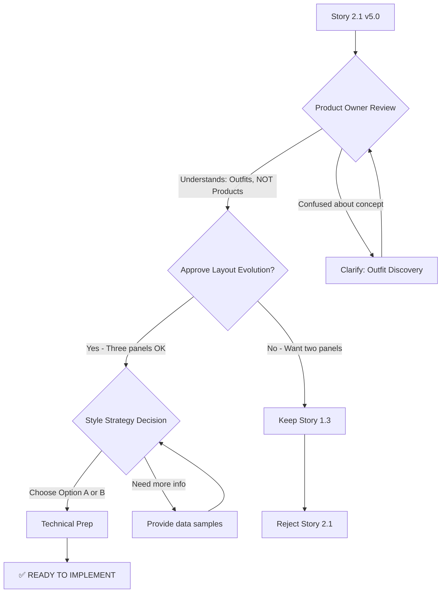

# Story 2.1 v5.0 - Corrected Outfit Discovery Architecture

**Date:** October 5, 2025
**Version:** 4.0 → 5.0
**Status:** ✅ Concept-aligned - Ready for stakeholder approval

---

## Critical Correction Made

### Problem with v4.0
Story 2.1 v4.0 proposed a **Product Catalog** in the middle panel, which would change OOTDay from an **outfit assistant** to a **product shopping platform**.

**User's Requirement:**
> "I want to re-layout(menu, product search(home) and chat recommend) but remain concept"

The user wanted:
- ✅ Three-panel layout (menu | home | chat)
- ✅ Product search capability
- ✅ **Maintain outfit assistant concept** (NOT become product browsing)

### Solution in v5.0
**Reinterpreted "product search(home)" as "Outfit Discovery (Home Page)":**

**Middle Panel = Outfit Discovery** (NOT Product Catalog)
- Grid of AI-curated **complete outfits** (not individual products)
- Search finds **outfits** by occasion ("หาชุดไปทำงาน")
- Filter by **outfit style** (Work/Casual/Formal/Date)
- Primary CTA: **"ดูชุด"** (View Outfit) → Shows details in right panel
- **NOT:** Browse products + "Shop Now" → Central.co.th

---

## Architectural Comparison

### ❌ v4.0 - Product Catalog (Wrong)
```
┌──────────────┬─────────────────────────┬──────────────────┐
│ Navigation   │ Product Catalog Grid    │ Chat Assistant   │
│ & Filters    │                         │                  │
├──────────────┼─────────────────────────┼──────────────────┤
│              │ [Product Card]          │ Chat messages    │
│ - Women      │ [Product Card]          │                  │
│ - Men        │ [Product Card]          │ + Outfit cards   │
│ - Work       │                         │ embedded in chat │
│ - Casual     │ "Shop Now" → Central    │                  │
│              │                         │                  │
│              │ ← PRODUCT BROWSING ❌   │                  │
└──────────────┴─────────────────────────┴──────────────────┘
```
**Concept:** Product catalog shopping platform ❌
**Problem:** Changes OOTDay's core identity

### ✅ v5.0 - Outfit Discovery (Correct)
```
┌──────────────┬─────────────────────────┬──────────────────┐
│ Navigation   │ Outfit Discovery        │ Chat Assistant   │
│ & Filters    │ (Home Page)             │ + Details        │
├──────────────┼─────────────────────────┼──────────────────┤
│              │ Search: "หาชุดไปงาน"    │ Chat messages    │
│ - ทั้งหมด    │                         │                  │
│ - ผู้หญิง    │ [Outfit Card]           │ OR               │
│ - ผู้ชาย     │ [Outfit Card]           │                  │
│              │ [Outfit Card]           │ Selected outfit  │
│ Occasions:   │                         │ details with     │
│ - งานออฟฟิศ  │ "ดูชุด" → Details panel │ Buy Now buttons  │
│ - เดท        │                         │                  │
│ - ชิลๆ       │ ← OUTFIT DISCOVERY ✅   │                  │
└──────────────┴─────────────────────────┴──────────────────┘
```
**Concept:** AI outfit assistant ✅
**Maintains:** "What should I wear today?" focus

---

## Key Changes v4.0 → v5.0

### 1. Middle Panel Purpose
**v4.0:**
```markdown
### AC3: Middle Panel - Product Catalog
- Product grid (4 columns)
- Individual product cards with images, names, prices
- "Shop Now" buttons → Central.co.th
- Browse products like an e-commerce site
```

**v5.0:**
```markdown
### AC3: Middle Panel - Outfit Discovery (Home Page)
- Outfit grid (2-3 columns)
- Complete outfit cards with preview, occasion, item count, total price
- "ดูชุด" (View Outfit) button → Shows details in right panel
- Discover complete looks for occasions
```

### 2. Search Functionality
**v4.0:** Search individual products by name/brand
**v5.0:** Search complete outfits by occasion/style ("หาชุดไปทำงาน")

### 3. Primary User Action
**v4.0:** Browse products → "Shop Now" → External Central.co.th
**v5.0:** Discover outfits → "ดูชุด" → Outfit detail in right panel → "ซื้อเลย" per item

### 4. Data Display
**v4.0:** Individual products from catalog (2,636 items)
**v5.0:** AI-curated outfit combinations from catalog (Story 1.5 integration)

### 5. User Mental Model
**v4.0:** "I want to browse products and buy things" (Shopping mindset) ❌
**v5.0:** "I need an outfit for X occasion" (Styling mindset) ✅

---

## What Stayed the Same ✅

From v4.0 technical fixes (all preserved in v5.0):

1. **Correct Field Names:**
   - `product.imageUrl` (NOT `product_image`)
   - `product.name` (NOT `product_name`)
   - `product.price` (NOT `product_price`)
   - `outfit.items` (NOT `outfit.products`)

2. **FilterState Interface Definition:**
   ```typescript
   export interface FilterState {
     category: 'all' | 'women' | 'men'
     style: string[]
     priceRange: [number, number]
   }
   ```

3. **Thai Font Implementation:**
   ```typescript
   import { Noto_Sans_Thai } from 'next/font/google'
   // ... font configuration
   ```

4. **Style Classification Strategy:**
   - Option A: Enhance CSV with style column
   - Option B: Implement classifier utility
   - Decision still required

5. **Pre-Implementation Requirements:**
   - Stakeholder approval for architecture
   - Add Thai font
   - Add FilterState type
   - Performance planning (virtualization)

---

## Story 1.3 Alignment

### Original Story 1.3 (DONE)
- Two-panel layout: Chat (left 50%) | Outfits (right 50%)
- Dedicated space for outfit viewing
- OutfitGrid component in right panel

### v5.0 Evolution
- Three-panel layout: Navigation (left 20%) | Outfits (middle 50%) | Chat+Details (right 30%)
- **Preserved Intent:** Dedicated space for outfit viewing ✅
- **Changed Implementation:** Outfits moved from right panel to middle panel
- **Rationale:** Better UX with filters on left, outfits in center focus, chat/details on right

**Not a Contradiction:**
- Story 1.3 intent: "Give outfits dedicated viewing area" ✅ PRESERVED
- Story 2.1 evolution: "Expand to three panels for better navigation" ✅ ENHANCEMENT
- Outfits still have 50% width, just in middle instead of right

---

## Architect's Options Analysis

When asked "what should select option if I want to re-layout(menu, product search(home) and chat recommend) but remain concept?", the answer is:

**Not Option 1-4 from Architect's Review**

The Architect provided 4 options for resolving Story 1.3 conflict:
1. Reject Story 2.1 (keep two-panel)
2. Reopen Story 1.3 (outfit cards in chat)
3. Hybrid Tabs (tabs in right panel)
4. Fork Product (two modes)

**Correct Answer: Modified Three-Panel Outfit Discovery** (v5.0)

This achieves:
- ✅ Re-layout: Three panels (menu | outfit discovery | chat)
- ✅ Search capability: Find outfits by occasion
- ✅ Remain concept: Outfit assistant (NOT product browsing)
- ✅ Story 1.3 spirit: Dedicated outfit viewing space (just moved to middle)

---

## Implementation Impact

### Files Updated (v5.0 Changes)
**AC3: Middle Panel Component**
```diff
-// components/product/ProductCatalog.tsx
+// components/outfit/OutfitDiscovery.tsx

export function OutfitDiscovery() {
   return (
     <div className="p-6">
       <input
-        placeholder="ค้นหาสินค้า..."  // Product search
+        placeholder="หาชุดไปทำงาน, งานเลี้ยง, เดท..."  // Outfit search
       />

-      {/* Product Grid */}
-      <div className="grid grid-cols-4 gap-4">
-        {products.map(product => (
-          <ProductCard product={product} />  // Individual products
-        ))}
-      </div>

+      {/* Outfit Grid */}
+      <div className="grid grid-cols-2 lg:grid-cols-3 gap-4">
+        {outfits.map(outfit => (
+          <OutfitCard outfit={outfit} />  // Complete outfits
+        ))}
+      </div>
     </div>
   )
}
```

**Card Component Changes**
```diff
-// ProductCard: Shows product + "Shop Now" button
+// OutfitCard: Shows outfit + "ดูชุด" button

-<Button onClick={() => window.open(shopUrl, '_blank')}>
-  Shop Now
-</Button>

+<Button onClick={() => setSelectedOutfit(outfit)}>
+  ดูชุด
+</Button>
```

### Data Flow Changes
**v4.0:**
```
CSV Products (2,636) → Filter → Display in grid → Click "Shop Now" → External Central.co.th
```

**v5.0:**
```
CSV Products (2,636) → Generate Outfits (Story 1.5) → Filter → Display in grid → Click "ดูชุด" → Show detail in right panel → "ซื้อเลย" per item → Central.co.th
```

---

## Success Validation

**v5.0 Successfully Maintains Concept:**

✅ **Primary Content:** Complete outfits (NOT individual products)
✅ **User Goal:** "What should I wear to X?" (NOT "Browse and buy products")
✅ **Data Source:** Outfit combinations from catalog (NOT raw product browsing)
✅ **Navigation Flow:** Filter → Discover outfit → View details → Buy items
✅ **Branding:** OOTDay AI outfit assistant (NOT product shopping platform)

**Technical Correctness Maintained:**

✅ All field names correct (imageUrl, name, price, items)
✅ FilterState interface defined
✅ Thai font implementation specified
✅ Style classification strategy documented
✅ Performance considerations noted
✅ Pre-implementation requirements listed

---

## Risk Assessment Update

| Risk | v4.0 Status | v5.0 Status |
|------|------------|------------|
| **Concept misalignment** | ❌ High - Product browsing breaks identity | ✅ Resolved - Outfit discovery maintains concept |
| **Story 1.3 conflict** | ⚠️ Medium - Chat vs outfits placement | ✅ Low - Evolution preserves intent |
| **Style metadata gap** | ⚠️ Medium - CSV lacks style data | ⚠️ Medium - Same (requires decision) |
| **Performance** | ⚠️ Medium - 2,636 products to render | ⚠️ Medium - Same (virtualization needed) |
| **Architectural change** | ❌ High - Greenfield redesign | ✅ Medium - Layout evolution |

**Overall Risk:** High → **Medium** ✅

---

## Pre-Implementation Checklist (Updated)

- [ ] **Stakeholder Approval**
  - [ ] Confirm three-panel layout direction ✅
  - [ ] Approve Story 1.3 evolution (two-panel → three-panel) ✅
  - [ ] Understand middle panel shows **outfits**, not products ✅

- [ ] **Technical Preparation**
  - [ ] Add Noto Sans Thai font to app/layout.tsx
  - [ ] Add FilterState interface to lib/types.ts
  - [ ] Test Thai character rendering

- [ ] **Data Strategy Decision**
  - [ ] Choose style classification approach:
    - [ ] Option A: Enhance CSV with style column
    - [ ] Option B: Implement classifier utility

- [ ] **Performance Planning**
  - [ ] Select virtualization library (react-window)
  - [ ] Plan pagination strategy
  - [ ] Set up performance monitoring

- [ ] **Story 1.5 Integration**
  - [ ] Confirm outfit generation logic ready
  - [ ] Test outfit combinations from catalog
  - [ ] Validate outfit preview images

---

## Approval Workflow



---

## Summary

### What Changed (v4.0 → v5.0)
**Middle Panel:**
- ❌ v4.0: Product Catalog Grid with "Shop Now" buttons
- ✅ v5.0: Outfit Discovery Grid with "ดูชุด" buttons

**Concept:**
- ❌ v4.0: Product browsing (shopping platform)
- ✅ v5.0: Outfit discovery (styling assistant)

**User Mental Model:**
- ❌ v4.0: "I want to browse and buy products"
- ✅ v5.0: "I need an outfit for X occasion"

### What Stayed the Same
- ✅ Three-panel layout structure
- ✅ Navigation & filters on left
- ✅ Chat + details on right
- ✅ All v4.0 technical fixes (field names, types, Thai font)
- ✅ Pre-implementation requirements
- ✅ Risk mitigation strategies

### Why This Matters
**v5.0 maintains OOTDay's core identity as an AI outfit assistant** while providing the three-panel layout the user requested. The middle panel is now correctly interpreted as "Outfit Discovery (Home Page)" rather than "Product Catalog", ensuring the platform helps users **find complete looks** instead of browsing individual products.

---

**Status:** ✅ **v5.0 Ready for Stakeholder Approval**

**Next Action:** Present v5.0 to Product Owner with emphasis on:
1. Middle panel shows **outfits**, not products
2. Maintains "What should I wear today?" concept
3. Three-panel layout improves navigation UX
4. Story 1.3 intent preserved (dedicated outfit viewing)

---

**Document prepared by:** Claude Code
**Date:** October 5, 2025
**Version:** 5.0 Correction Summary
