# Story 2.1 Three-Panel Layout - Implementation Stories

**Epic:** Story 2.1 Three-Panel Layout Redesign
**Version:** v5.1
**Total Estimated Effort:** 20 days (4 weeks) with 1 developer
**Status:** Phase 1 Complete ✅, Phases 2-7 Ready for Development

---

## Overview

This directory contains discrete, implementable user stories broken down from Story 2.1 v5.1 (Three-Panel Layout Redesign). Each story represents a specific phase of development with clear acceptance criteria, technical requirements, and success metrics.

### Architecture Summary
```
┌─────────────┬──────────────────────────┬─────────────────┐
│ Navigation  │   Outfit Discovery       │  Chat + Details │
│ & Filters   │   (Home) (50%)          │   (30%)         │
│ (20%)       │                          │                 │
├─────────────┼──────────────────────────┼─────────────────┤
│             │                          │                 │
│ • Categories│  🔍 Search               │  💬 Chat        │
│ • Occasions │  [งานออฟฟิศ] [เดท]     │  Messages       │
│ • Price     │                          │                 │
│             │  Grid of Outfit Cards    │  OR             │
│ Quick:      │  (Virtualized)           │                 │
│ 💼 Work     │                          │  👔 Outfit      │
│ 💃 Party    │  "ดูชุด" → Details      │  Detail View    │
│ 🌴 Travel   │                          │  with Buy Now   │
│             │                          │                 │
└─────────────┴──────────────────────────┴─────────────────┘
```

---

## Stories Overview

| Story | Phase | Days | Status | Blocks | Priority |
|-------|-------|------|--------|--------|----------|
| [2.1.0](#story-210-foundation) | 1 | 1-4 | ✅ COMPLETE | All others | Critical |
| [2.1.1](#story-211-left-panel) | 2 | 5-6 | Ready | 2.1.2, 2.1.5 | High |
| [2.1.2](#story-212-middle-panel) | 3 | 7-10 | Ready | 2.1.3, 2.1.5 | High |
| [2.1.3](#story-213-right-panel) | 4 | 11-13 | Ready | 2.1.5 | High |
| [2.1.4](#story-214-interactivity) | 5 | 14-15 | Ready | 2.1.6 | High |
| [2.1.5](#story-215-data-integration) | 6 | 16-17 | Ready | 2.1.6 | High |
| [2.1.6](#story-216-testing-qa) | 7 | 18-20 | Ready | Prod Deploy | High |

---

## Detailed Stories

### Story 2.1.0: Foundation ✅

**File:** `2.1.0-Foundation-Setup.md`
**Status:** ✅ COMPLETE
**Effort:** 4 days (estimated) → 1 day (actual)

**What Was Implemented:**
- ✅ Noto Sans Thai font integration
- ✅ react-window virtualization library
- ✅ FilterState TypeScript interface
- ✅ Three-panel layout structure (desktop & mobile)
- ✅ Semantic HTML with Thai ARIA labels
- ✅ Zero build errors, all 2,636 products loaded

**Key Deliverables:**
- Thai font renders correctly: "ทั้งหมด", "ผู้หญิง", "ผู้ชาย"
- Desktop: Navigation (20%) | Outfits (50%) | Chat+Details (30%)
- Mobile: Bottom tab navigation (Filters | Outfits | Chat)
- FilterState interface available for all components

**Next:** Ready for Phase 2 (Left Panel)

---

### Story 2.1.1: Left Panel - Navigation & Filters

**File:** `2.1.1-Left-Panel-Navigation-Filters.md`
**Status:** Ready for Development
**Effort:** 2 days (Days 5-6)

**User Story:**
> As a user, I want a persistent filter panel with category, occasion, and price controls, so I can quickly refine outfit recommendations.

**Key Components:**
- `NavigationFilters.tsx` - Main filter panel
- `CategoryFilter.tsx` - Gender radio buttons
- `OccasionFilter.tsx` - Occasion checkboxes
- `PriceRangeSlider.tsx` - Dual-handle price slider
- `QuickPresets.tsx` - Preset filter buttons

**Acceptance Criteria:**
- Category filter: ทั้งหมด / ผู้หญิง / ผู้ชาย
- Occasion filter: งานออฟฟิศ / เดท / ชิลๆ วันหยุด / งานเลี้ยง
- Price range: ฿0 - ฿20,000 with ฿500 steps
- Quick presets: Work / Party / Travel outfits
- Responsive: Fixed on desktop, drawer on tablet, full-screen on mobile

**Blocks:** Story 2.1.2 (Middle Panel needs filter state)

---

### Story 2.1.2: Middle Panel - Outfit Discovery

**File:** `2.1.2-Middle-Panel-Outfit-Discovery.md`
**Status:** Ready for Development
**Effort:** 4 days (Days 7-10)

**User Story:**
> As a user, I want a grid of outfit recommendations with search and filter pills, so I can browse complete looks for different occasions.

**Key Components:**
- `OutfitDiscovery.tsx` - Main middle panel
- `OutfitSearchBar.tsx` - Debounced search input
- `FilterPills.tsx` - Horizontal occasion pills
- `OutfitGrid.tsx` - Virtualized grid (react-window)
- `OutfitCardSkeleton.tsx` - Loading states
- `EmptyOutfitState.tsx` - No results state

**Acceptance Criteria:**
- Search: "หาชุดไปทำงาน, งานเลี้ยง, เดท..."
- Filter pills sync with left panel occasions
- Virtualized grid: 3 columns desktop, 2 columns mobile
- Skeleton loaders with shimmer effect
- Empty state with clear filters button
- Performance: <300ms render for 50 outfits

**Blocks:** Story 2.1.3 (Right Panel displays selected outfit)

---

### Story 2.1.3: Right Panel - Chat Assistant + Outfit Details

**File:** `2.1.3-Right-Panel-Chat-Details.md`
**Status:** Ready for Development
**Effort:** 3 days (Days 11-13)

**User Story:**
> As a user, I want a dual-purpose right panel showing either AI chat or outfit details, so I can ask for recommendations and view complete outfit breakdowns.

**Key Components:**
- `ChatAssistant.tsx` - Chat interface (updated)
- `ChatHeader.tsx`, `ChatMessage.tsx`, `ChatInput.tsx`
- `OutfitDetail.tsx` - Outfit detail view (updated)
- `OutfitProductList.tsx` - Product breakdown
- `StickyPurchaseSection.tsx` - Sticky total + buy all button
- `SimilarOutfits.tsx` - Alternative suggestions

**Acceptance Criteria:**
- Dual mode: `viewMode: "chat" | "detail"`
- Chat quick prompts: "ไปทำงาน", "เดทสุดสัปดาห์", "งานเลี้ยง"
- Outfit detail: Preview, product list, buy buttons
- Sticky purchase section with total price
- ESC key returns from detail to chat
- URL updates with selected outfit ID

**Blocks:** Story 2.1.5 (Interactivity integration)

---

### Story 2.1.4: Interactivity & State Management

**File:** `2.1.4-Interactivity-State-Management.md`
**Status:** Ready for Development
**Effort:** 2 days (Days 14-15)

**User Story:**
> As a user, I want filters and selections to work seamlessly across panels with URL persistence, so I can share specific views and have preferences remembered.

**Key Components:**
- `useOutfitDiscovery.ts` - Central state management hook
- `outfit-filter.ts` - Filtering logic
- `url-params.ts` - URL serialization utilities
- `useDebounce.ts` - Debounce hook

**Acceptance Criteria:**
- Filters sync between left panel and middle panel
- Search works with debounce (300ms)
- URL format: `/?gender=women&occasion=work&price=1000-5000&outfit=abc123`
- Browser back/forward buttons work
- Shared URLs load correct state
- Filter reset button clears all filters

**Blocks:** Story 2.1.6 (Testing needs full functionality)

---

### Story 2.1.5: Data Integration - Story 1.5 Outfit Generation

**File:** `2.1.5-Data-Integration-Story-1.5.md`
**Status:** Ready for Development
**Effort:** 2 days (Days 16-17, includes buffer)

**User Story:**
> As a user, I want real AI-generated outfits from the catalog, so I can discover complete looks curated from available Central Group inventory.

**Key Components:**
- `outfit-service.ts` - Outfit generation integration
- `useOutfitCache.ts` - Caching strategy
- `ProductImage.tsx` - Image loading with fallbacks

**Acceptance Criteria:**
- Replace mockOutfits with generated outfits
- Display real product images from catalog
- Outfit generation based on filters
- Cache generated outfits
- Error handling with retry mechanism
- Performance: Generation <2 seconds

**Dependencies:**
- ⚠️ **CRITICAL:** Story 1.5 QA must be complete
- 2-day buffer allocated for Story 1.5 fixes

**Blocks:** Story 2.1.6 (Testing with real data)

---

### Story 2.1.6: Testing, Polish & QA

**File:** `2.1.6-Testing-Polish-QA.md`
**Status:** Ready for Development
**Effort:** 3 days (Days 18-20)

**User Story:**
> As a QA engineer, I want comprehensive testing and accessibility audit, so the layout meets production quality standards.

**Key Testing Areas:**
- Accessibility: Zero violations, Lighthouse ≥95
- Performance: FCP <1.5s, LCP <2.5s, TTI <3s
- Cross-browser: Chrome, Safari, Firefox, Edge
- Responsive: Desktop, tablet, mobile breakpoints
- E2E tests: Filter flow, search flow, URL state
- Visual regression testing

**Acceptance Criteria:**
- All E2E tests passing
- Lighthouse accessibility ≥95
- Lighthouse performance ≥90
- Zero critical bugs
- Thai font renders on all devices
- Cross-browser compatibility 100%

**Blocks:** Production deployment, stakeholder sign-off

---

## Dependencies Graph

```mermaid
graph TD
    A[2.1.0 Foundation ✅] --> B[2.1.1 Left Panel]
    A --> C[2.1.2 Middle Panel]
    A --> D[2.1.3 Right Panel]

    B --> C
    C --> D
    D --> E[2.1.4 Interactivity]

    E --> F[2.1.5 Data Integration]
    F --> G[2.1.6 Testing & QA]

    H[Story 1.5 Outfit Generation] -.-> F

    G --> I[Production Deployment]
```



---

## Implementation Workflow

### Week 1 (Days 1-6)
**Phase 1-2: Foundation + Left Panel**
- [x] Day 1-4: Foundation (Thai font, FilterState, layout) ✅ DONE in 1 day
- [ ] Day 5-6: Left panel navigation & filters

### Week 2 (Days 7-13)
**Phase 3-4: Middle + Right Panels**
- [ ] Day 7-10: Middle panel outfit discovery
- [ ] Day 11-13: Right panel chat + details

### Week 3 (Days 14-17)
**Phase 5-6: Interactivity + Data**
- [ ] Day 14-15: State management & URL persistence
- [ ] Day 16-17: Story 1.5 integration (includes buffer)

### Week 4 (Days 18-20)
**Phase 7: Testing & QA**
- [ ] Day 18-20: Accessibility, performance, cross-browser testing

---

## Technical Stack

**Frontend Framework:**
- Next.js 14 with App Router
- React 18
- TypeScript

**UI Components:**
- Radix UI primitives
- Tailwind CSS v4
- Noto Sans Thai font

**State Management:**
- React hooks (useState, useEffect, useMemo)
- Custom useOutfitDiscovery hook
- URL search params

**Performance:**
- react-window for virtualization
- Next.js Image optimization
- Debounced search/filters

**Testing:**
- Vitest for unit tests
- Playwright for E2E tests
- axe-core for accessibility
- React Testing Library

---

## Success Metrics

**Technical:**
- ✅ Build succeeds with zero errors
- ✅ All 2,636 products load correctly
- ✅ Lighthouse accessibility ≥95
- ✅ Lighthouse performance ≥90
- ✅ Unit test coverage ≥80%
- ✅ Zero critical bugs

**User Experience:**
- ✅ Filters update outfit grid <100ms
- ✅ Search debounce prevents lag
- ✅ Virtual scrolling maintains 60fps
- ✅ Thai text renders correctly
- ✅ Touch targets ≥44x44px on mobile
- ✅ Cross-browser compatibility

**Business:**
- ✅ Outfit discovery flow clear
- ✅ Buy Now buttons work correctly
- ✅ URL sharing enables collaboration
- ✅ Mobile experience excellent

---

## Risk Management

### High Risks

**1. Story 1.5 Dependency**
- **Risk:** Story 1.5 QA not complete by Day 16
- **Mitigation:** 2-day buffer allocated, fallback to mock data

**2. Performance with 2,636 Products**
- **Risk:** Lag when filtering/rendering large dataset
- **Mitigation:** Virtualization, caching, progressive loading

**3. Cross-Browser Thai Font**
- **Risk:** Thai characters don't render on some browsers
- **Mitigation:** Noto Sans Thai with fallback to system fonts

### Medium Risks

**4. Mobile UX Complexity**
- **Risk:** Three panels difficult on small screens
- **Mitigation:** Bottom tab navigation, full-screen filters

**5. Accessibility Violations**
- **Risk:** ARIA labels incorrect or missing
- **Mitigation:** Continuous axe-core testing, manual review

---

## Change Log

| Date | Version | Changes |
|------|---------|---------|
| 2025-10-05 | 1.0 | Stories created from Story 2.1 v5.1 |
| 2025-10-05 | 1.1 | Phase 1 marked complete (1 day actual vs 4 estimated) |

---

## Notes

**Phase 1 Completion:**
Phase 1 was completed in 1 day instead of the estimated 4 days. This gives us a 3-day buffer for later phases if needed.

**Story 1.5 Critical Path:**
Story 2.1.5 cannot start until Story 1.5 (Outfit Generation) passes QA. Daily check-ins recommended.

**Parallelization Opportunities:**
- Stories 2.1.1, 2.1.2, 2.1.3 can be worked on in parallel by different developers
- Testing (2.1.6) can start incrementally as each phase completes

---

## Related Documents

- **Parent Epic:** `/docs/stories/re-design/2.1-STAKEHOLDER-PRESENTATION-v5.1.md`
- **Corrections Log:** `/docs/stories/re-design/2.1-v5.0-to-v5.1-CHANGES.md`
- **Technical Fixes:** `/docs/stories/re-design/2.1-v4.0-FIXES.md`
- **Revision Summary:** `/docs/stories/re-design/2.1-REVISION-SUMMARY.md`

---

**Prepared by:** PM Agent (John) & Claude Code
**Date:** October 5, 2025
**Status:** Ready for Development (Phase 2 onwards)
