# OOTDay AI Fashion Assistant - UX/UI Specification

## Document Overview

**Document Type:** UX/UI Specification
**Project:** OOTDay AI Fashion Assistant
**Phase:** MVP Development Phase
**Version:** 1.0
**Date:** 2025-09-26
**Author:** Sarah (Product Owner)

---

## Executive Summary

This UX/UI specification defines the user experience and interface requirements for the OOTDay AI Fashion Assistant MVP. The platform targets Thai fashion consumers across four key segments, providing AI-powered outfit recommendations through conversational interfaces and seamless integration with Central Group's product ecosystem.

The specification prioritizes mobile-first design, conversational UX patterns, and cultural localization for the Thai market while maintaining scalability for international expansion.

---

## User Personas & Target Segments

### Primary Personas (Based on PRD Analysis)

#### 1. **Maya** - Fashion-Curious & Social (18-25)
**Demographics:**
- Age: 18-25, University student or early professional
- Income: 15,000-30,000 THB/month
- Tech-savvy, heavy social media user (Instagram, TikTok, Line)
- Lives in Bangkok or major urban areas

**Pain Points:**
- Limited budget but wants trendy outfits
- Overwhelmed by too many fashion choices
- Seeks validation and inspiration from peers
- Wants to discover new brands and styles

**Goals:**
- Find affordable trendy outfits
- Get outfit inspiration for events/daily wear
- Share looks with friends
- Stay current with fashion trends

**Platform Usage:**
- Primary device: Mobile (iOS/Android)
- Usage time: 15-30 minutes per session, multiple times daily
- Features: Chat recommendations, visual search, social sharing

#### 2. **Priya** - Fashion-Struggling Professional (28-35)
**Demographics:**
- Age: 28-35, Working professional or young mother
- Income: 40,000-80,000 THB/month
- Busy lifestyle, limited shopping time
- Lives in Bangkok or Chiang Mai

**Pain Points:**
- No time to browse and coordinate outfits
- Uncertainty about what looks good together
- Need versatile pieces for work and personal life
- Wants to look professional without much effort

**Goals:**
- Quick outfit solutions for work/life
- Build a capsule wardrobe
- Get personalized recommendations
- Maximize cost-per-wear of purchases

**Platform Usage:**
- Primary device: Mobile and desktop
- Usage time: 10-20 minutes, 2-3 times per week
- Features: Quick outfit generation, saved favorites, professional styling

#### 3. **Alex** - Mobile-First Inspiration Seeker (22-32)
**Demographics:**
- Age: 22-32, Creative professional or entrepreneur
- Income: 25,000-60,000 THB/month
- Always on mobile, visual learner
- Lives across Thailand, travels frequently

**Pain Points:**
- Wants unique style inspiration
- Needs outfits for different occasions/weather
- Difficulty finding pieces that match vision
- Wants seamless mobile experience

**Goals:**
- Discover unique fashion combinations
- Get occasion-specific recommendations
- Visual outfit planning and coordination
- Quick purchase decisions

**Platform Usage:**
- Primary device: Mobile only
- Usage time: 20-40 minutes per session, daily
- Features: Visual search, AI recommendations, virtual try-on

#### 4. **Sophia** - Special Occasions & Executive (35-45)
**Demographics:**
- Age: 35-45, Senior professional or business owner
- Income: 80,000+ THB/month
- Values quality and professional appearance
- Based in Bangkok, travels internationally

**Pain Points:**
- Needs sophisticated looks for business/events
- Limited time for shopping
- Wants high-quality, investment pieces
- Requires styling for various formal occasions

**Goals:**
- Executive and event-appropriate styling
- Quality over quantity purchases
- Professional wardrobe optimization
- Time-efficient shopping experience

**Platform Usage:**
- Primary device: Desktop and mobile
- Usage time: 20-30 minutes, weekly
- Features: Premium styling, high-end product filtering, appointment booking

---

## User Journey Maps

### Core User Journey: First-Time Fashion Recommendation


### Power User Journey: Daily Outfit Planning


---

## Information Architecture

### Site Map & Navigation Structure

```mermaid
graph TB
    HOME[🏠 Home]

    subgraph "Core Features"
        CHAT[💬 AI Chat Assistant]
        DISCOVER[🔍 Discover Products]
        OUTFITS[👗 My Outfits]
        TRYON[📷 Virtual Try-On]
    end

    subgraph "User Account"
        PROFILE[👤 Profile]
        SAVED[❤️ Saved Items]
        SETTINGS[⚙️ Settings]
        HISTORY[📚 Chat History]
    end

    subgraph "Content Pages"
        TRENDS[📈 Trends]
        INSPIRATION[✨ Inspiration]
        BRANDS[🏷️ Brands]
        CATEGORIES[📂 Categories]
    end

    HOME --> CHAT
    HOME --> DISCOVER
    HOME --> OUTFITS
    HOME --> TRYON

    HOME --> PROFILE
    HOME --> SAVED
    HOME --> SETTINGS
    HOME --> HISTORY

    HOME --> TRENDS
    HOME --> INSPIRATION
    HOME --> BRANDS
    HOME --> CATEGORIES

    CHAT --> DISCOVER
    CHAT --> OUTFITS
    DISCOVER --> TRYON
    OUTFITS --> SAVED
```



### Navigation Patterns

#### Primary Navigation (Mobile Bottom Tab Bar)
1. **Home** - Dashboard with personalized recommendations
2. **Chat** - AI fashion assistant conversation
3. **Discover** - Product browsing and search
4. **Outfits** - Saved and generated outfit collections
5. **Profile** - User account and preferences

#### Secondary Navigation (Header/Drawer)
- Search (Global product/outfit search)
- Notifications (New trends, sales, recommendations)
- Settings & Preferences
- Help & Support

---

## Visual Design System

### Design Principles

#### 1. **Conversational & Approachable**
- Warm, friendly tone in all interactions
- Chat-first interface design
- Natural language processing and responses
- Emoji and visual cues for emotional connection

#### 2. **Visual-First Fashion Focus**
- High-quality product imagery takes priority
- Rich media support (images, videos)
- Visual search and inspiration feeds
- Color and pattern-driven interface

#### 3. **Mobile-Optimized Experience**
- Touch-friendly interaction patterns
- Swipe gestures for browsing
- Quick actions and shortcuts
- Thumb-friendly navigation zones

#### 4. **Cultural Localization**
- Thai language support (primary)
- English language option
- Thai fashion preferences and sizing
- Local trends and seasonal considerations

### Color Palette

#### Primary Colors
```css
--primary-50: #fef7ff
--primary-100: #fdeeff
--primary-500: #d946ef    /* Brand purple - fashion/luxury */
--primary-600: #c026d3
--primary-900: #581c87
```

#### Secondary Colors
```css
--secondary-50: #fff7ed
--secondary-100: #ffedd5
--secondary-500: #f97316   /* Accent orange - energy/excitement */
--secondary-600: #ea580c
--secondary-900: #9a3412
```

#### Neutral Colors
```css
--neutral-50: #fafafa     /* Backgrounds */
--neutral-100: #f5f5f5    /* Cards */
--neutral-200: #e5e5e5    /* Borders */
--neutral-400: #a3a3a3    /* Placeholders */
--neutral-600: #525252    /* Body text */
--neutral-900: #171717    /* Headlines */
```

#### Semantic Colors
```css
--success: #10b981       /* Purchase success, saved items */
--warning: #f59e0b       /* Low stock, price changes */
--error: #ef4444         /* Errors, unavailable items */
--info: #3b82f6          /* Tips, information */
```

### Typography Scale

#### Font Family
```css
/* Primary Font - Modern, readable */
--font-primary: 'Inter', system-ui, -apple-system, sans-serif;

/* Thai Font Support */
--font-thai: 'Sarabun', 'Inter', system-ui, -apple-system, sans-serif;

/* Display Font - Fashion headlines */
--font-display: 'Playfair Display', Georgia, serif;
```

#### Font Sizes & Weights
```css
/* Headlines */
--text-4xl: 2.25rem;     /* Hero headlines */
--text-3xl: 1.875rem;    /* Page titles */
--text-2xl: 1.5rem;      /* Section headers */
--text-xl: 1.25rem;      /* Card titles */

/* Body Text */
--text-lg: 1.125rem;     /* Large body text */
--text-base: 1rem;       /* Default body */
--text-sm: 0.875rem;     /* Small text */
--text-xs: 0.75rem;      /* Captions, meta */

/* Font Weights */
--font-light: 300;
--font-normal: 400;
--font-medium: 500;
--font-semibold: 600;
--font-bold: 700;
```

### Spacing System

#### Spacing Scale (Tailwind-based)
```css
--space-1: 0.25rem;      /* 4px */
--space-2: 0.5rem;       /* 8px */
--space-3: 0.75rem;      /* 12px */
--space-4: 1rem;         /* 16px */
--space-6: 1.5rem;       /* 24px */
--space-8: 2rem;         /* 32px */
--space-12: 3rem;        /* 48px */
--space-16: 4rem;        /* 64px */
```

#### Layout Grid
- **Mobile:** 16px margins, 12px gutters
- **Tablet:** 24px margins, 16px gutters
- **Desktop:** 32px margins, 24px gutters

---

## Component Library Specifications

### Base Components (Using Radix UI + shadcn/ui)

#### 1. **Button Component**
```typescript
interface ButtonProps {
  variant: 'primary' | 'secondary' | 'ghost' | 'outline'
  size: 'sm' | 'md' | 'lg'
  loading?: boolean
  disabled?: boolean
  icon?: ReactNode
  children: ReactNode
}
```

**Variants:**
- **Primary:** Solid background, high contrast (CTA buttons)
- **Secondary:** Subtle background, medium contrast
- **Ghost:** No background, text only
- **Outline:** Border only, transparent background

#### 2. **Input Components**
```typescript
interface InputProps {
  type: 'text' | 'email' | 'search' | 'number'
  placeholder: string
  label?: string
  error?: string
  icon?: ReactNode
  required?: boolean
  disabled?: boolean
}
```

**Variations:**
- Search input with voice input capability
- Multi-language placeholder support
- Validation states with Thai error messages

#### 3. **Card Components**
```typescript
interface ProductCardProps {
  product: Product
  variant: 'grid' | 'list' | 'featured'
  showQuickActions?: boolean
  onSave?: () => void
  onTryOn?: () => void
}

interface OutfitCardProps {
  outfit: Outfit
  showProducts?: boolean
  onEdit?: () => void
  onShare?: () => void
}
```

### Fashion-Specific Components

#### 1. **Chat Interface Components**

##### Chat Container
```typescript
interface ChatContainerProps {
  messages: ChatMessage[]
  isTyping: boolean
  onSendMessage: (message: string, attachments?: File[]) => void
  onVoiceInput?: () => void
}
```

##### Message Bubbles
- **User Messages:** Right-aligned, primary color
- **AI Messages:** Left-aligned, neutral background
- **System Messages:** Centered, subtle styling
- **Rich Media:** Product cards, outfit grids, images

##### Quick Reply Buttons
```typescript
interface QuickReplyProps {
  suggestions: string[]
  onSelect: (suggestion: string) => void
  maxVisible?: number
}
```

#### 2. **Product Display Components**

##### Product Grid
```typescript
interface ProductGridProps {
  products: Product[]
  columns: { mobile: number, tablet: number, desktop: number }
  loading?: boolean
  hasMore?: boolean
  onLoadMore?: () => void
}
```

##### Product Modal/Detail View
```typescript
interface ProductModalProps {
  product: Product
  open: boolean
  onClose: () => void
  onAddToOutfit?: () => void
  onTryVirtually?: () => void
  relatedProducts?: Product[]
}
```

#### 3. **Outfit Components**

##### Outfit Builder
```typescript
interface OutfitBuilderProps {
  selectedProducts: Product[]
  availableProducts: Product[]
  onProductSelect: (product: Product) => void
  onProductRemove: (productId: string) => void
  onGenerateVisualization?: () => void
}
```

##### Outfit Visualization
```typescript
interface OutfitVisualizationProps {
  outfit: Outfit
  showLabels?: boolean
  interactive?: boolean
  onProductClick?: (productId: string) => void
}
```

#### 4. **Filter & Search Components**

##### Advanced Filters
```typescript
interface FilterPanelProps {
  filters: FilterOptions
  onFilterChange: (filters: FilterOptions) => void
  onReset: () => void
  availableOptions: FilterMetadata
}

interface FilterOptions {
  category?: 'Men' | 'Women'
  brands?: string[]
  priceRange?: { min: number, max: number }
  sizes?: string[]
  colors?: string[]
  occasions?: string[]
  styles?: string[]
}
```

##### Search Bar with AI
```typescript
interface SearchBarProps {
  placeholder: string
  value: string
  onChange: (value: string) => void
  onSearch: (query: string) => void
  onVoiceSearch?: () => void
  suggestions?: string[]
  showCamera?: boolean // For visual search
}
```

### Interactive Components

#### 1. **Virtual Try-On Interface**
```typescript
interface VirtualTryOnProps {
  product: Product
  userImage?: File
  onImageUpload: (file: File) => void
  onGenerate: () => void
  generationStatus?: 'idle' | 'processing' | 'complete' | 'error'
  resultImage?: string
}
```

#### 2. **Social Features**
```typescript
interface ShareButtonProps {
  content: 'product' | 'outfit' | 'recommendation'
  data: any
  platforms: ('facebook' | 'instagram' | 'line' | 'copy')[]
  onShare: (platform: string) => void
}

interface RatingComponentProps {
  rating: number
  onRate: (rating: number) => void
  readonly?: boolean
  size?: 'sm' | 'md' | 'lg'
}
```

---

## Responsive Design Specifications

### Breakpoint System
```css
/* Mobile First Approach */
@media (min-width: 640px)  { /* sm - Small tablets */ }
@media (min-width: 768px)  { /* md - Tablets */ }
@media (min-width: 1024px) { /* lg - Small desktops */ }
@media (min-width: 1280px) { /* xl - Large desktops */ }
@media (min-width: 1536px) { /* 2xl - Extra large */ }
```

### Layout Specifications

#### Mobile Layout (< 640px)
- **Single column layout**
- **Bottom tab navigation**
- **Full-width chat interface**
- **2-column product grid**
- **Stack outfit components vertically**
- **Thumb-friendly touch targets (44px minimum)**

#### Tablet Layout (640px - 1024px)
- **Flexible 2-3 column layouts**
- **Side drawer navigation option**
- **3-4 column product grids**
- **Side-by-side chat layout (landscape)**
- **Outfit builder with drag-and-drop**

#### Desktop Layout (> 1024px)
- **Multi-column dashboard layouts**
- **Persistent sidebar navigation**
- **4-6 column product grids**
- **Split-screen chat interface**
- **Advanced filtering panels**
- **Keyboard shortcuts support**

### Component Responsive Behavior

#### Chat Interface Adaptations
```typescript
// Mobile: Full screen overlay
// Tablet: Side panel (landscape)
// Desktop: Split view or embedded widget

const ChatLayout = {
  mobile: 'fullscreen',
  tablet: 'sidebar',
  desktop: 'split'
}
```

#### Product Grid Adaptations
```typescript
const GridColumns = {
  mobile: 2,
  tablet: 3,
  desktop: 4,
  wide: 6
}
```

---

## Accessibility Requirements (WCAG 2.1 AA)

### Color & Contrast
- **Minimum contrast ratio:** 4.5:1 for normal text
- **Large text contrast:** 3:1 for 18pt+ or bold 14pt+
- **Interactive elements:** 3:1 contrast for focus indicators
- **Color-blind friendly:** No information conveyed by color alone

### Keyboard Navigation
- **Tab order:** Logical sequence through all interactive elements
- **Focus indicators:** Visible focus rings on all focusable elements
- **Keyboard shortcuts:** Common shortcuts (Escape, Enter, Arrow keys)
- **Skip links:** Jump to main content, navigation

### Screen Reader Support
- **Semantic HTML:** Proper heading hierarchy (h1-h6)
- **ARIA labels:** Descriptive labels for complex UI elements
- **Alt text:** All images have descriptive alternative text
- **Live regions:** Chat messages announced automatically

### Touch & Motor Accessibility
- **Touch targets:** Minimum 44px x 44px for all interactive elements
- **Gesture alternatives:** No swipe-only interactions
- **Timeout warnings:** Extended sessions with warning dialogs
- **Error prevention:** Confirmation for destructive actions

### Specific Fashion Platform Considerations
```typescript
// Product images require descriptive alt text
const ProductImageAlt = (product: Product) =>
  `${product.brand} ${product.productName} in ${product.colors.join(' and ')} - ${product.category} clothing item`

// Outfit combinations need structured descriptions
const OutfitDescription = (outfit: Outfit) =>
  `Outfit for ${outfit.occasion}: ${outfit.products.map(p => p.product.productName).join(', ')}`

// Price announcements in user's preferred currency format
const PriceAnnouncement = (price: number) =>
  `Price: ${new Intl.NumberFormat('th-TH', { style: 'currency', currency: 'THB' }).format(price)}`
```

---

## Internationalization (i18n) Specifications

### Language Support

#### Primary Language: Thai (th-TH)
- **Text direction:** Left-to-right
- **Character encoding:** UTF-8
- **Font requirements:** Thai-compatible fonts (Sarabun, Kanit)
- **Text input:** Thai keyboard support
- **Number formats:** Thai numbering system support
- **Currency:** Thai Baht (฿) primary, USD ($) secondary

#### Secondary Language: English (en-US)
- **Fallback language** for untranslated content
- **International users** and tourist market
- **Technical terms** that don't translate well

### Content Localization Strategy

#### Fashion-Specific Terminology
```typescript
// Size conversions (Thai sizing standards)
const SizeMapping = {
  'XS': { thai: 'XS', international: 'XS', measurements: 'รอบอก 32"' },
  'S': { thai: 'S', international: 'S', measurements: 'รอบอก 34"' },
  'M': { thai: 'M', international: 'M', measurements: 'รอบอก 36"' },
  // ... continuing size chart
}

// Occasion translations with cultural context
const OccasionTerms = {
  'work': { thai: 'ทำงาน', context: 'Professional office attire' },
  'casual': { thai: 'ลำลอง', context: 'Daily wear, shopping, social' },
  'formal': { thai: 'ทางการ', context: 'Formal events, ceremonies' },
  'temple': { thai: 'วัด', context: 'Temple visits, religious events' }
}
```

#### Cultural Considerations
- **Thai fashion preferences:** Traditional and modern fusion
- **Seasonal awareness:** Hot, rainy, cool seasons vs. Western seasons
- **Cultural events:** Songkran, Loy Krathong, royal ceremonies
- **Religious considerations:** Appropriate temple attire
- **Professional norms:** Thai workplace dress codes

### Implementation Requirements
```typescript
// Multi-language content structure
interface ContentTranslation {
  key: string
  th: string
  en: string
  context?: string
  culturalNote?: string
}

// AI response localization
interface AIResponseLocalization {
  detectLanguage: (input: string) => 'th' | 'en'
  translateResponse: (response: string, targetLang: 'th' | 'en') => Promise<string>
  localizeRecommendations: (products: Product[], userLocale: string) => Product[]
}
```

---

## Performance & Loading States

### Performance Targets
- **First Contentful Paint:** < 1.5 seconds
- **Largest Contentful Paint:** < 2.5 seconds
- **Time to Interactive:** < 3.5 seconds
- **Cumulative Layout Shift:** < 0.1

### Loading State Patterns

#### Progressive Loading
```typescript
// Product grid loading
const ProductGridSkeleton = () => (
  <div className="grid grid-cols-2 md:grid-cols-4 gap-4">
    {Array.from({ length: 8 }).map((_, i) => (
      <ProductCardSkeleton key={i} />
    ))}
  </div>
)

// Chat message loading
const TypingIndicator = () => (
  <div className="flex items-center space-x-2">
    <div className="flex space-x-1">
      <div className="w-2 h-2 bg-gray-400 rounded-full animate-bounce" />
      <div className="w-2 h-2 bg-gray-400 rounded-full animate-bounce delay-100" />
      <div className="w-2 h-2 bg-gray-400 rounded-full animate-bounce delay-200" />
    </div>
    <span className="text-sm text-gray-500">AI กำลังคิด...</span>
  </div>
)
```

#### Image Loading Optimization
```typescript
interface OptimizedImageProps {
  src: string
  alt: string
  placeholder?: 'blur' | 'empty'
  priority?: boolean
  sizes: string
}

// Responsive image with multiple formats
const ProductImage = ({ product }: { product: Product }) => (
  <Image
    src={product.imageUrl}
    alt={`${product.brand} ${product.productName}`}
    placeholder="blur"
    blurDataURL="data:image/jpeg;base64,/9j/4AAQSkZJRgABA..."
    sizes="(max-width: 640px) 50vw, (max-width: 1024px) 33vw, 25vw"
    className="object-cover w-full h-full"
  />
)
```

### Error States & Recovery

#### Network Error Handling
```typescript
const NetworkErrorBoundary = ({ children, fallback }: {
  children: ReactNode
  fallback: ComponentType<{ retry: () => void }>
}) => {
  // Implementation for network error recovery
}

// Offline support
const OfflineIndicator = () => {
  const isOnline = useOnlineStatus()

  return !isOnline ? (
    <div className="bg-amber-100 border-amber-200 text-amber-800 p-3 text-center">
      <Icon name="wifi-off" className="w-4 h-4 inline mr-2" />
      คุณกำลังใช้งานแบบออฟไลน์
    </div>
  ) : null
}
```

---

## Interaction Patterns & Micro-interactions

### Chat Interface Interactions

#### Message Animations
```css
/* New message slide-in */
@keyframes messageSlideIn {
  from {
    opacity: 0;
    transform: translateY(20px);
  }
  to {
    opacity: 1;
    transform: translateY(0);
  }
}

/* Typing indicator pulse */
@keyframes typingPulse {
  0%, 60%, 100% {
    transform: scale(1);
    opacity: 0.4;
  }
  30% {
    transform: scale(1.2);
    opacity: 1;
  }
}
```

#### Voice Input Interaction
```typescript
const VoiceInputButton = () => {
  const [isRecording, setIsRecording] = useState(false)

  return (
    <button
      className={`
        relative p-3 rounded-full transition-all duration-200
        ${isRecording
          ? 'bg-red-500 text-white animate-pulse'
          : 'bg-gray-100 hover:bg-gray-200'
        }
      `}
      onMouseDown={startRecording}
      onMouseUp={stopRecording}
      onTouchStart={startRecording}
      onTouchEnd={stopRecording}
    >
      <Icon name="microphone" className="w-6 h-6" />
      {isRecording && (
        <div className="absolute inset-0 rounded-full border-2 border-red-300 animate-ping" />
      )}
    </button>
  )
}
```

### Product Interaction Patterns

#### Quick Actions on Hover/Touch
```typescript
const ProductQuickActions = ({ product }: { product: Product }) => (
  <div className="absolute inset-0 bg-black bg-opacity-0 group-hover:bg-opacity-30 transition-all duration-200 flex items-center justify-center opacity-0 group-hover:opacity-100">
    <div className="flex space-x-2">
      <QuickActionButton icon="heart" onClick={() => saveProduct(product.id)} />
      <QuickActionButton icon="camera" onClick={() => tryVirtually(product.id)} />
      <QuickActionButton icon="eye" onClick={() => openModal(product.id)} />
    </div>
  </div>
)
```

#### Swipe Gestures for Mobile
```typescript
const SwipeableProductCard = ({ product }: { product: Product }) => {
  const swipeHandlers = useSwipeable({
    onSwipedLeft: () => moveToNextProduct(),
    onSwipedRight: () => moveToPrevProduct(),
    onSwipedUp: () => addToWishlist(product.id),
    onSwipedDown: () => viewProductDetails(product.id),
    trackMouse: true
  })

  return (
    <div {...swipeHandlers} className="swipeable-card">
      {/* Product card content */}
    </div>
  )
}
```

### Feedback & Success States

#### Save Action Feedback
```typescript
const SaveButton = ({ productId }: { productId: string }) => {
  const [saved, setSaved] = useState(false)
  const [showSuccess, setShowSuccess] = useState(false)

  const handleSave = async () => {
    setSaved(true)
    setShowSuccess(true)

    // API call
    await saveProduct(productId)

    // Hide success message after animation
    setTimeout(() => setShowSuccess(false), 2000)
  }

  return (
    <button
      onClick={handleSave}
      className={`
        relative transition-all duration-200
        ${saved ? 'text-pink-500' : 'text-gray-400 hover:text-pink-400'}
      `}
    >
      <Icon name={saved ? "heart-filled" : "heart"} className="w-6 h-6" />

      {showSuccess && (
        <div className="absolute -top-8 left-1/2 transform -translate-x-1/2 bg-green-500 text-white text-xs px-2 py-1 rounded animate-fadeInOut">
          บันทึกแล้ว!
        </div>
      )}
    </button>
  )
}
```

---

## Quality Assurance & Testing Specifications

### User Experience Testing

#### Usability Testing Plan
1. **Task-based testing** with representative users from each persona
2. **A/B testing** for critical conversion paths
3. **Accessibility testing** with screen readers and keyboard navigation
4. **Multi-device testing** across iOS, Android, tablets, desktops
5. **Language testing** for Thai and English interfaces

#### Key Metrics to Track
```typescript
interface UXMetrics {
  taskCompletionRate: number      // % of users completing core tasks
  timeToFirstRecommendation: number // Seconds from landing to first AI rec
  chatEngagementRate: number      // Messages per session
  productSaveRate: number         // % of viewed products saved
  conversionRate: number          // % of sessions leading to purchases
  userSatisfactionScore: number   // 1-10 rating scale
  languageSwitchRate: number      // % switching from Thai to English
}
```

### Component Testing Requirements

#### Visual Regression Testing
```typescript
// Chromatic or similar tool configuration
const ComponentStories = {
  ProductCard: {
    variants: ['grid', 'list', 'featured'],
    states: ['default', 'loading', 'saved', 'outOfStock'],
    responsive: ['mobile', 'tablet', 'desktop']
  },
  ChatInterface: {
    states: ['empty', 'typing', 'withRecommendations'],
    languages: ['th', 'en'],
    themes: ['light', 'dark']
  }
}
```

#### Interaction Testing
```typescript
// Playwright test examples
test('Product save interaction', async ({ page }) => {
  await page.goto('/products/123')

  // Test save button animation and feedback
  await page.click('[data-testid="save-button"]')
  await expect(page.locator('[data-testid="success-message"]')).toBeVisible()

  // Verify state persistence
  await page.reload()
  await expect(page.locator('[data-testid="save-button"]')).toHaveClass(/saved/)
})

test('Chat AI response flow', async ({ page }) => {
  await page.goto('/chat')

  // Test message sending and AI response
  await page.fill('[data-testid="chat-input"]', 'ฉันต้องการชุดไปงานแต่งงาน')
  await page.click('[data-testid="send-button"]')

  // Wait for AI response with product recommendations
  await expect(page.locator('[data-testid="ai-message"]')).toBeVisible()
  await expect(page.locator('[data-testid="product-recommendations"]')).toContainText('แนะนำ')
})
```

---

## Implementation Timeline & Phases

### Phase 1: Foundation & Core Chat (Weeks 1-4)
**Sprint 1-2: Basic Infrastructure**
- [ ] Set up Next.js 14 with TypeScript
- [ ] Implement design system and base components
- [ ] Basic responsive layout structure
- [ ] Authentication integration (Azure AD B2C)

**Sprint 3-4: Chat Interface**
- [ ] Chat UI components and conversation flow
- [ ] AI integration with Claude API
- [ ] Basic product recommendation display
- [ ] Thai/English language switching

### Phase 2: Product Discovery & Recommendations (Weeks 5-8)
**Sprint 5-6: Product Catalog**
- [ ] Product grid and search interface
- [ ] Filtering and sorting functionality
- [ ] Product detail modals
- [ ] Integration with Central Group inventory

**Sprint 7-8: AI Recommendations**
- [ ] Enhanced recommendation algorithms
- [ ] Outfit generation and display
- [ ] Save/wishlist functionality
- [ ] User preference learning

### Phase 3: Advanced Features & Polish (Weeks 9-12)
**Sprint 9-10: Virtual Try-On**
- [ ] Image upload and processing
- [ ] Kling AI integration
- [ ] Try-on result display and sharing
- [ ] Performance optimization

**Sprint 11-12: UX Enhancement**
- [ ] Micro-interactions and animations
- [ ] Advanced accessibility features
- [ ] Performance optimization
- [ ] User testing and refinement

---

## Success Metrics & KPIs

### User Engagement Metrics
- **Daily Active Users (DAU):** Target 1,000+ by month 3
- **Session Duration:** Average 8-12 minutes per session
- **Messages per Session:** 6-10 interactions with AI
- **Return User Rate:** 40%+ weekly retention

### Business Impact Metrics
- **Conversion Rate:** 3-5% from recommendation to purchase
- **Average Order Value:** 20% increase vs. direct product browsing
- **Product Discovery Rate:** 60%+ of purchases from AI recommendations
- **User Satisfaction:** 4.2+ rating on app stores

### Technical Performance Metrics
- **Page Load Speed:** < 2 seconds on 4G networks
- **API Response Time:** < 500ms for chat responses
- **Error Rate:** < 0.5% for critical user journeys
- **Accessibility Score:** WCAG 2.1 AA compliance (95%+)

---

*This UX/UI specification document will be continuously updated based on user feedback, testing results, and evolving business requirements. Version control and stakeholder review processes ensure all team members work from the latest approved specifications.*