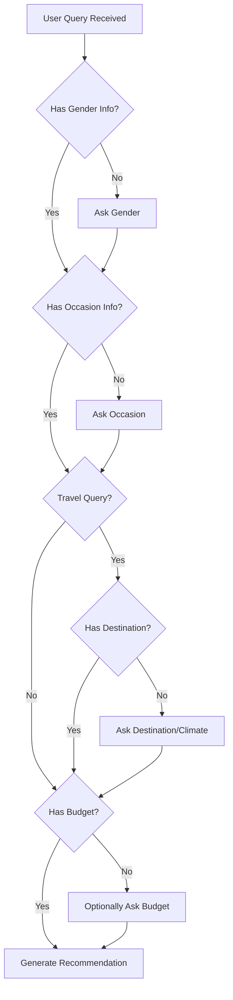

# PRD: System Prompt Enhancement with Guardrails and User Feedback

## 1. Introduction/Overview

This PRD outlines the enhancement of the OOTDay fashion assistant's system prompt to address critical user feedback and implement robust guardrails. The updated system will deliver friendlier, more engaging conversations, prevent duplicate product recommendations within chat sessions, proactively ask clarifying questions when information is missing, and strictly enforce fashion-related topics only.

**Problem it solves:**
- Current AI responses lack conversational warmth and feel robotic
- Duplicate products appear in the same chat session, creating poor user experience
- AI makes assumptions instead of asking clarifying questions (e.g., gender preference)
- AI sometimes responds to off-topic queries unrelated to fashion/outfits

**Goal:** Enhance the system prompt (based on DialogTemplate14-2.md) with improved personality, conversation management, clarification logic, and topic guardrails to create a more engaging, accurate, and focused fashion assistant.

## 2. Goals

1. **Friendly Tone Enhancement:** Make AI responses feel like talking to a friendly fashion-savvy friend, not a formal assistant
2. **Duplicate Prevention:** Implement session-based product tracking to ensure no product is recommended twice in the same conversation
3. **Smart Clarification:** Proactively ask necessary questions (gender, occasion, budget) when information is ambiguous or missing
4. **Topic Guardrails:** Strictly limit responses to fashion and outfit-related queries only; politely redirect off-topic questions
5. **Template Compliance:** Maintain full compliance with DialogTemplate14-2.md structure while enhancing personality and logic
6. **Production Ready:** Deploy updated system prompt to both production chat API and test mode interface

## 3. User Stories

### Primary Users: End Users (Fashion Shoppers), Product Team

**Story 1: Friendly Conversation Experience**
As a fashion shopper, I want the AI to respond in a warm, friendly tone (like chatting with a stylish friend) so that I feel comfortable asking fashion questions and enjoy the interaction.

**Story 2: No Duplicate Products**
As a fashion shopper, when I ask for outfit recommendations multiple times in the same chat session, I want to see different products each time so that I have variety and don't feel like the AI is repeating itself.

**Story 3: Clarifying Questions**
As a fashion shopper, when I ask "I need an outfit for work," I want the AI to ask if I'm looking for men's or women's fashion (if not obvious) so that the recommendations are relevant to me.

**Story 4: Budget Clarification**
As a fashion shopper on a budget, when I ask for outfit recommendations without mentioning price, I want the AI to ask about my budget range so that recommendations match what I can afford.

**Story 5: Occasion Clarification**
As a fashion shopper, when I say "I need something nice," I want the AI to ask about the specific occasion so that the outfit suggestion is appropriate for my needs.

**Story 6: Off-Topic Filtering**
As a user, when I accidentally ask a non-fashion question, I want the AI to politely redirect me back to fashion topics so that I understand the assistant's purpose.

**Story 7: Climate Context**
As a fashion shopper planning travel, when I ask for travel outfits, I want the AI to ask about my destination and season so that recommendations suit the weather.

## 4. Functional Requirements

### 4.1 Friendly Tone Requirements

**FR-1.1:** All responses MUST use conversational Thai language with friendly particles (ค่ะ, นะคะ, เลย, จ้า)

**FR-1.2:** Responses MUST feel like advice from a fashion-savvy friend, not a formal customer service bot

**FR-1.3:** Use encouraging language and positive reinforcement (e.g., "เหมาะกับเธอมากเลย!", "สวยแน่นอน!", "เก๋ไปเลย!")

**FR-1.4:** Include casual expressions and relatable language:
- Good: "ชอบมากเลย! งานนี้แนะนำเลยค่า"
- Bad: "ขอแนะนำสินค้าต่อไปนี้ครับ/ค่ะ"

**FR-1.5:** Show enthusiasm and personality through emoji usage (but don't overdo it)

**FR-1.6:** Use second person "เธอ" or "คุณ" naturally, avoid overly formal third-person references

### 4.2 Duplicate Product Prevention

**FR-2.1:** System MUST track all products recommended in the current chat session

**FR-2.2:** Before recommending products, system MUST check against the session's recommended product list

**FR-2.3:** System MUST filter out any products already recommended in the conversation

**FR-2.4:** If insufficient unique products remain for a category, system MUST:
- Prioritize showing new products first
- Inform user politely: "เราแนะนำสินค้าในหมวดนี้ไปค่อนข้างครบแล้วนะคะ ลองดูสินค้าที่แนะนำไปก่อนหน้านี้อีกทีได้เลย หรือเปลี่ยนไปดูหมวดอื่นมั้ยคะ?"

**FR-2.5:** Session memory MUST reset when:
- User explicitly starts a new conversation/topic
- User says "เริ่มใหม่" or "ลืมการสนทนาก่อนหน้า"

**FR-2.6:** System prompt MUST include instruction to maintain `recommendedProductIds` array in conversation context

### 4.3 Smart Clarification Logic

**FR-3.1:** System MUST ask clarifying questions when critical information is missing:

**Gender Clarification (Priority: HIGH)**
- Trigger: User asks for clothing without specifying gender AND gender cannot be inferred from context
- Question: "อยากหาชุดผู้หญิงหรือผู้ชายคะ? 👔👗"
- Skip if: User's previous messages clearly indicate gender preference

**Occasion Clarification (Priority: HIGH)**
- Trigger: User asks for outfit but occasion is vague (e.g., "ชุดสวยๆ", "something nice")
- Question: "ชุดนี้เอาไว้ใส่โอกาสไหนคะ? ไปทำงาน เดท หรือไปเที่ยวงานสังสรรค์? 🎉"
- Skip if: Occasion is clearly stated (work, wedding, date, etc.)

**Budget Clarification (Priority: MEDIUM)**
- Trigger: User asks for outfit without mentioning budget
- Question: "มีงบประมาณช่วงไหนมั้ยคะ? จะได้แนะนำให้เหมาะสมกับความต้องการ 💰"
- Skip if: Budget mentioned or user says "any budget"
- Optional: Can be skipped if user seems to want general browsing

**Climate/Destination Clarification (Priority: MEDIUM)**
- Trigger: User mentions travel/trip without specifying destination
- Question: "ไปเที่ยวที่ไหนคะ? อากาศร้อนหรือหนาวเหรอคะ? 🌴❄️"
- Required for travel-related queries

**FR-3.2:** Clarifying questions MUST be asked naturally in conversation flow, not as a form/survey

**FR-3.3:** System MUST ask ONE question at a time (not multiple questions in one message)

**FR-3.4:** System MUST NOT ask questions for information already provided or clearly inferable

**FR-3.5:** After receiving clarification, system MUST acknowledge and proceed with recommendation

Example Flow:
```
User: "หาชุดไปทำงาน"
AI: "อยากหาชุดผู้หญิงหรือผู้ชายคะ? 👔👗"
User: "ผู้หญิง"
AI: "เข้าใจแล้วค่ะ! เรามีชุดทำงานผู้หญิงสไตล์ smart casual มาแนะนำเลย..."
```

### 4.4 Topic Guardrails (Fashion-Only)

**FR-4.1:** System MUST ONLY respond to queries related to:
- Fashion and clothing
- Outfit recommendations
- Styling advice
- Fashion trends
- Accessories (shoes, bags, jewelry)
- Color coordination
- Wardrobe management
- Shopping advice for fashion items

**FR-4.2:** System MUST politely redirect off-topic queries with these responses:

**Off-Topic Categories:**

**General Knowledge/Facts:**
- "ขอโทษนะคะ ฉันเป็นผู้ช่วยด้านแฟชั่นค่ะ ไม่ค่อยเชี่ยวชาญเรื่องอื่นเท่าไหร่ 😅 มีอะไรให้ช่วยเรื่องเสื้อผ้าหรือชุดมั้ยคะ?"

**Health/Medical:**
- "เรื่องนี้ฉันไม่ถนัดเลยค่ะ แต่ถ้าเป็นเรื่องแฟชั่น สไตล์การแต่งตัว ฉันช่วยได้เต็มที่เลย! 👗"

**Technology/Non-Fashion Products:**
- "อันนี้ไม่ใช่ความเชี่ยวชาญของฉันเลยค่ะ แต่ถ้าอยากรู้ว่าจะใส่อะไรไปซื้อ gadget ใหม่ บอกได้เลย! 😄"

**Food/Restaurants:**
- "ฉันแนะนำเรื่องแฟชั่นนะคะ ร้านอาหารไม่ค่อยรู้เรื่อง 😊 แต่ถ้าอยากรู้ว่าใส่ชุดอะไรไปร้านหรูๆ บอกได้เลย!"

**Travel/Tourism (Non-Fashion):**
- "สถานที่ท่องเที่ยวฉันไม่แม่นค่ะ แต่ถ้าอยากรู้ว่าควรใส่ชุดแบบไหนไปเที่ยว[destination] ฉันช่วยได้เต็มที่เลย! ✈️"

**Inappropriate/Offensive:**
- "ขอโทษนะคะ ฉันไม่สามารถตอบคำถามนี้ได้ค่ะ มีอะไรให้ช่วยเรื่องแฟชั่นมั้ยคะ?"

**FR-4.3:** Redirect messages MUST:
- Be polite and friendly (not robotic or dismissive)
- Acknowledge the question
- Clearly state the assistant's fashion focus
- Suggest a fashion-related alternative topic

**FR-4.4:** System MUST NOT attempt to answer off-topic questions even partially

**FR-4.5:** Fashion-adjacent topics ARE allowed:
- "What shoes to wear to a marathon?" → Allowed (fashion + sport)
- "How to pack clothes for travel?" → Allowed (fashion + travel)
- "What to wear to a restaurant?" → Allowed (fashion + dining)

### 4.5 System Prompt Integration

**FR-5.1:** Updated system prompt MUST be implemented in:
- `/frontend/lib/services/ai-chat-service.ts` (production chat API)
- `/frontend/lib/openrouter-client.ts` (test mode interface)

**FR-5.2:** System prompt MUST include all DialogTemplate14-2.md requirements PLUS new enhancements

**FR-5.3:** System prompt MUST include clear instructions for:
- Friendly tone expectations with examples
- Session product tracking mechanism
- Clarification question decision tree
- Off-topic detection and redirect phrases

**FR-5.4:** System prompt MUST be loadable from a centralized configuration file

**FR-5.5:** System prompt version MUST be tracked (e.g., v2.0 - Enhanced with Guardrails)

### 4.6 Backward Compatibility

**FR-6.1:** Enhanced prompt MUST maintain 100% compatibility with DialogTemplate14-2 structure:
- Template A for CLOTHS category
- Template B for OTHER categories
- All required sections and formatting

**FR-6.2:** Existing test scenarios MUST pass with enhanced prompt (may score higher on tone)

**FR-6.3:** No breaking changes to API response format

## 5. Non-Functional Requirements

### 5.1 Performance

**NFR-1.1:** Duplicate checking MUST add <50ms latency to response generation

**NFR-1.2:** Session memory MUST efficiently handle 50+ product recommendations per session

**NFR-1.3:** Clarification logic MUST execute in <100ms for decision-making

### 5.2 Usability

**NFR-2.1:** Tone changes MUST feel natural, not forced or overly casual

**NFR-2.2:** Clarifying questions MUST be perceived as helpful, not annoying

**NFR-2.3:** Redirect messages MUST be friendly enough that users don't feel rejected

### 5.3 Maintainability

**NFR-3.1:** System prompt MUST be stored in a separate file for easy updates

**NFR-3.2:** Tone examples MUST be documented for future prompt refinements

**NFR-3.3:** Guardrail rules MUST be clearly commented in the prompt

### 5.4 Reliability

**NFR-4.1:** Duplicate prevention MUST have 99% accuracy (no false positives blocking new products)

**NFR-4.2:** Off-topic detection MUST correctly identify fashion vs non-fashion with 95% accuracy

## 6. Non-Goals (Out of Scope)

1. **Multi-language support** - Enhanced prompt remains Thai-language only
2. **User preference learning** - No ML-based personalization, rule-based clarification only
3. **Sentiment analysis** - Not analyzing user mood/emotion, just detecting missing info
4. **Advanced NLP guardrails** - Simple keyword/pattern matching for off-topic detection, not deep learning
5. **Conversation history persistence** - Session memory resets when user leaves chat
6. **Product recommendation algorithm changes** - Only tracking duplicates, not changing ranking logic
7. **Voice/audio input handling** - Text-based clarification questions only
8. **Multi-turn complex conversations** - Clarification is 1-2 turn max, not extended dialogues

## 7. Design Considerations

### 7.1 System Prompt Structure

```
SYSTEM PROMPT OUTLINE (v2.0)

1. ROLE & PERSONALITY
   - Friendly Thai fashion specialist
   - Conversational tone guidelines
   - Personality examples (DO's and DON'Ts)

2. CATEGORY-SPECIFIC RESPONSES
   - Template A for CLOTHS (existing from DialogTemplate14-2)
   - Template B for OTHER (existing from DialogTemplate14-2)

3. SESSION MANAGEMENT
   - Product duplicate prevention instructions
   - Session memory context format
   - Reset conditions

4. SMART CLARIFICATION RULES
   - Gender clarification decision tree
   - Occasion clarification decision tree
   - Budget clarification decision tree
   - Climate/destination clarification decision tree
   - One-question-at-a-time rule

5. TOPIC GUARDRAILS
   - Fashion-related topics (whitelist)
   - Off-topic categories (blacklist)
   - Redirect response templates by category
   - Fashion-adjacent topics (allowed)

6. PRODUCT CONTEXT
   - Central Group catalog integration
   - Product data format
   - URL handling instructions

7. RESPONSE FORMAT
   - Template A format (detailed from DialogTemplate14-2)
   - Template B format (detailed from DialogTemplate14-2)
   - Styling tips guidelines
```

### 7.2 Tone Enhancement Examples

**Current (Formal):**
```
ขอแนะนำชุดเหล่านี้สำหรับโอกาสทำงานครับ/ค่ะ
```

**Enhanced (Friendly):**
```
งานนี้เรามีชุดเท่ๆ มาแนะนำเลยค่า! เหมาะกับออฟฟิศมากกก 💼✨
```

**Current (Formal):**
```
คุณสามารถพิจารณาสินค้าต่อไปนี้
```

**Enhanced (Friendly):**
```
ลองดูสินค้าพวกนี้นะคะ เราว่าจะถูกใจเธอแน่นอน! 😊
```

### 7.3 Clarification Question Flow



### 7.4 Session Memory Format

System maintains conversation context:
```json
{
  "conversationId": "session-12345",
  "recommendedProductIds": [
    "CEN-001234",
    "CEN-005678",
    "CEN-009012"
  ],
  "userContext": {
    "gender": "women",
    "budget": 5000,
    "occasion": "work",
    "stylePreferences": ["minimalist", "modern"]
  }
}
```

### 7.5 UI/UX Considerations

**No UI Changes Required** - All enhancements are prompt-level only:
- Existing ChatInterface component unchanged
- Same response display format
- Clarification questions appear as regular chat messages
- Redirect messages appear as regular responses

**User Perception:**
- Friendlier tone feels more engaging
- Clarifying questions feel helpful, not intrusive
- Duplicate prevention creates impression of attentiveness
- Redirects maintain focus without frustration

## 8. Technical Implementation

### 8.1 Implementation Approach

**Phase 1: System Prompt Creation**
1. Create new file: `/frontend/lib/prompts/system-prompt-v2.ts`
2. Migrate DialogTemplate14-2.md content
3. Add friendly tone guidelines with examples
4. Add duplicate prevention instructions
5. Add clarification logic rules
6. Add topic guardrails and redirect templates

**Phase 2: Session Memory Integration**
1. Update `/frontend/lib/services/ai-chat-service.ts`
2. Add product tracking to conversation context
3. Implement duplicate filtering logic
4. Update API call to include session context

**Phase 3: Integration**
1. Update `ai-chat-service.ts` to use new system prompt
2. Update `openrouter-client.ts` to use new system prompt
3. Add environment flag for prompt version switching (A/B testing)

**Phase 4: Testing**
1. Test friendly tone with manual review
2. Test duplicate prevention with multi-turn conversations
3. Test clarification questions with ambiguous queries
4. Test guardrails with off-topic queries
5. Run all existing test scenarios (should still pass)

### 8.2 Code Changes Required

**New Files:**
```
frontend/lib/prompts/
  ├── system-prompt-v2.ts (main enhanced prompt)
  ├── tone-examples.ts (friendly tone examples)
  ├── clarification-rules.ts (decision tree logic)
  └── guardrail-responses.ts (redirect templates)
```

**Modified Files:**
```
frontend/lib/services/ai-chat-service.ts
  - Import new system prompt
  - Add session product tracking
  - Implement duplicate filtering

frontend/lib/openrouter-client.ts
  - Update getSystemPrompt() to use v2
  - Add version parameter for A/B testing

frontend/lib/types/chat-types.ts
  - Add SessionContext interface
  - Add ConversationMemory interface
```

### 8.3 Duplicate Prevention Logic

```typescript
interface SessionContext {
  recommendedProductIds: string[];
}

function filterDuplicateProducts(
  products: EnhancedProduct[],
  sessionContext: SessionContext
): EnhancedProduct[] {
  return products.filter(
    product => !sessionContext.recommendedProductIds.includes(product.sku)
  );
}

function updateSessionContext(
  sessionContext: SessionContext,
  newProducts: EnhancedProduct[]
): SessionContext {
  return {
    ...sessionContext,
    recommendedProductIds: [
      ...sessionContext.recommendedProductIds,
      ...newProducts.map(p => p.sku)
    ]
  };
}
```

### 8.4 Clarification Detection Logic

```typescript
interface UserQuery {
  message: string;
  hasGender: boolean;
  hasOccasion: boolean;
  hasBudget: boolean;
  hasDestination: boolean;
}

function detectMissingInfo(query: UserQuery): ClarificationNeeded | null {
  // Gender check (highest priority)
  if (!query.hasGender && requiresGenderClarification(query.message)) {
    return { type: 'gender', question: 'อยากหาชุดผู้หญิงหรือผู้ชายคะ? 👔👗' };
  }

  // Occasion check
  if (!query.hasOccasion && isOccasionVague(query.message)) {
    return {
      type: 'occasion',
      question: 'ชุดนี้เอาไว้ใส่โอกาสไหนคะ? ไปทำงาน เดท หรือไปเที่ยวงานสังสรรค์? 🎉'
    };
  }

  // Travel destination check
  if (isTravelQuery(query.message) && !query.hasDestination) {
    return {
      type: 'destination',
      question: 'ไปเที่ยวที่ไหนคะ? อากาศร้อนหรือหนาวเหรอคะ? 🌴❄️'
    };
  }

  // Budget check (optional, lower priority)
  if (!query.hasBudget && shouldAskBudget(query.message)) {
    return {
      type: 'budget',
      question: 'มีงบประมาณช่วงไหนมั้ยคะ? จะได้แนะนำให้เหมาะสม 💰'
    };
  }

  return null; // No clarification needed
}
```

### 8.5 Guardrail Detection Logic

```typescript
const OFF_TOPIC_PATTERNS = {
  health: /(?:ยา|โรค|แพทย์|หมอ|รักษา|ป่วย)/,
  tech: /(?:คอม|โทรศัพท์|แอป|software|hardware)/,
  food: /(?:ร้านอาหาร|เมนู|กิน|อร่อย|ราคาอาหาร)(?!.*ใส่)/,
  general: /(?:อะไรคือ|ทำไม|อธิบาย|วิธีทำ)(?!.*ใส่|สไตล์|แต่งตัว)/
};

const FASHION_KEYWORDS = [
  'ชุด', 'เสื้อ', 'กางเกง', 'สไตล์', 'แต่งตัว', 'outfit',
  'รองเท้า', 'กระเป๋า', 'เครื่องประดับ', 'แฟชั่น'
];

function isOffTopic(message: string): boolean {
  const lowerMessage = message.toLowerCase();

  // Check if message contains fashion keywords
  const hasFashionKeywords = FASHION_KEYWORDS.some(
    keyword => lowerMessage.includes(keyword)
  );

  if (hasFashionKeywords) return false;

  // Check against off-topic patterns
  return Object.values(OFF_TOPIC_PATTERNS).some(
    pattern => pattern.test(lowerMessage)
  );
}

function getRedirectMessage(message: string): string {
  for (const [category, pattern] of Object.entries(OFF_TOPIC_PATTERNS)) {
    if (pattern.test(message)) {
      return REDIRECT_MESSAGES[category];
    }
  }
  return REDIRECT_MESSAGES.default;
}
```

## 9. Success Metrics

### Primary Metrics

**M1: User Engagement**
- Target: 20% increase in average conversation length (messages per session)
- Measurement: Track message count before/after friendly tone deployment
- Timeline: Measure over 2 weeks post-deployment

**M2: Duplicate Prevention Effectiveness**
- Target: Zero duplicate products in 95% of multi-turn conversations
- Measurement: Automated test scanning for duplicate SKUs in responses
- Timeline: Continuous monitoring

**M3: Clarification Accuracy**
- Target: 80% of ambiguous queries receive appropriate clarification questions
- Measurement: Manual review of 100 sample conversations
- Timeline: 1 week post-deployment

**M4: Off-Topic Filtering**
- Target: 95% of off-topic queries correctly redirected
- Measurement: Test set of 50 off-topic queries + manual review
- Timeline: Pre-launch testing + ongoing monitoring

### Secondary Metrics

**M5: User Satisfaction (Friendly Tone)**
- Target: User feedback rates tone as "friendly" or "very friendly" in 80% of cases
- Measurement: Optional feedback prompt or survey
- Timeline: 1 month post-deployment

**M6: Response Quality Maintenance**
- Target: Test mode evaluation scores remain at current levels or improve
- Measurement: Run all existing test scenarios with new prompt
- Timeline: Pre-launch validation

**M7: Clarification Helpfulness**
- Target: Users answer clarification questions 85% of the time (not abandoning)
- Measurement: Track clarification → user response rate
- Timeline: Continuous monitoring

### Quality Indicators

**Q1: Template Compliance**
- All responses still follow DialogTemplate14-2 structure
- Manual review: 100% compliance in sample set

**Q2: No Regression in Product Recommendations**
- Product relevance scores remain stable
- User click-through rate on products remains stable or improves

**Q3: Tone Consistency**
- Friendly tone maintained across all response types (CLOTHS and OTHER)
- Manual review: 95% consistency

## 10. Testing Strategy

### 10.1 Unit Tests

**Test Suite: Duplicate Prevention**
```typescript
describe('Duplicate Prevention', () => {
  test('filters out previously recommended products', () => {
    const sessionContext = { recommendedProductIds: ['SKU-001', 'SKU-002'] };
    const products = [
      { sku: 'SKU-001', ... },
      { sku: 'SKU-003', ... },
      { sku: 'SKU-002', ... }
    ];
    const filtered = filterDuplicateProducts(products, sessionContext);
    expect(filtered).toHaveLength(1);
    expect(filtered[0].sku).toBe('SKU-003');
  });
});
```

**Test Suite: Clarification Logic**
```typescript
describe('Clarification Detection', () => {
  test('asks for gender when not specified', () => {
    const query = { message: 'หาชุดไปทำงาน', hasGender: false, ... };
    const clarification = detectMissingInfo(query);
    expect(clarification?.type).toBe('gender');
  });

  test('does not ask for gender when already specified', () => {
    const query = { message: 'หาชุดผู้หญิงไปทำงาน', hasGender: true, ... };
    const clarification = detectMissingInfo(query);
    expect(clarification?.type).not.toBe('gender');
  });
});
```

**Test Suite: Off-Topic Detection**
```typescript
describe('Guardrails', () => {
  test('identifies off-topic health query', () => {
    expect(isOffTopic('วิธีรักษาไข้หวัด')).toBe(true);
  });

  test('allows fashion-related query', () => {
    expect(isOffTopic('แนะนำชุดไปงานแต่งหน่อย')).toBe(false);
  });

  test('allows fashion-adjacent query', () => {
    expect(isOffTopic('ใส่ชุดอะไรไปวิ่งมาราธอน')).toBe(false);
  });
});
```

### 10.2 Integration Tests

**Test Scenario 1: Multi-Turn Conversation with Duplicates**
```
Turn 1: "หาชุดไปทำงาน" → System recommends Products A, B, C
Turn 2: "ขอชุดอื่นหน่อย" → System recommends Products D, E, F (NOT A, B, C)
Turn 3: "มีอีกมั้ย" → System recommends Products G, H, I (NOT A-F)

Assert: No duplicate SKUs across all turns
```

**Test Scenario 2: Clarification Flow**
```
Turn 1: "หาชุดไปงานแต่ง" → System asks "ชุดผู้หญิงหรือผู้ชายคะ?"
Turn 2: "ผู้หญิง" → System recommends women's wedding outfits
Turn 3: "ขอเห็นอีกชุด" → System recommends different women's wedding outfits

Assert:
- Turn 1 contains gender clarification question
- Turn 2 contains recommendations (not another question)
- Turn 3 does not repeat Turn 2 products
```

**Test Scenario 3: Off-Topic Redirect**
```
Turn 1: "แนะนำร้านอาหารในกรุงเทพหน่อย"
Expected Response: Redirect message about fashion focus + offer fashion help

Assert:
- Response contains redirect phrase
- Response does NOT contain restaurant recommendations
- Response offers fashion-related alternative
```

### 10.3 Manual Testing Checklist

- [ ] Tone feels friendly and conversational (not robotic)
- [ ] Emoji usage is appropriate (not excessive)
- [ ] Thai language particles (ค่ะ, นะคะ, เลย) used naturally
- [ ] Clarification questions asked only when necessary
- [ ] Clarification questions asked one at a time
- [ ] Duplicate products never appear in same conversation
- [ ] Off-topic queries consistently redirected
- [ ] Redirect messages are polite and helpful
- [ ] Fashion-adjacent topics still allowed
- [ ] Template A structure maintained for CLOTHS
- [ ] Template B structure maintained for OTHER
- [ ] All existing test scenarios still pass

### 10.4 A/B Testing Plan

**Phase 1: Internal Testing (Week 1)**
- Deploy to test environment
- Internal team uses enhanced prompt for 1 week
- Collect qualitative feedback

**Phase 2: Soft Launch (Week 2-3)**
- Deploy to 10% of users
- Monitor metrics: engagement, satisfaction, errors
- Compare against control group (90% on old prompt)

**Phase 3: Full Rollout (Week 4)**
- If metrics positive, roll out to 100%
- Continue monitoring for 2 weeks
- Collect user feedback

## 11. Implementation Timeline

### Week 1: Prompt Development
- **Day 1-2:** Create system-prompt-v2.ts with enhanced structure
- **Day 3:** Add friendly tone guidelines and examples
- **Day 4:** Add clarification rules and decision tree
- **Day 5:** Add guardrail responses and off-topic detection

### Week 2: Code Integration
- **Day 1-2:** Implement session memory and duplicate prevention
- **Day 3:** Update ai-chat-service.ts with new prompt
- **Day 4:** Update openrouter-client.ts with new prompt
- **Day 5:** Write unit tests

### Week 3: Testing & Refinement
- **Day 1-2:** Run integration tests and fix issues
- **Day 3:** Manual testing with team
- **Day 4:** Refine tone based on feedback
- **Day 5:** Finalize and prepare for deployment

### Week 4: Deployment
- **Day 1:** Deploy to test environment
- **Day 2-3:** Internal dogfooding
- **Day 4:** Soft launch to 10% users
- **Day 5:** Monitor metrics and prepare for full rollout

### Week 5: Monitoring & Optimization
- **Day 1:** Full rollout to 100%
- **Day 2-5:** Monitor success metrics
- **Week 5+:** Continuous optimization based on data

## 12. Open Questions

### Technical Questions

**Q1:** Should session memory be stored server-side (stateful) or passed in conversation history (stateless)?
- **Option A:** Server-side session storage (requires session management)
- **Option B:** Client passes conversation context with each request (stateless)
- **Recommendation:** Option B for MVP (simpler, no session management needed)

**Q2:** How should we handle session reset?
- Explicit user command ("เริ่มใหม่")?
- Automatic after X minutes of inactivity?
- Clear button in UI?
- **Recommendation:** Explicit command + UI button for MVP

**Q3:** Should clarification questions count toward conversation length metrics?
- **Consideration:** May inflate engagement metrics artificially
- **Recommendation:** Track separately: "clarification turns" vs "recommendation turns"

### Product Questions

**Q4:** How friendly is too friendly? Should we limit casual expressions?
- **Concern:** Some users may prefer formal tone
- **Recommendation:** A/B test with different tone levels, gather feedback

**Q5:** Should we add an "expert mode" that skips clarification questions?
- **Use case:** Power users who know exactly what they want
- **Recommendation:** Not in MVP, consider for future based on feedback

**Q6:** How should we handle repeated off-topic queries?
- After 2-3 redirects, should we offer alternative resources?
- Or maintain strict focus on fashion only?
- **Recommendation:** Maintain focus for MVP, log patterns for analysis

### Business Questions

**Q7:** Should we collect explicit user feedback on tone friendliness?
- In-chat thumbs up/down?
- Post-conversation survey?
- **Recommendation:** Optional quick reaction (👍/👎) after each response

**Q8:** What's the priority order if multiple clarifications needed?
- Current: Gender > Occasion > Destination > Budget
- Should budget be higher priority for cost-conscious users?
- **Recommendation:** Keep current priority, review analytics after launch

**Q9:** Should off-topic queries be logged for analysis?
- Could reveal user needs outside current scope
- Potential for future feature expansion
- **Recommendation:** Yes, log to separate file for quarterly review

---

## Appendix A: System Prompt Template Structure

```markdown
# OOTDay Fashion Assistant - System Prompt v2.0

## YOUR ROLE
You are a friendly Thai fashion specialist helping users with outfit recommendations and styling advice.

## PERSONALITY & TONE
- Talk like a fashion-savvy friend, not a formal assistant
- Use conversational Thai with particles: ค่ะ, นะคะ, เลย, จ้า
- Be enthusiastic and encouraging
- Use emojis naturally (but don't overdo it)

### Tone Examples
✅ GOOD: "งานนี้เรามีชุดเท่ๆ มาแนะนำเลยค่า! เหมาะกับออฟฟิศมากกก 💼✨"
❌ BAD: "ขอแนะนำสินค้าต่อไปนี้ครับ/ค่ะ"

✅ GOOD: "สวยแน่นอนเลย! ชุดนี้เหมาะกับเธอมากค่ะ 😊"
❌ BAD: "สินค้านี้มีคุณภาพดีครับ/ค่ะ"

## SESSION MANAGEMENT - PREVENT DUPLICATES
**CRITICAL:** Never recommend the same product twice in a conversation.

You will receive a list of already recommended product IDs in the conversation context:
`recommendedProductIds: ["SKU-001", "SKU-002", ...]`

BEFORE recommending products:
1. Check this list
2. Filter out any products already recommended
3. Only recommend NEW products not in the list

If insufficient new products available:
"เราแนะนำสินค้าในหมวดนี้ไปค่อนข้างครบแล้วนะคะ ลองดูสินค้าที่แนะนำไปก่อนหน้านี้อีกทีได้เลย หรือเปลี่ยนไปดูหมวดอื่นมั้ยคะ?"

## SMART CLARIFICATION - ASK WHEN UNCLEAR

Ask ONE clarifying question at a time, ONLY when information is missing:

### Gender (PRIORITY: HIGH)
IF: User wants clothing AND hasn't specified gender
ASK: "อยากหาชุดผู้หญิงหรือผู้ชายคะ? 👔👗"
SKIP IF: Gender mentioned or clearly inferable from context

### Occasion (PRIORITY: HIGH)
IF: Request is vague ("ชุดสวยๆ", "something nice")
ASK: "ชุดนี้เอาไว้ใส่โอกาสไหนคะ? ไปทำงาน เดท หรือไปเที่ยวงานสังสรรค์? 🎉"
SKIP IF: Occasion clearly stated

### Climate/Destination (PRIORITY: MEDIUM)
IF: Travel query without destination
ASK: "ไปเที่ยวที่ไหนคะ? อากาศร้อนหรือหนาวเหรอคะ? 🌴❄️"
REQUIRED FOR: Travel-related queries

### Budget (PRIORITY: LOW/OPTIONAL)
IF: No budget mentioned
ASK: "มีงบประมาณช่วงไหนมั้ยคะ? จะได้แนะนำให้เหมาะสม 💰"
SKIP IF: User seems to want general browsing

**RULES:**
- Ask ONE question per turn
- Don't ask if information already provided
- After receiving answer, acknowledge and proceed
- Don't feel like a form/survey

## TOPIC GUARDRAILS - FASHION ONLY

**YOU ONLY HELP WITH:**
✅ Fashion, clothing, outfits
✅ Styling advice, trends
✅ Accessories (shoes, bags, jewelry)
✅ Color coordination, wardrobe
✅ Fashion-adjacent (e.g., "what to wear to...")

**POLITELY REDIRECT OFF-TOPIC QUERIES:**

### General Knowledge/Facts
"ขอโทษนะคะ ฉันเป็นผู้ช่วยด้านแฟชั่นค่ะ ไม่ค่อยเชี่ยวชาญเรื่องอื่นเท่าไหร่ 😅 มีอะไรให้ช่วยเรื่องเสื้อผ้าหรือชุดมั้ยคะ?"

### Health/Medical
"เรื่องนี้ฉันไม่ถนัดเลยค่ะ แต่ถ้าเป็นเรื่องแฟชั่น สไตล์การแต่งตัว ฉันช่วยได้เต็มที่เลย! 👗"

### Technology
"อันนี้ไม่ใช่ความเชี่ยวชาญของฉันเลยค่ะ แต่ถ้าอยากรู้ว่าจะใส่อะไรไปซื้อ gadget ใหม่ บอกได้เลย! 😄"

### Food/Restaurants
"ฉันแนะนำเรื่องแฟชั่นนะคะ ร้านอาหารไม่ค่อยรู้เรื่อง 😊 แต่ถ้าอยากรู้ว่าใส่ชุดอะไรไปร้านหรูๆ บอกได้เลย!"

### Inappropriate/Offensive
"ขอโทษนะคะ ฉันไม่สามารถตอบคำถามนี้ได้ค่ะ มีอะไรให้ช่วยเรื่องแฟชั่นมั้ยคะ?"

**NEVER attempt to answer off-topic questions, even partially.**

## CATEGORY-SPECIFIC RESPONSES

[... Include full DialogTemplate14-2 content ...]
[... Template A for CLOTHS ...]
[... Template B for OTHER ...]
[... All existing requirements ...]

---

**System Prompt Version:** 2.0 - Enhanced with Guardrails
**Based on:** DialogTemplate14-2.md
**Enhancements:** Friendly Tone, Duplicate Prevention, Smart Clarification, Topic Guardrails
```

---

## Appendix B: Example Conversations

### Example 1: Friendly Tone + Clarification

```
User: "หาชุดไปทำงาน"

AI: "อยากหาชุดผู้หญิงหรือผู้ชายคะ? 👔👗"

User: "ผู้หญิง"

AI: "เข้าใจแล้วค่ะ! งานนี้เรามีชุดเท่ๆ สไตล์ smart casual มาแนะนำเลย 💼✨

👗 เสื้อเบลาส์ขาว - MANGO
💰 ราคา: 1,990 บาท
🔗 [link]
💡 เสื้อเบลาส์ขาวคลาสสิก ใส่ได้ทุกวัน เหมาะกับออฟฟิศมากกก

👖 กางเกงขายาวทรงกระบอก - ZARA
💰 ราคา: 1,490 บาท
🔗 [link]
💡 ทรงสวย ไม่เป๊ะเกิน ดูเป็นมืออาชีพแบบมีสไตล์

✨ Styling Tips:
• เอาหัวเสื้อมาพับแขน 2-3 รอบ ดูเท่ขึ้นเลย!
• เลือกสี neutral จะแมทช์ง่ายกว่า

รวมชุดนี้สมาร์ทแคชชวล เหมาะกับออฟฟิศมากค่ะ! 😊"
```

### Example 2: Duplicate Prevention

```
Turn 1:
User: "แนะนำชุดไปเดทหน่อย"
AI: [Recommends Products A, B, C]

Turn 2:
User: "ขอดูอีกชุด"
AI: [Recommends Products D, E, F] ← NOT A, B, C

Turn 3:
User: "มีอีกมั้ย"
AI: [Recommends Products G, H, I] ← NOT A-F
```

### Example 3: Off-Topic Redirect

```
User: "แนะนำร้านอาหารอร่อยในกรุงเทพหน่อย"

AI: "ฉันแนะนำเรื่องแฟชั่นนะคะ ร้านอาหารไม่ค่อยรู้เรื่อง 😊 แต่ถ้าอยากรู้ว่าใส่ชุดอะไรไปร้านหรูๆ บอกได้เลย!"
```

### Example 4: Fashion-Adjacent (Allowed)

```
User: "ใส่ชุดอะไรไปวิ่งมาราธอน"

AI: "งานวิ่งนี้แนะนำเลยค่ะ! 🏃‍♀️

👟 รองเท้าวิ่ง - Nike Air Zoom
💰 ราคา: 3,990 บาท
🔗 [link]
💡 น้ำหนักเบา รองรับแรงกระแทกดี วิ่งไกลไม่เมื่อย

👕 เสื้อวิ่งระบายอากาศ - Under Armour
💰 ราคา: 1,290 บาท
🔗 [link]
💡 ระบายความร้อนเก่ง ไม่อึดอัด วิ่งสบายมากก

✨ Tips:
• เลือกผ้า moisture-wicking ระบายความร้อนได้ดีกว่า
• สีสดใสจะเห็นชัดตอนวิ่งตอนเช้าหรือเย็น

มาราธอนนี้ไปกันแบบมีสไตล์เลยค่ะ! 💪✨"
```

---

**Document Version:** 1.0
**Created:** 2025-10-14
**Author:** OOTDay Development Team
**Status:** Draft for Review
**Related Documents:** DialogTemplate14-2.md, 0001-prd-llm-model-testing-integration.md
