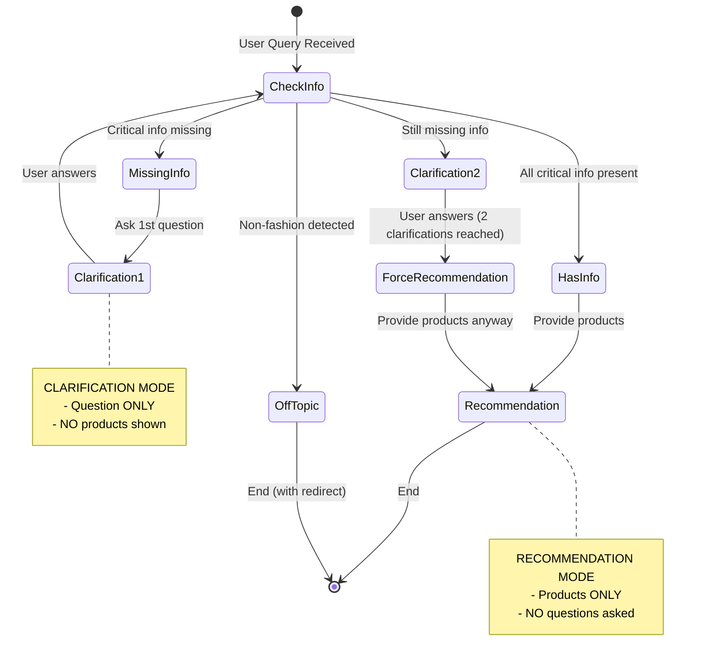

# PRD: System Prompt v3.0 - Clarification Flow Fix

## Document Information
- **PRD Number**: 0007
- **Version**: 1.0
- **Created**: 2025-10-15
- **Author**: OOTDay Development Team
- **Status**: Draft for Review
- **Related Documents**:
  - DialogTemplate14-2.md
  - 0006-prd-system-prompt-enhancement-guardrails.md
  - system-prompt-v2.ts (current implementation)

---

## 1. Introduction/Overview

This PRD addresses a critical conversation flow issue in System Prompt v2.1 where the AI asks clarifying questions **AFTER** providing product recommendations, creating frustrating loops and degrading user experience. The issue manifests as:
- AI recommends products first, then asks for missing information
- AI repeats the same clarification question multiple times
- AI fails to recognize when user has already answered a question
- Creates unnecessary back-and-forth instead of efficient recommendations

**Problem it solves:**
Current v2.1 has loop prevention rules (MAX 2 clarifications) but doesn't enforce the **SEQUENCE** of operations. The AI can provide recommendations AND ask clarifications in the same response, or ask clarifications after recommendations, leading to confusion.

**Goal:** Create System Prompt v3.0 with strict conversation flow enforcement:
1. **CLARIFY FIRST**: If info is missing → Ask clarification questions ONLY
2. **RECOMMEND SECOND**: After sufficient info → Provide product recommendations ONLY
3. **NEVER MIX**: Don't combine recommendations + clarifications in one response

---

## 2. Goals

### Primary Goals

**G1: Strict Flow Enforcement**
- Implement binary decision: EITHER clarify OR recommend (never both)
- Ensure clarifications always come BEFORE recommendations
- Eliminate recommendations followed by clarification questions

**G2: One-Shot Completion**
- After gathering sufficient info (max 2 clarifications), provide complete recommendations
- No follow-up questions after recommendations are given
- Recommendations are final and comprehensive

**G3: Memory & Context Awareness**
- Track what information has already been asked
- Recognize when user has provided answers
- Never ask the same question twice in one conversation

**G4: Backward Compatibility**
- Maintain all v2.1 features (friendly tone, duplicate prevention, topic guardrails)
- Keep DialogTemplate14-2 compliance
- No breaking changes to API response format

### Secondary Goals

**G5: Improved User Experience**
- Reduce conversation turns needed to get recommendations
- Make clarification flow feel natural and efficient
- Increase user satisfaction with response relevance

**G6: Measurable Improvements**
- Reduce average turns-to-recommendation by 30%
- Eliminate 100% of post-recommendation clarification loops
- Maintain or improve recommendation quality scores

---

## 3. User Stories

### Critical User Story (Addresses Screenshot Issue)

**Story 1: No Post-Recommendation Clarifications**
```
As a fashion shopper,
When I receive outfit recommendations from the AI,
Then I should NOT be asked clarifying questions afterward,
So that I can directly evaluate and choose products without confusion.

Acceptance Criteria:
✅ AI asks clarification questions BEFORE providing any recommendations
✅ Once recommendations are shown, no further clarifications asked
✅ User can request "more options" without being re-questioned
❌ AI never provides recommendations then asks "what gender?"
❌ AI never asks the same question multiple times
```

**Current (v2.1) - BROKEN:**
```
User: "งานบวช"
AI: "สวัสดีค่า! 🎉 งานบวชนี่งานดีมาก... [shows products]
     อยากหาชุดสำหรับผู้หญิงหรือผู้ชายคะ? 👔👗"  ← WRONG! Asked after showing products
```

**Expected (v3.0) - CORRECT:**
```
User: "งานบวช"
AI: "อยากหาชุดสำหรับผู้หญิงหรือผู้ชายคะ? 👔👗"  ← CORRECT! Ask first

User: "ผู้ชาย"
AI: "เข้าใจแล้วค่ะ! งานบวชนี้เรามีชุดไทยสำหรับผู้ชายมาแนะนำเลย 🙏
     [complete product recommendations]"  ← CORRECT! Recommend after clarification
```

### Additional User Stories

**Story 2: Efficient Information Gathering**
```
As a fashion shopper with a clear request,
When I provide sufficient information upfront,
Then I should receive recommendations immediately without clarification questions,
So that I don't waste time answering unnecessary questions.

Example:
User: "หาชุดผู้หญิงไปงานแต่งงาน งบ 5000"
AI: [Provides recommendations immediately, no questions needed]
```

**Story 3: Smart Context Tracking**
```
As a fashion shopper in a multi-turn conversation,
When I answer a clarification question,
Then the AI should remember my answer and never ask again,
So that the conversation feels intelligent and respectful of my time.

Example:
User: "หาชุดไปทำงาน"
AI: "ผู้หญิงหรือผู้ชายคะ?"
User: "ผู้หญิง"
AI: [Provides women's work outfits]
User: "มีอื่นมั้ย"
AI: [Provides different women's work outfits] ← Remembers "ผู้หญิง", doesn't ask again
```

**Story 4: Maximum 2 Clarifications Before Forcing Recommendations**
```
As a fashion shopper with vague requirements,
When the AI needs to clarify multiple things,
Then it should ask maximum 2 questions then provide recommendations anyway,
So that I get results even if my request is unclear.

Example:
User: "หาชุด"
AI: "ผู้หญิงหรือผู้ชายคะ?" [Clarification 1]
User: "ผู้หญิง"
AI: "ใส่โอกาสไหนคะ? ทำงาน เดท หรือเที่ยว?" [Clarification 2]
User: "ทำไปเลย"
AI: [Provides varied recommendations covering multiple styles] ← Forces recommendation after 2 clarifications
```

---

## 4. Functional Requirements

### 4.1 Conversation State Machine (NEW - Core Fix)

**FR-1.1: Binary Decision Enforcement**

The AI MUST operate in one of three exclusive states per response:

**STATE 1: CLARIFICATION MODE** ✋
- **Trigger**: Missing critical information (gender, occasion, etc.)
- **Action**: Ask ONE clarifying question
- **Output**: Question ONLY, NO product recommendations
- **Restrictions**:
  - ❌ Cannot show products in this state
  - ❌ Cannot provide styling tips
  - ✅ Can acknowledge previous messages
  - ✅ Can be friendly and conversational

**STATE 2: RECOMMENDATION MODE** 👗
- **Trigger**: Sufficient information collected OR 2 clarifications already asked
- **Action**: Provide complete outfit recommendations
- **Output**: Product recommendations ONLY, NO questions
- **Restrictions**:
  - ❌ Cannot ask clarifying questions
  - ❌ Cannot ask confirmation questions
  - ✅ Can provide styling tips
  - ✅ Can offer to show more options

**STATE 3: REDIRECT MODE** 🛡️
- **Trigger**: Off-topic query detected
- **Action**: Politely redirect to fashion topics
- **Output**: Redirect message ONLY
- **Restrictions**:
  - ❌ Cannot show products
  - ❌ Cannot ask questions
  - ✅ Can suggest fashion-related alternatives

**FR-1.2: State Transition Rules**



**FR-1.3: Clarification Counter**

System MUST track clarification count in conversation context:
```typescript
interface ConversationState {
  clarificationsAsked: number; // Max value: 2
  clarificationsTypes: ('gender' | 'occasion' | 'destination' | 'budget')[]; // Track what was asked
  hasProvidedRecommendations: boolean; // Once true, no more clarifications allowed
}
```

**Rules:**
- Counter increments each time AI asks a clarifying question
- When counter reaches 2, next response MUST be RECOMMENDATION MODE
- Once `hasProvidedRecommendations = true`, AI cannot enter CLARIFICATION MODE again
- Counter resets only when user starts a new topic/conversation

**FR-1.4: Post-Recommendation Lockout (NEW - Critical)**

Once AI has provided product recommendations in a conversation:
- **MUST NOT** ask any clarifying questions
- **MUST NOT** ask "do you want to see more?"
- **MUST** directly provide alternative recommendations if user asks for more
- **MUST** maintain the same context (gender, occasion, etc.) from previous recommendations

Example:
```
User: "หาชุดไปทำงาน"
AI: "ผู้หญิงหรือผู้ชายคะ?" [Clarification 1, hasProvidedRecommendations=false]

User: "ผู้หญิง"
AI: [Shows 3-5 products] [hasProvidedRecommendations=true, LOCKOUT ACTIVATED]

User: "มีอื่นมั้ย"
AI: [Shows different products immediately] ← NO questions asked, remembers "ผู้หญิง"
```

### 4.2 Critical Information Detection (Enhanced)

**FR-2.1: Pre-Response Information Check**

Before generating ANY response, AI MUST check conversation context for:

```typescript
interface RequiredInfo {
  // Critical for CLOTHS category
  gender?: 'men' | 'women' | 'unisex';
  occasion?: string; // work, wedding, date, party, travel, etc.

  // Important for specific contexts
  destination?: string; // Required if travel-related
  climate?: 'tropical' | 'cold' | 'temperate';

  // Optional
  budget?: number;
  style?: string[];
}

interface InformationStatus {
  hasCriticalInfo: boolean; // gender + occasion for CLOTHS
  missingCritical: string[]; // List of missing critical fields
  clarificationsAsked: number;
  canRecommend: boolean; // True if hasCriticalInfo OR clarificationsAsked >= 2
}
```

**FR-2.2: Decision Logic**

```typescript
function decideResponseMode(info: InformationStatus): ResponseMode {
  // Off-topic check first
  if (isOffTopic(userMessage)) {
    return 'REDIRECT';
  }

  // Check if recommendations already provided
  if (conversationState.hasProvidedRecommendations) {
    return 'RECOMMENDATION'; // Always recommend, never ask again
  }

  // Check clarification limit
  if (info.clarificationsAsked >= 2) {
    return 'RECOMMENDATION'; // Force recommendation after 2 clarifications
  }

  // Check if critical info present
  if (info.hasCriticalInfo) {
    return 'RECOMMENDATION'; // Have enough info, recommend
  }

  // Missing critical info and haven't asked 2 questions yet
  if (info.missingCritical.length > 0) {
    return 'CLARIFICATION'; // Ask ONE question
  }

  // Default to recommendation
  return 'RECOMMENDATION';
}
```

**FR-2.3: Gender Detection Enhancement**

Improve gender detection from context:
- Keywords: "ผู้หญิง", "ผู้ชาย", "men", "women", "สำหรับผู้ชาย", etc.
- Previous conversation history
- User profile (if available)

If detected, MUST NOT ask for gender again.

**FR-2.4: Occasion Detection Enhancement**

Improve occasion detection:
- Explicit: "ไปทำงาน", "งานแต่ง", "ไปเดท", etc.
- Implicit from location: "ไปออฟฟิศ" → work, "ไปงานบวช" → ceremony
- Context clues: "formal", "casual", "sport"

If clearly stated, MUST NOT ask for occasion again.

### 4.3 Response Generation Rules (Strict Enforcement)

**FR-3.1: Clarification Mode Response Format**

When in CLARIFICATION MODE, response MUST follow this exact structure:

```
[Optional: Brief acknowledgment of user's message]
[ONE clarifying question with friendly tone]
[Optional: Context-setting emoji]

❌ NO product recommendations
❌ NO product mentions
❌ NO styling tips
❌ NO "while you decide, here are some options..."
```

**Example:**
```
✅ CORRECT:
"เข้าใจค่ะ! งานบวชนี้เป็นงานพิเศษเลยนะ 🙏
อยากหาชุดสำหรับผู้หญิงหรือผู้ชายคะ? 👔👗"

❌ WRONG (mixing modes):
"เข้าใจค่ะ! งานบวชนี้เรามีชุดไทยสวยๆ มาแนะนำเลย...
[shows products]
อยากหาชุดสำหรับผู้หญิงหรือผู้ชายคะ? 👔👗"
```

**FR-3.2: Recommendation Mode Response Format**

When in RECOMMENDATION MODE, response MUST follow this exact structure:

```
[Friendly acknowledgment incorporating gathered context]
[Complete product recommendations (3-5 items for CLOTHS)]
[Styling tips (1-3 tips maximum)]
[Encouraging closing statement]

✅ Can offer "มีอื่นมั้ยคะ?" as a statement, not question
❌ NO clarifying questions
❌ NO "ใช่มั้ยคะ?" confirmation questions
❌ NO "อยากดู..." questions
```

**Example:**
```
✅ CORRECT:
"เข้าใจแล้วค่ะ! งานบวชผู้ชายนี้เรามีชุดไทยสวยๆ มาแนะนำเลย 🙏

👔 ชุดไทยบรมพิมาน - Jim Thompson
💰 ราคา: 3,500 บาท
🔗 [link]
💡 ชุดไทยคลาสสิก เหมาะกับงานบุญ

[... more products ...]

✨ Styling Tips:
• เลือกสีอ่อนหรือขาวจะดูเหมาะกับงานบวช
• ใส่รองเท้าหนังสีน้ำตาลจะดูครบเซ็ต

ชุดพวกนี้เหมาะกับงานบวชมากค่ะ! 🙏
ถ้าอยากดูเพิ่มบอกได้เลยนะ!"

❌ WRONG (asking after recommending):
"[... shows all products ...]
อยากเห็นชุดเจ้าบ่าวด้วยมั้ยคะ?" ← FORBIDDEN
```

**FR-3.3: Response Validation Checkpoint**

Before sending response, AI MUST validate:

```typescript
interface ResponseValidation {
  mode: 'CLARIFICATION' | 'RECOMMENDATION' | 'REDIRECT';
  hasQuestion: boolean;
  hasProducts: boolean;
  isValid: boolean;
}

function validateResponse(response: string, mode: ResponseMode): boolean {
  const hasQuestion = containsQuestion(response);
  const hasProducts = containsProductLinks(response);

  if (mode === 'CLARIFICATION') {
    return hasQuestion && !hasProducts; // MUST have question, MUST NOT have products
  }

  if (mode === 'RECOMMENDATION') {
    return !hasQuestion && hasProducts; // MUST have products, MUST NOT have questions
  }

  if (mode === 'REDIRECT') {
    return !hasQuestion && !hasProducts; // Only redirect message
  }

  return false;
}
```

**If validation fails, AI MUST regenerate response in correct mode.**

### 4.4 Context Memory & Tracking (Enhanced)

**FR-4.1: Conversation Context Structure**

```typescript
interface ConversationContext {
  // State tracking
  state: {
    mode: 'CLARIFICATION' | 'RECOMMENDATION' | 'REDIRECT';
    clarificationsAsked: number;
    hasProvidedRecommendations: boolean;
  };

  // User information collected
  userInfo: {
    gender?: 'men' | 'women';
    occasion?: string;
    destination?: string;
    climate?: string;
    budget?: number;
    style?: string[];
  };

  // Clarification history
  clarificationHistory: {
    type: 'gender' | 'occasion' | 'destination' | 'budget';
    question: string;
    answer?: string;
    timestamp: Date;
  }[];

  // Product tracking (from v2.1)
  recommendedProductIds: string[];

  // Conversation metadata
  turnCount: number;
  lastRecommendationTurn?: number;
}
```

**FR-4.2: Context Update Rules**

After each user message:
1. Parse user message for information (gender, occasion, budget, etc.)
2. Update `userInfo` fields if new information detected
3. Check `clarificationHistory` - if user answered a pending question, mark it answered
4. Update `state.clarificationsAsked` if AI asked a question in previous turn
5. Set `state.hasProvidedRecommendations = true` if AI provided products in previous turn

**FR-4.3: Answer Recognition**

AI MUST recognize when user has answered a clarification question:

```typescript
const genderAnswers = ['ผู้หญิง', 'ผู้ชาย', 'women', 'men', 'ชาย', 'หญิง'];
const occasionKeywords = ['ทำงาน', 'งานแต่ง', 'เดท', 'เที่ยว', 'party', 'work', 'wedding', 'date'];

function detectAnswerToQuestion(
  lastQuestion: ClarificationType,
  userMessage: string
): boolean {
  if (lastQuestion === 'gender') {
    return genderAnswers.some(word => userMessage.includes(word));
  }
  if (lastQuestion === 'occasion') {
    return occasionKeywords.some(word => userMessage.includes(word)) ||
           userMessage.length < 30; // Short answer likely responding to question
  }
  // ... similar logic for other question types
  return false;
}
```

**FR-4.4: Never Ask Same Question Twice**

Before asking a clarification question:
```typescript
function canAskQuestion(type: ClarificationType, context: ConversationContext): boolean {
  // Check if already have this information
  if (context.userInfo[type]) return false;

  // Check if already asked this question
  const alreadyAsked = context.clarificationHistory.some(h => h.type === type);
  if (alreadyAsked) return false;

  // Check if at clarification limit
  if (context.state.clarificationsAsked >= 2) return false;

  // Check if already provided recommendations (post-recommendation lockout)
  if (context.state.hasProvidedRecommendations) return false;

  return true;
}
```

### 4.5 Maintain v2.1 Features

**FR-5.1: Friendly Tone (Keep)**
- All v2.1 friendly tone guidelines remain active
- Conversational Thai, particles, emojis, enthusiasm
- Examples remain the same

**FR-5.2: Duplicate Prevention (Keep)**
- Continue tracking `recommendedProductIds`
- Filter out duplicate products in subsequent recommendations
- Maintain all v2.1 duplicate prevention logic

**FR-5.3: Topic Guardrails (Keep)**
- All off-topic detection and redirect messages remain
- Fashion-only focus maintained
- All v2.1 redirect templates remain

**FR-5.4: DialogTemplate14-2 Compliance (Keep)**
- Template A for CLOTHS category
- Template B for OTHER categories
- All formatting requirements maintained

---

## 5. Non-Functional Requirements

### 5.1 Performance

**NFR-1.1:** State machine decision-making MUST add <100ms to response latency

**NFR-1.2:** Context validation checks MUST execute in <50ms

**NFR-1.3:** Conversation context storage MUST handle 100+ turn conversations efficiently

### 5.2 Reliability

**NFR-2.1:** State transition logic MUST have 99.9% accuracy (no invalid state transitions)

**NFR-2.2:** Response validation MUST catch 100% of mixed-mode responses before sending

**NFR-2.3:** Context tracking MUST maintain 100% accuracy for user information across turns

### 5.3 Usability

**NFR-3.1:** Clarification questions MUST feel purposeful and timely (not interrupting)

**NFR-3.2:** Forced recommendations (after 2 clarifications) MUST still be relevant and useful

**NFR-3.3:** Users MUST perceive reduction in unnecessary questions (measured via feedback)

### 5.4 Maintainability

**NFR-4.1:** State machine logic MUST be documented with clear transition rules

**NFR-4.2:** All validation checks MUST have descriptive error messages for debugging

**NFR-4.3:** Conversation context schema MUST be versioned for backward compatibility

---

## 6. Non-Goals (Out of Scope)

1. **ML-based intent prediction** - Continue using rule-based clarification logic
2. **Voice/audio input** - Text-only conversation
3. **Multi-language support** - Thai language only
4. **Personalization beyond conversation** - No user profile learning
5. **Image-based recommendations** - Text/product-based only for MVP
6. **Conversation branching** - Linear clarification → recommendation flow only
7. **Undo/edit previous answers** - No conversation history editing
8. **Product availability checking** - Continue using existing product catalog as-is

---

## 7. Design Considerations

### 7.1 System Prompt v3.0 Structure

```markdown
# OOTDay Fashion Assistant - System Prompt v3.0

## CRITICAL: CONVERSATION FLOW STATE MACHINE 🚦

You MUST operate in ONE of these exclusive modes per response:

### STATE 1: CLARIFICATION MODE ✋ (Ask Questions ONLY)
**WHEN TO USE:**
- Missing critical info (gender OR occasion for CLOTHS)
- Have NOT asked 2 clarifications yet
- Have NOT provided recommendations yet

**WHAT TO DO:**
✅ Ask ONE clarifying question (from priority list)
✅ Be friendly and conversational
✅ Use appropriate emoji

**STRICT RULES:**
❌ DO NOT show any products
❌ DO NOT provide recommendations
❌ DO NOT give styling tips
❌ DO NOT say "while you decide, here's..."

**EXAMPLE:**
User: "งานบวช"
You: "เข้าใจค่ะ! งานบวชนี้เป็นงานพิเศษเลยนะ 🙏
อยากหาชุดสำหรับผู้หญิงหรือผู้ชายคะ? 👔👗"
[STOP HERE - NO PRODUCTS]

---

### STATE 2: RECOMMENDATION MODE 👗 (Provide Products ONLY)
**WHEN TO USE:**
- Have critical info (gender + occasion)
- OR already asked 2 clarifications (force recommendation)
- OR already provided recommendations (user wants more options)

**WHAT TO DO:**
✅ Provide 3-5 product recommendations (Template A for CLOTHS)
✅ Include all product details (brand, price, link)
✅ Add 1-3 styling tips
✅ Use encouraging closing

**STRICT RULES:**
❌ DO NOT ask clarifying questions
❌ DO NOT ask "ใช่มั้ยคะ?" confirmation
❌ DO NOT ask "อยากดู..." questions
❌ DO NOT ask what they want after showing products

**EXAMPLE:**
User: "ผู้ชาย" [answered gender question]
You: "เข้าใจแล้วค่ะ! งานบวชผู้ชายนี้เรามีชุดไทยสวยๆ มาแนะนำเลย 🙏

👔 ชุดไทยบรมพิมาน - Jim Thompson
💰 ราคา: 3,500 บาท
🔗 [link]
💡 ชุดไทยคลาสสิก เหมาะกับงานบุญ

[2-4 more products...]

✨ Styling Tips:
• เลือกสีอ่อนจะดูเหมาะกับงานบวช
• ใส่รองเท้าหนังดำจะดูสมบูรณ์

ชุดพวกนี้เหมาะกับงานบวชมากค่ะ! 🙏"
[STOP HERE - NO QUESTIONS]

---

### STATE 3: REDIRECT MODE 🛡️ (Off-Topic)
**WHEN TO USE:** User asks non-fashion questions

**WHAT TO DO:** Use appropriate redirect message from topic guardrails

---

## CONVERSATION FLOW TRACKER 📊

Track these in conversation context:

```typescript
{
  clarificationsAsked: 0,  // Increment when you ask a question (MAX: 2)
  hasProvidedRecommendations: false,  // Set true after showing products
  userInfo: {
    gender: null,      // Track when detected/answered
    occasion: null,    // Track when detected/answered
    destination: null, // For travel queries
    budget: null       // Optional
  },
  recommendedProductIds: []  // Duplicate prevention (v2.1 feature)
}
```

---

## DECISION LOGIC FLOWCHART 🎯

For EVERY user message, follow this logic:

```
1. Is off-topic? → REDIRECT MODE

2. Check context:
   - hasProvidedRecommendations = true? → RECOMMENDATION MODE (no more questions!)
   - clarificationsAsked >= 2? → RECOMMENDATION MODE (force recommendation)
   - Have gender + occasion? → RECOMMENDATION MODE
   - Missing critical info? → CLARIFICATION MODE (ask ONE question)

3. Default → RECOMMENDATION MODE
```

---

## CLARIFICATION PRIORITY ORDER (Ask in this order)

Only ask if information is truly missing and not inferable from context:

1. **Gender** (HIGH PRIORITY - for CLOTHS category only)
   - Ask: "อยากหาชุดผู้หญิงหรือผู้ชายคะ? 👔👗"
   - Skip if: Already mentioned, inferable, or OTHER category

2. **Occasion** (HIGH PRIORITY - if request vague)
   - Ask: "ชุดนี้เอาไว้ใส่โอกาสไหนคะ? ไปทำงาน เดท หรือไปเที่ยวงานสังสรรค์? 🎉"
   - Skip if: Already clear (work, wedding, party, etc.)

3. **Destination/Climate** (MEDIUM - for travel only)
   - Ask: "ไปเที่ยวที่ไหนคะ? อากาศร้อนหรือหนาวเหรอคะ? 🌴❄️"
   - Only if: User mentioned travel

4. **Budget** (LOW - optional)
   - Ask: "มีงบประมาณช่วงไหนมั้ยคะ? 💰"
   - Can skip: If user seems to want browsing

---

## POST-RECOMMENDATION LOCKOUT 🔒

**CRITICAL RULE:** Once you've shown products, you CANNOT ask questions anymore.

❌ FORBIDDEN PATTERN:
```
You: [Shows products]
You: "อยากดูแบบอื่นมั้ยคะ?" ← WRONG! Never ask after showing products
```

✅ CORRECT PATTERN:
```
You: [Shows products]
User: "มีอื่นมั้ย"
You: [Shows different products immediately] ← CORRECT! No question, direct response
```

---

## VALIDATION CHECKPOINT ✅

Before sending your response, verify:

**If in CLARIFICATION MODE:**
- [ ] Contains ONE question
- [ ] Does NOT contain product recommendations
- [ ] Does NOT contain product links
- [ ] Does NOT contain styling tips beyond context-setting

**If in RECOMMENDATION MODE:**
- [ ] Contains 3-5 product recommendations (CLOTHS) or tips (OTHER)
- [ ] Does NOT contain clarifying questions
- [ ] Does NOT contain confirmation questions
- [ ] Product details complete (brand, price, link for CLOTHS)

**If validation fails:** Regenerate response in correct mode.

---

## MAINTAINED FROM v2.1 ✨

All these features remain active:

### Friendly Tone
[... keep all v2.1 tone guidelines ...]

### Duplicate Prevention
[... keep all v2.1 duplicate tracking ...]

### Topic Guardrails
[... keep all v2.1 off-topic detection ...]

### Category-Specific Responses
[... keep all DialogTemplate14-2 compliance ...]

---

**System Prompt Version:** 3.0 - Conversation Flow Fix
**Previous Version:** 2.1 - Loop Prevention
**Major Change:** Strict state machine enforcement, post-recommendation lockout
**Based on:** DialogTemplate14-2.md
**Last Updated:** 2025-10-15
```

### 7.2 Example Conversations (v3.0 vs v2.1)

#### Example 1: The Screenshot Issue (FIXED)

**v2.1 (BROKEN) ❌:**
```
Turn 1:
User: "งานบวช"
AI: "สวัสดีค่า! 🎉 งานบวชนี้งานดีมาก เรามีชุดไทยมาแนะนำเลย...

    [Shows 3 products with links]

    อยากหาชุดสำหรับผู้หญิงหรือผู้ชายคะ? 👔👗"  ← WRONG! Asked after showing

Turn 2:
User: "ผู้ชาย"
AI: "สวัสดีค่า! 😊 อยากให้ช่วยแนะนำชุดสำหรับผู้หญิงหรือผู้ชายคะ?
    ชุดนี้เอาไว้ใส่โอกาสไหนคะ? เดท หรือไปงานสังสรรค์? 🎉"  ← WRONG! Asked again!

Turn 3:
User: "งานบวชอ่า"
AI: "โอเค! งานบวชเป็นโอกาสพิเศษมากนะคะ 😊
    อยากหาชุดผู้หญิงหรือผู้ชายคะ? 👔👗"  ← WRONG! Third time asking!
```
**Problems**: Post-recommendation questions, repeated questions, ignored answers

---

**v3.0 (FIXED) ✅:**
```
Turn 1:
User: "งานบวช"
AI: "เข้าใจค่ะ! งานบวชนี้เป็นงานพิเศษเลยนะ 🙏
    อยากหาชุดสำหรับผู้หญิงหรือผู้ชายคะ? 👔👗"
[CLARIFICATION MODE - Question ONLY, NO products]

Turn 2:
User: "ผู้ชาย"
AI: "เข้าใจแล้วค่ะ! งานบวชผู้ชายนี้เรามีชุดไทยสวยๆ มาแนะนำเลย 🙏

    👔 ชุดไทยบรมพิมาน - Jim Thompson
    💰 ราคา: 3,500 บาท
    🔗 [link]

    👔 ชุดไทยจักรี - Thai Silk
    💰 ราคา: 2,890 บาท
    🔗 [link]

    ✨ Styling Tips:
    • เลือกสีอ่อนหรือขาวจะดูเหมาะกับงานบวช
    • ใส่รองเท้าหนังดำจะดูสมบูรณ์

    ชุดพวกนี้เหมาะกับงานบวชมากค่ะ! 🙏"
[RECOMMENDATION MODE - Products ONLY, NO questions]

Turn 3:
User: "มีอื่นมั้ย"
AI: "มีเลยค่ะ! เรามีชุดไทยอีกแบบมาให้เลือกนะคะ 🙏

    [Shows 3-5 different products, different SKUs]

    ชุดพวกนี้ก็เหมาะกับงานบวชเหมือนกันค่ะ!"
[RECOMMENDATION MODE - Remembers gender, shows alternatives, NO questions]
```
**Why it works**: Clarify first, recommend second, remember context, no post-recommendation questions

---

#### Example 2: Sufficient Info Upfront (No Clarifications Needed)

**v3.0 ✅:**
```
User: "หาชุดผู้หญิงไปงานแต่งงาน งบ 5000"

AI: "เข้าใจแล้วค่ะ! งานแต่งผู้หญิงงบ 5000 เรามีชุดสวยๆ มาแนะนำเลย 💕

    👗 ชุดเดรสยาว - CPS Chaps
    💰 ราคา: 4,990 บาท
    🔗 [link]

    [3-4 more products within budget...]

    ✨ Styling Tips:
    • เลือกสีพาสเทลจะดูหวานและเหมาะกับงานแต่ง
    • เพิ่มคลัตช์เล็กๆ จะดูสมบูรณ์

    ชุดพวกนี้เหมาะกับงานแต่งมากค่ะ! 💕"
```
[No clarifications needed - all info provided, goes straight to RECOMMENDATION MODE]

---

#### Example 3: Force Recommendation After 2 Clarifications

**v3.0 ✅:**
```
Turn 1:
User: "หาชุด"  [Very vague]

AI: "อยากหาชุดผู้หญิงหรือผู้ชายคะ? 👔👗"
[Clarification 1/2]

Turn 2:
User: "ผู้หญิง"

AI: "ชุดนี้เอาไว้ใส่โอกาสไหนคะ? ไปทำงาน เดท หรือไปเที่ยว? 🎉"
[Clarification 2/2 - reached limit]

Turn 3:
User: "ก็ใส่ทั่วไป"  [Still vague answer]

AI: "เข้าใจค่ะ! เราแนะนำชุด versatile ที่ใส่ได้หลายโอกาสนะคะ 👗

    [Shows variety: casual, smart casual, dressy casual]
    [Multiple price points to cover different budgets]

    ✨ Styling Tips:
    • ชุดพวกนี้แมทช์ง่าย ใส่ได้หลายโอกาส
    • เปลี่ยนแค่ accessories ก็เปลี่ยนลุคได้เลย

    ชุดพวกนี้ใส่ได้หลายโอกาสเลยค่ะ! 😊"
```
[Forced recommendation after 2 clarifications, provides variety to cover uncertainty]

---

## 8. Technical Implementation

### 8.1 Implementation Approach

**Phase 1: State Machine Implementation (Week 1)**
1. Create conversation state manager module
2. Implement state transition logic
3. Add validation checkpoints
4. Write unit tests for state machine

**Phase 2: System Prompt v3.0 Creation (Week 1-2)**
1. Create `/frontend/lib/prompts/system-prompt-v3.ts`
2. Migrate all v2.1 content
3. Add state machine instructions with clear examples
4. Add validation checkpoint instructions
5. Add anti-patterns (v2.1 broken examples vs v3.0 correct examples)

**Phase 3: Context Management Enhancement (Week 2)**
1. Extend conversation context schema
2. Implement answer recognition logic
3. Add clarification history tracking
4. Implement post-recommendation lockout

**Phase 4: Integration & Testing (Week 2-3)**
1. Update `ai-chat-service.ts` with state machine
2. Update `openrouter-client.ts` with v3.0 prompt
3. Implement response validation before sending
4. Integration testing with real conversations

**Phase 5: Validation & Rollout (Week 3-4)**
1. A/B testing: v2.1 vs v3.0
2. Monitor conversation flow metrics
3. Manual review of edge cases
4. Gradual rollout to 100%

### 8.2 Code Structure

**New Files:**
```
frontend/lib/conversation/
  ├── state-machine.ts          # State transition logic
  ├── context-manager.ts         # Conversation context tracking
  ├── validation.ts              # Response validation
  └── answer-recognition.ts      # Detect user answers to questions

frontend/lib/prompts/
  ├── system-prompt-v3.ts        # New v3.0 prompt
  ├── state-machine-examples.ts  # Good/bad examples for prompt
  └── prompt-version.ts          # Version management
```

**Modified Files:**
```
frontend/lib/services/ai-chat-service.ts
  - Integrate state machine
  - Add response validation
  - Implement context management

frontend/lib/openrouter-client.ts
  - Use system-prompt-v3.ts
  - Add version parameter for A/B testing

frontend/lib/types/chat-types.ts
  - Add ConversationState interface
  - Add ResponseMode type
  - Add ClarificationHistory interface
```

### 8.3 State Machine Implementation

```typescript
// frontend/lib/conversation/state-machine.ts

export type ResponseMode = 'CLARIFICATION' | 'RECOMMENDATION' | 'REDIRECT';

export interface ConversationState {
  mode: ResponseMode;
  clarificationsAsked: number;
  hasProvidedRecommendations: boolean;
  userInfo: {
    gender?: 'men' | 'women';
    occasion?: string;
    destination?: string;
    climate?: string;
    budget?: number;
  };
  clarificationHistory: {
    type: 'gender' | 'occasion' | 'destination' | 'budget';
    question: string;
    answer?: string;
    askedAt: Date;
  }[];
  recommendedProductIds: string[];
}

export class ConversationStateMachine {

  /**
   * Decide which response mode to use based on current state
   */
  decideMode(
    userMessage: string,
    state: ConversationState
  ): ResponseMode {

    // 1. Check for off-topic (highest priority)
    if (this.isOffTopic(userMessage)) {
      return 'REDIRECT';
    }

    // 2. Post-recommendation lockout - always recommend, never ask again
    if (state.hasProvidedRecommendations) {
      return 'RECOMMENDATION';
    }

    // 3. Force recommendation after 2 clarifications
    if (state.clarificationsAsked >= 2) {
      return 'RECOMMENDATION';
    }

    // 4. Check if we have critical information
    const hasCriticalInfo = this.hasSufficientInfo(state.userInfo, userMessage);
    if (hasCriticalInfo) {
      return 'RECOMMENDATION';
    }

    // 5. Missing critical info and haven't asked 2 questions yet
    const missingInfo = this.detectMissingInfo(state.userInfo, userMessage);
    if (missingInfo.length > 0) {
      return 'CLARIFICATION';
    }

    // 6. Default to recommendation (edge case)
    return 'RECOMMENDATION';
  }

  /**
   * Determine if we have sufficient information to recommend
   */
  hasSufficientInfo(userInfo: ConversationState['userInfo'], message: string): boolean {
    // For CLOTHS category, need gender + occasion
    const hasGender = userInfo.gender !== undefined || this.detectGender(message);
    const hasOccasion = userInfo.occasion !== undefined || this.detectOccasion(message);

    // If it's OTHER category (shoes, bags, cosmetics), different rules apply
    if (this.isOtherCategory(message)) {
      return true; // Can provide tips without gender/occasion
    }

    return hasGender && hasOccasion;
  }

  /**
   * Detect what critical information is missing
   */
  detectMissingInfo(
    userInfo: ConversationState['userInfo'],
    message: string
  ): ('gender' | 'occasion' | 'destination')[] {
    const missing: ('gender' | 'occasion' | 'destination')[] = [];

    const hasGender = userInfo.gender || this.detectGender(message);
    const hasOccasion = userInfo.occasion || this.detectOccasion(message);
    const isTravelQuery = this.isTravelQuery(message);
    const hasDestination = userInfo.destination || this.detectDestination(message);

    if (!hasGender) missing.push('gender');
    if (!hasOccasion) missing.push('occasion');
    if (isTravelQuery && !hasDestination) missing.push('destination');

    return missing;
  }

  /**
   * Get next clarification question based on priority
   */
  getNextClarification(
    missingInfo: string[],
    history: ConversationState['clarificationHistory']
  ): { type: string; question: string } | null {

    // Filter out already asked questions
    const alreadyAsked = history.map(h => h.type);
    const notAsked = missingInfo.filter(info => !alreadyAsked.includes(info));

    if (notAsked.length === 0) return null;

    // Priority order
    const priorityOrder = ['gender', 'occasion', 'destination', 'budget'];

    for (const type of priorityOrder) {
      if (notAsked.includes(type)) {
        return this.getClarificationQuestion(type);
      }
    }

    return null;
  }

  /**
   * Get the clarification question for a given type
   */
  getClarificationQuestion(type: string): { type: string; question: string } {
    const questions = {
      gender: "อยากหาชุดผู้หญิงหรือผู้ชายคะ? 👔👗",
      occasion: "ชุดนี้เอาไว้ใส่โอกาสไหนคะ? ไปทำงาน เดท หรือไปเที่ยวงานสังสรรค์? 🎉",
      destination: "ไปเที่ยวที่ไหนคะ? อากาศร้อนหรือหนาวเหรอคะ? 🌴❄️",
      budget: "มีงบประมาณช่วงไหนมั้ยคะ? จะได้แนะนำให้เหมาะสม 💰"
    };

    return { type, question: questions[type] || "" };
  }

  // Helper detection methods
  private detectGender(message: string): boolean {
    const genderKeywords = ['ผู้หญิง', 'ผู้ชาย', 'women', 'men', 'ชาย', 'หญิง'];
    return genderKeywords.some(kw => message.toLowerCase().includes(kw));
  }

  private detectOccasion(message: string): boolean {
    const occasionKeywords = [
      'ทำงาน', 'งานแต่ง', 'เดท', 'เที่ยว', 'party', 'work', 'wedding',
      'date', 'ออฟฟิศ', 'งานบวช', 'sport', 'gym', 'café'
    ];
    return occasionKeywords.some(kw => message.toLowerCase().includes(kw));
  }

  private detectDestination(message: string): boolean {
    const destinationKeywords = ['ไปเที่ยว', 'เที่ยว', 'ไป', 'travel', 'trip'];
    return destinationKeywords.some(kw => message.includes(kw)) &&
           (message.includes('ที่') || message.includes('where'));
  }

  private isTravelQuery(message: string): boolean {
    const travelKeywords = ['เที่ยว', 'ไปเที่ยว', 'travel', 'trip', 'vacation'];
    return travelKeywords.some(kw => message.toLowerCase().includes(kw));
  }

  private isOtherCategory(message: string): boolean {
    const otherKeywords = ['รองเท้า', 'กระเป๋า', 'เครื่องสำอาง', 'shoes', 'bag', 'cosmetics'];
    return otherKeywords.some(kw => message.toLowerCase().includes(kw));
  }

  private isOffTopic(message: string): boolean {
    // Reuse v2.1 off-topic detection logic
    const offTopicPatterns = [
      /(?:ยา|โรค|แพทย์|หมอ|รักษา|ป่วย)/,
      /(?:คอม|โทรศัพท์|แอป|software|hardware)/,
      /(?:ร้านอาหาร|เมนู|กิน|อร่อย)(?!.*ใส่)/,
    ];

    const fashionKeywords = ['ชุด', 'เสื้อ', 'กางเกง', 'สไตล์', 'แต่งตัว'];
    const hasFashion = fashionKeywords.some(kw => message.includes(kw));

    if (hasFashion) return false;

    return offTopicPatterns.some(pattern => pattern.test(message));
  }
}

/**
 * Validate that response matches the decided mode
 */
export class ResponseValidator {

  validate(response: string, expectedMode: ResponseMode): ValidationResult {
    const hasQuestion = this.containsQuestion(response);
    const hasProducts = this.containsProductLinks(response);

    switch (expectedMode) {
      case 'CLARIFICATION':
        return {
          isValid: hasQuestion && !hasProducts,
          errors: [
            !hasQuestion && "CLARIFICATION mode must contain a question",
            hasProducts && "CLARIFICATION mode must NOT contain products"
          ].filter(Boolean)
        };

      case 'RECOMMENDATION':
        return {
          isValid: !hasQuestion && hasProducts,
          errors: [
            hasQuestion && "RECOMMENDATION mode must NOT contain questions",
            !hasProducts && "RECOMMENDATION mode must contain products"
          ].filter(Boolean)
        };

      case 'REDIRECT':
        return {
          isValid: !hasQuestion && !hasProducts,
          errors: [
            hasQuestion && "REDIRECT mode should not ask questions",
            hasProducts && "REDIRECT mode should not show products"
          ].filter(Boolean)
        };

      default:
        return { isValid: false, errors: ["Unknown response mode"] };
    }
  }

  private containsQuestion(response: string): boolean {
    // Check for question marks and question keywords
    return response.includes('?') ||
           response.includes('มั้ย') ||
           response.includes('ไหม') ||
           response.includes('หรือ');
  }

  private containsProductLinks(response: string): boolean {
    // Check for Central Online links or product SKU patterns
    return response.includes('http') ||
           response.includes('💰 ราคา') ||
           response.includes('🔗');
  }
}

interface ValidationResult {
  isValid: boolean;
  errors: string[];
}
```

### 8.4 Context Manager Implementation

```typescript
// frontend/lib/conversation/context-manager.ts

import { ConversationState } from './state-machine';

export class ConversationContextManager {

  /**
   * Update context after user message
   */
  updateContext(
    currentState: ConversationState,
    userMessage: string
  ): ConversationState {
    const newState = { ...currentState };

    // Extract information from user message
    const extractedInfo = this.extractUserInfo(userMessage);
    newState.userInfo = { ...newState.userInfo, ...extractedInfo };

    // Check if user answered pending clarification
    const lastClarification = this.getLastUnansweredClarification(newState);
    if (lastClarification) {
      const answer = this.detectAnswerToQuestion(lastClarification.type, userMessage);
      if (answer) {
        // Mark question as answered
        const index = newState.clarificationHistory.findIndex(
          h => h.type === lastClarification.type && !h.answer
        );
        if (index >= 0) {
          newState.clarificationHistory[index].answer = userMessage;

          // Update userInfo based on answer
          if (lastClarification.type === 'gender') {
            newState.userInfo.gender = answer.gender;
          } else if (lastClarification.type === 'occasion') {
            newState.userInfo.occasion = answer.occasion;
          }
          // ... similar for other types
        }
      }
    }

    return newState;
  }

  /**
   * Update context after AI response
   */
  updateContextAfterResponse(
    currentState: ConversationState,
    mode: ResponseMode,
    response: string
  ): ConversationState {
    const newState = { ...currentState };

    // If AI asked a clarification question
    if (mode === 'CLARIFICATION') {
      newState.clarificationsAsked += 1;

      // Extract what type of question was asked and add to history
      const questionType = this.detectQuestionType(response);
      if (questionType) {
        newState.clarificationHistory.push({
          type: questionType,
          question: response,
          askedAt: new Date()
        });
      }
    }

    // If AI provided recommendations
    if (mode === 'RECOMMENDATION') {
      newState.hasProvidedRecommendations = true;

      // Extract product IDs from response (duplicate prevention)
      const productIds = this.extractProductIds(response);
      newState.recommendedProductIds.push(...productIds);
    }

    return newState;
  }

  /**
   * Extract user information from message
   */
  private extractUserInfo(message: string): Partial<ConversationState['userInfo']> {
    const info: Partial<ConversationState['userInfo']> = {};

    // Gender detection
    if (message.includes('ผู้หญิง') || message.includes('women') || message.includes('หญิง')) {
      info.gender = 'women';
    } else if (message.includes('ผู้ชาย') || message.includes('men') || message.includes('ชาย')) {
      info.gender = 'men';
    }

    // Occasion detection
    const occasions = {
      'ทำงาน': 'work',
      'งานแต่ง': 'wedding',
      'เดท': 'date',
      'เที่ยว': 'travel',
      'party': 'party',
      'งานบวช': 'ceremony'
    };
    for (const [thai, eng] of Object.entries(occasions)) {
      if (message.includes(thai) || message.toLowerCase().includes(eng)) {
        info.occasion = eng;
        break;
      }
    }

    // Budget detection (number with บาท or $)
    const budgetMatch = message.match(/(\d{3,5})\s*(?:บาท|\$|baht)/i);
    if (budgetMatch) {
      info.budget = parseInt(budgetMatch[1]);
    }

    return info;
  }

  /**
   * Detect if user answered a specific question type
   */
  private detectAnswerToQuestion(
    questionType: string,
    userMessage: string
  ): any | null {

    if (questionType === 'gender') {
      if (userMessage.includes('ผู้หญิง') || userMessage.includes('women')) {
        return { gender: 'women' };
      }
      if (userMessage.includes('ผู้ชาย') || userMessage.includes('men')) {
        return { gender: 'men' };
      }
    }

    if (questionType === 'occasion') {
      const occasions = ['ทำงาน', 'งานแต่ง', 'เดท', 'เที่ยว', 'party', 'work', 'wedding'];
      const found = occasions.find(occ => userMessage.toLowerCase().includes(occ));
      if (found) {
        return { occasion: found };
      }
      // Short message likely responding to occasion question
      if (userMessage.length < 30) {
        return { occasion: userMessage };
      }
    }

    return null;
  }

  private getLastUnansweredClarification(state: ConversationState) {
    return state.clarificationHistory
      .filter(h => !h.answer)
      .sort((a, b) => b.askedAt.getTime() - a.askedAt.getTime())[0];
  }

  private detectQuestionType(response: string): string | null {
    if (response.includes('ผู้หญิงหรือผู้ชาย')) return 'gender';
    if (response.includes('โอกาสไหน')) return 'occasion';
    if (response.includes('ไปเที่ยวที่ไหน')) return 'destination';
    if (response.includes('งบประมาณ')) return 'budget';
    return null;
  }

  private extractProductIds(response: string): string[] {
    // Extract SKU/product IDs from response (implementation depends on format)
    const ids: string[] = [];
    const regex = /\[ID:\s*([A-Z0-9-]+)\]/g;
    let match;
    while ((match = regex.exec(response)) !== null) {
      ids.push(match[1]);
    }
    return ids;
  }
}
```

### 8.5 Integration into AI Chat Service

```typescript
// frontend/lib/services/ai-chat-service.ts (updated)

import { ConversationStateMachine, ResponseValidator } from '../conversation/state-machine';
import { ConversationContextManager } from '../conversation/context-manager';
import { SYSTEM_PROMPT_V3 } from '../prompts/system-prompt-v3';

export class AIChatService {
  private stateMachine = new ConversationStateMachine();
  private contextManager = new ConversationContextManager();
  private validator = new ResponseValidator();

  async sendMessage(
    userMessage: string,
    conversationHistory: Message[],
    conversationState: ConversationState
  ): Promise<AIResponse> {

    // 1. Update context with user message
    let updatedState = this.contextManager.updateContext(conversationState, userMessage);

    // 2. Decide response mode
    const mode = this.stateMachine.decideMode(userMessage, updatedState);

    // 3. Prepare system prompt with state instructions
    const systemPrompt = this.prepareSystemPrompt(mode, updatedState);

    // 4. Call AI API
    let response = await this.callOpenRouter({
      systemPrompt,
      messages: conversationHistory,
      userMessage,
      mode // Pass mode as hint to AI
    });

    // 5. Validate response matches expected mode
    const validation = this.validator.validate(response.content, mode);

    if (!validation.isValid) {
      console.warn('Response validation failed:', validation.errors);

      // Regenerate response (with stricter instructions)
      response = await this.regenerateResponse({
        systemPrompt,
        messages: conversationHistory,
        userMessage,
        mode,
        validationErrors: validation.errors
      });
    }

    // 6. Update context after AI response
    updatedState = this.contextManager.updateContextAfterResponse(
      updatedState,
      mode,
      response.content
    );

    return {
      message: response.content,
      mode,
      conversationState: updatedState
    };
  }

  private prepareSystemPrompt(mode: ResponseMode, state: ConversationState): string {
    // Start with base v3.0 prompt
    let prompt = SYSTEM_PROMPT_V3;

    // Add current state context
    prompt += `\n\n## CURRENT CONVERSATION STATE\n`;
    prompt += `- Clarifications asked so far: ${state.clarificationsAsked}/2\n`;
    prompt += `- Has provided recommendations: ${state.hasProvidedRecommendations}\n`;
    prompt += `- User info collected:\n`;
    if (state.userInfo.gender) prompt += `  - Gender: ${state.userInfo.gender}\n`;
    if (state.userInfo.occasion) prompt += `  - Occasion: ${state.userInfo.occasion}\n`;
    if (state.userInfo.budget) prompt += `  - Budget: ${state.userInfo.budget}\n`;

    // Add mode instruction
    prompt += `\n## REQUIRED MODE FOR THIS RESPONSE: ${mode}\n`;

    if (mode === 'CLARIFICATION') {
      prompt += `\nYou MUST:\n`;
      prompt += `✅ Ask ONE clarifying question\n`;
      prompt += `❌ DO NOT show any products\n`;
      prompt += `❌ DO NOT provide recommendations\n`;
    } else if (mode === 'RECOMMENDATION') {
      prompt += `\nYou MUST:\n`;
      prompt += `✅ Provide 3-5 product recommendations\n`;
      prompt += `❌ DO NOT ask any questions\n`;
      prompt += `❌ DO NOT ask for clarification\n`;
    }

    // Add duplicate prevention list
    if (state.recommendedProductIds.length > 0) {
      prompt += `\n## ALREADY RECOMMENDED PRODUCTS (DO NOT REPEAT):\n`;
      prompt += `${state.recommendedProductIds.join(', ')}\n`;
    }

    return prompt;
  }
}
```

---

## 9. Success Metrics

### Primary Metrics (Critical for v3.0)

**M1: Eliminate Post-Recommendation Clarifications**
- **Target**: 0% of conversations have clarifications asked after showing products
- **Measurement**: Automated scan of conversation logs for pattern: [shows products] → [asks question]
- **Timeline**: Immediate post-deployment, continuous monitoring
- **Success Criteria**: 100% elimination (hard requirement)

**M2: Reduce Conversation Turns to Recommendation**
- **Target**: 30% reduction in average turns before first recommendation
- **Baseline (v2.1)**: Approximately 3-4 turns average
- **Target (v3.0)**: 2-3 turns maximum
- **Measurement**: Calculate `turnsToFirstRecommendation` metric
- **Timeline**: 2 weeks post-deployment comparison

**M3: Question Repetition Elimination**
- **Target**: 0% of conversations have the same question asked twice
- **Measurement**: Check clarificationHistory for duplicate question types
- **Timeline**: Immediate, continuous monitoring
- **Success Criteria**: 100% elimination (hard requirement)

**M4: State Transition Accuracy**
- **Target**: 99%+ correct state transitions (CLARIFICATION → RECOMMENDATION flow)
- **Measurement**: Log all state transitions, manual review of 100 samples
- **Timeline**: 1 week post-deployment
- **Success Criteria**: <1% invalid transitions

### Secondary Metrics

**M5: User Satisfaction with Conversation Flow**
- **Target**: 80%+ users rate conversation as "smooth" or "very smooth"
- **Measurement**: Optional quick feedback after conversation ("Was this helpful? 👍👎")
- **Timeline**: 1 month post-deployment

**M6: Recommendation Quality Maintenance**
- **Target**: Maintain or improve v2.1 recommendation quality scores
- **Measurement**: Test mode evaluation scores for outfit relevance
- **Timeline**: Pre-launch and 2 weeks post-deployment

**M7: Conversation Abandonment Rate**
- **Target**: <10% abandonment during clarification phase
- **Measurement**: Track users who leave after AI asks clarification question
- **Timeline**: 2 weeks post-deployment
- **Success Criteria**: Better than or equal to v2.1

### Validation Metrics (Technical)

**V1: Response Validation Pass Rate**
- **Target**: <5% of responses fail validation and need regeneration
- **Measurement**: Log validation failures
- **Timeline**: Continuous monitoring
- **Action**: If >10%, review prompt clarity

**V2: Context Tracking Accuracy**
- **Target**: 100% accuracy in remembering user answers
- **Measurement**: Test scenarios checking if AI remembers gender/occasion after user answers
- **Timeline**: Pre-launch test suite
- **Success Criteria**: All test cases pass

**V3: Duplicate Prevention Effectiveness**
- **Target**: <1% duplicate products shown (maintain v2.1 level)
- **Measurement**: Scan conversation logs for repeated SKUs
- **Timeline**: Continuous monitoring

---

## 10. Testing Strategy

### 10.1 Unit Tests

**Test Suite 1: State Machine Logic**
```typescript
describe('ConversationStateMachine', () => {

  test('should decide CLARIFICATION mode when missing gender', () => {
    const state = createEmptyState();
    const machine = new ConversationStateMachine();

    const mode = machine.decideMode('หาชุดไปทำงาน', state);

    expect(mode).toBe('CLARIFICATION');
  });

  test('should decide RECOMMENDATION mode when has all info', () => {
    const state = createStateWithInfo({ gender: 'women', occasion: 'work' });
    const machine = new ConversationStateMachine();

    const mode = machine.decideMode('หาชุดไปทำงาน', state);

    expect(mode).toBe('RECOMMENDATION');
  });

  test('should force RECOMMENDATION mode after 2 clarifications', () => {
    const state = createEmptyState();
    state.clarificationsAsked = 2;
    const machine = new ConversationStateMachine();

    const mode = machine.decideMode('หาชุด', state);

    expect(mode).toBe('RECOMMENDATION');
  });

  test('should always use RECOMMENDATION mode after providing products', () => {
    const state = createStateWithInfo({ gender: 'women' });
    state.hasProvidedRecommendations = true;
    const machine = new ConversationStateMachine();

    // Even if missing occasion, should still recommend (lockout active)
    const mode = machine.decideMode('มีอื่นมั้ย', state);

    expect(mode).toBe('RECOMMENDATION');
  });

  test('should detect REDIRECT mode for off-topic query', () => {
    const state = createEmptyState();
    const machine = new ConversationStateMachine();

    const mode = machine.decideMode('แนะนำร้านอาหารหน่อย', state);

    expect(mode).toBe('REDIRECT');
  });
});
```

**Test Suite 2: Response Validation**
```typescript
describe('ResponseValidator', () => {
  const validator = new ResponseValidator();

  test('CLARIFICATION mode: should pass with question, no products', () => {
    const response = 'อยากหาชุดผู้หญิงหรือผู้ชายคะ? 👔👗';

    const result = validator.validate(response, 'CLARIFICATION');

    expect(result.isValid).toBe(true);
    expect(result.errors).toHaveLength(0);
  });

  test('CLARIFICATION mode: should fail if contains products', () => {
    const response = `อยากหาชุดผู้หญิงหรือผู้ชายคะ?

    👗 เดรส - MANGO
    💰 ราคา: 1,990 บาท`;

    const result = validator.validate(response, 'CLARIFICATION');

    expect(result.isValid).toBe(false);
    expect(result.errors).toContain('CLARIFICATION mode must NOT contain products');
  });

  test('RECOMMENDATION mode: should pass with products, no questions', () => {
    const response = `เข้าใจแล้วค่ะ! มีชุดมาแนะนำเลย

    👗 เดรส - MANGO
    💰 ราคา: 1,990 บาท
    🔗 http://central.com/...`;

    const result = validator.validate(response, 'RECOMMENDATION');

    expect(result.isValid).toBe(true);
  });

  test('RECOMMENDATION mode: should fail if contains questions', () => {
    const response = `มีชุดมาแนะนำเลย

    [... products ...]

    อยากดูอีกมั้ยคะ?`; // Contains question!

    const result = validator.validate(response, 'RECOMMENDATION');

    expect(result.isValid).toBe(false);
    expect(result.errors).toContain('RECOMMENDATION mode must NOT contain questions');
  });
});
```

**Test Suite 3: Context Management**
```typescript
describe('ConversationContextManager', () => {
  const manager = new ConversationContextManager();

  test('should extract gender from user message', () => {
    const state = createEmptyState();

    const updated = manager.updateContext(state, 'อยากหาชุดผู้หญิง');

    expect(updated.userInfo.gender).toBe('women');
  });

  test('should detect answer to gender question', () => {
    const state = createEmptyState();
    state.clarificationHistory.push({
      type: 'gender',
      question: 'ผู้หญิงหรือผู้ชาย?',
      askedAt: new Date()
    });

    const updated = manager.updateContext(state, 'ผู้ชาย');

    expect(updated.userInfo.gender).toBe('men');
    expect(updated.clarificationHistory[0].answer).toBe('ผู้ชาย');
  });

  test('should not ask same question twice', () => {
    const state = createEmptyState();
    state.clarificationHistory.push({
      type: 'gender',
      question: 'ผู้หญิงหรือผู้ชาย?',
      answer: 'ผู้หญิง',
      askedAt: new Date()
    });

    const machine = new ConversationStateMachine();
    const next = machine.getNextClarification(['gender', 'occasion'], state.clarificationHistory);

    expect(next?.type).toBe('occasion'); // Should skip gender
  });
});
```

### 10.2 Integration Tests

**Test Scenario 1: Complete Flow - The Screenshot Issue (MUST PASS)**
```typescript
test('CRITICAL: Should NOT ask questions after showing products', async () => {
  const chatService = new AIChatService();
  let state = createEmptyState();

  // Turn 1: User asks about ordination ceremony
  const response1 = await chatService.sendMessage('งานบวช', [], state);

  expect(response1.mode).toBe('CLARIFICATION');
  expect(response1.message).toContain('ผู้หญิงหรือผู้ชาย');
  expect(response1.message).not.toContain('💰'); // No products

  state = response1.conversationState;

  // Turn 2: User answers gender
  const response2 = await chatService.sendMessage('ผู้ชาย', [], state);

  expect(response2.mode).toBe('RECOMMENDATION');
  expect(response2.message).toContain('💰'); // Has products
  expect(response2.message).not.toContain('?'); // NO questions
  expect(state.hasProvidedRecommendations).toBe(true);

  state = response2.conversationState;

  // Turn 3: User asks for more options
  const response3 = await chatService.sendMessage('มีอื่นมั้ย', [], state);

  expect(response3.mode).toBe('RECOMMENDATION');
  expect(response3.message).toContain('💰'); // Has products
  expect(response3.message).not.toContain('?'); // Still NO questions!

  // Verify never asked same question twice
  const genderQuestions = state.clarificationHistory.filter(h => h.type === 'gender');
  expect(genderQuestions).toHaveLength(1);
});
```

**Test Scenario 2: Force Recommendation After 2 Clarifications**
```typescript
test('Should force recommendation after 2 clarifications even with vague info', async () => {
  const chatService = new AIChatService();
  let state = createEmptyState();

  // Very vague request
  const r1 = await chatService.sendMessage('หาชุด', [], state);
  expect(r1.mode).toBe('CLARIFICATION'); // Asks clarification 1
  expect(r1.conversationState.clarificationsAsked).toBe(1);

  state = r1.conversationState;

  const r2 = await chatService.sendMessage('ผู้หญิง', [], state);
  expect(r2.mode).toBe('CLARIFICATION'); // Asks clarification 2
  expect(r2.conversationState.clarificationsAsked).toBe(2);

  state = r2.conversationState;

  const r3 = await chatService.sendMessage('ก็ธรรมดา', [], state); // Still vague
  expect(r3.mode).toBe('RECOMMENDATION'); // MUST force recommendation
  expect(r3.message).toContain('💰'); // Has products
  expect(r3.message).not.toContain('?'); // No 3rd question
});
```

**Test Scenario 3: Direct Recommendation with Sufficient Info**
```typescript
test('Should recommend immediately when user provides all info upfront', async () => {
  const chatService = new AIChatService();
  const state = createEmptyState();

  const response = await chatService.sendMessage(
    'หาชุดผู้หญิงไปงานแต่งงาน งบ 5000',
    [],
    state
  );

  expect(response.mode).toBe('RECOMMENDATION'); // No clarification needed
  expect(response.conversationState.clarificationsAsked).toBe(0);
  expect(response.message).toContain('💰');
  expect(response.message).not.toContain('?');
});
```

### 10.3 Manual Test Cases (QA Checklist)

**Critical Test Cases (Must Pass for Release)**

- [ ] **TC-1**: AI never shows products then asks clarification questions
- [ ] **TC-2**: AI never asks same question twice in one conversation
- [ ] **TC-3**: After showing recommendations, AI only provides more recommendations (no questions)
- [ ] **TC-4**: Clarifications always come before recommendations
- [ ] **TC-5**: Maximum 2 clarifications asked before forcing recommendation
- [ ] **TC-6**: AI remembers user answers (gender, occasion) across turns
- [ ] **TC-7**: Duplicate products never appear in same conversation
- [ ] **TC-8**: Off-topic queries properly redirected

**Edge Case Test Cases**

- [ ] **TC-9**: User provides conflicting information (AI uses most recent)
- [ ] **TC-10**: User changes their mind mid-conversation (e.g., "actually, men's outfit")
- [ ] **TC-11**: User types very short responses ("ok", "ใช่", "yes")
- [ ] **TC-12**: User types in English instead of Thai
- [ ] **TC-13**: User provides partial information in follow-up
- [ ] **TC-14**: Rapid-fire questions from user (multiple messages quickly)
- [ ] **TC-15**: User asks for OTHER category (tips/tricks) - should not ask gender

**Regression Test Cases (Maintain v2.1 Quality)**

- [ ] **TC-16**: Friendly tone maintained across all responses
- [ ] **TC-17**: Template A structure correct for CLOTHS
- [ ] **TC-18**: Template B structure correct for OTHER categories
- [ ] **TC-19**: Styling tips included and relevant
- [ ] **TC-20**: Product links valid and correct
- [ ] **TC-21**: Emoji usage appropriate and not excessive
- [ ] **TC-22**: Thai language natural and conversational

### 10.4 A/B Testing Plan

**Phase 1: Internal Alpha (Week 1)**
- Deploy v3.0 to test environment
- Team uses both v2.1 and v3.0 in parallel
- Collect qualitative feedback via survey
- Identify any critical bugs

**Phase 2: Beta Testing (Week 2)**
- Deploy to 10% of users (beta group)
- Monitor key metrics:
  - Post-recommendation clarification rate (should be 0%)
  - Turns to recommendation (should decrease)
  - User satisfaction (should maintain or improve)
  - Error rate (should be low)
- Compare beta group (v3.0) vs control group (v2.1)

**Phase 3: Gradual Rollout (Week 3-4)**
- If metrics positive:
  - Day 1: 25% users
  - Day 3: 50% users
  - Day 5: 75% users
  - Day 7: 100% users
- Continue monitoring metrics at each stage
- Rollback plan ready if critical issues detected

**Success Criteria for Full Rollout:**
- ✅ Zero post-recommendation clarifications
- ✅ 20%+ reduction in turns to recommendation
- ✅ User satisfaction >= v2.1 level
- ✅ <5% error/validation failure rate
- ✅ No increase in conversation abandonment

---

## 11. Implementation Timeline

### Week 1: Core Development
- **Day 1-2**: Implement state machine and validation classes
- **Day 3-4**: Create system prompt v3.0 with clear examples
- **Day 5**: Write unit tests, achieve 90% coverage

### Week 2: Integration & Testing
- **Day 1-2**: Integrate state machine into ai-chat-service
- **Day 3**: Implement context manager enhancements
- **Day 4**: Integration testing, fix issues
- **Day 5**: Internal alpha testing with team

### Week 3: Beta & Refinement
- **Day 1**: Deploy to 10% beta users
- **Day 2-3**: Monitor metrics, collect feedback
- **Day 4-5**: Refinements based on beta feedback

### Week 4: Rollout
- **Day 1**: 25% rollout
- **Day 2-3**: 50% rollout
- **Day 4**: 75% rollout
- **Day 5**: 100% rollout + monitoring

### Week 5+: Optimization
- Continuous monitoring of success metrics
- Prompt refinements based on real usage
- Edge case handling improvements

---

## 12. Risks & Mitigation

### Technical Risks

**R1: AI Doesn't Follow State Machine Instructions**
- **Risk**: Even with clear prompt, AI may mix modes
- **Impact**: High - defeats purpose of v3.0
- **Mitigation**:
  - Strong validation layer catches violations
  - Regenerate response if validation fails
  - Use few-shot examples in prompt
  - Consider fine-tuning if issues persist

**R2: Context Tracking Failures**
- **Risk**: Lost user answers, repeated questions
- **Impact**: Medium - frustrates users
- **Mitigation**:
  - Robust context update logic
  - Comprehensive unit tests
  - Logging for debugging
  - Fallback to asking again if uncertain

**R3: Performance Degradation**
- **Risk**: State machine adds latency
- **Impact**: Low - but affects UX
- **Mitigation**:
  - Optimize state machine logic
  - Cache decisions where possible
  - Monitor response times
  - Set performance budgets (NFR-1.1)

### Product Risks

**R4: Over-Restriction**
- **Risk**: Strict rules make AI feel robotic
- **Impact**: Medium - loses friendly tone
- **Mitigation**:
  - Maintain v2.1 friendly tone guidelines
  - Test tone quality in manual reviews
  - A/B test for user satisfaction
  - Iterate prompt if needed

**R5: Forced Recommendations Quality**
- **Risk**: Recommendations after 2 unclear clarifications may be irrelevant
- **Impact**: Medium - poor user experience
- **Mitigation**:
  - Provide variety in forced recommendations
  - Cover multiple price points and styles
  - Clear messaging about versatility
  - Track recommendation quality metrics

**R6: User Confusion from Sudden Change**
- **Risk**: Users accustomed to v2.1 behavior
- **Impact**: Low - but temporary
- **Mitigation**:
  - Gradual rollout (A/B testing)
  - v3.0 actually improves UX (fewer loops)
  - Monitor feedback closely
  - Quick rollback if major issues

### Business Risks

**R7: Development Timeline Slip**
- **Risk**: 4-week timeline may be tight
- **Impact**: Medium - delays rollout
- **Mitigation**:
  - Prioritize critical features
  - Have MVP vs nice-to-have list
  - Buffer time in Week 3
  - Clear scope (non-goals defined)

**R8: No Measurable Improvement**
- **Risk**: Metrics don't show expected gains
- **Impact**: Medium - wasted effort
- **Mitigation**:
  - Clear baseline metrics from v2.1
  - Strong hypothesis (screenshot shows clear problem)
  - Early beta testing validates approach
  - Success criteria realistic

---

## 13. Open Questions

### Technical Questions

**Q1**: Should we add a "confidence score" to state decisions for monitoring?
- Would help identify edge cases where state machine is uncertain
- Adds complexity to implementation
- **Recommendation**: Add logging of decision rationale first, consider confidence later

**Q2**: How to handle users who change their mind? (e.g., "actually, men's outfit instead")
- Should we detect intent to change and reset relevant context?
- Or let conversation context build up?
- **Recommendation**: Detect explicit change keywords ("actually", "wait", "change to"), update context

**Q3**: Should validation failures trigger automatic regeneration or return error to user?
- Regeneration hides the problem but improves UX
- Returning error is more transparent but worse UX
- **Recommendation**: Regenerate once, if still fails return graceful error

### Product Questions

**Q4**: Should we add explicit "start over" button in UI?
- Makes it easier for users to reset conversation
- May encourage abandonment if too prominent
- **Recommendation**: Add subtle "Start new conversation" link in menu

**Q5**: What if user explicitly asks a question back to AI? (e.g., "what do you recommend for weddings?")
- This is technically a question but should get recommendation response
- Need to distinguish "user question to AI" from "AI question to user"
- **Recommendation**: Detection logic focuses on AI asking user for info, not user asking AI

**Q6**: Should we show progress indicator during clarifications? (e.g., "1 of 2 questions")
- Could help users understand they're close to recommendations
- May feel too transactional
- **Recommendation**: Not for MVP, consider based on user feedback

### Measurement Questions

**Q7**: How to measure "conversation quality" beyond quantitative metrics?
- Need qualitative assessment of flow naturalness
- Manual review is time-consuming
- **Recommendation**: Weekly manual review of 20 random conversations, scorecard

**Q8**: Should we track "clarification helpfulness" separately?
- Did the clarification actually improve recommendation quality?
- Hard to measure causation
- **Recommendation**: Track correlation between clarifications asked and user satisfaction

---

## Appendix A: Comparison - v2.1 vs v3.0

| Aspect | v2.1 (Current) | v3.0 (New) | Improvement |
|--------|----------------|------------|-------------|
| **Core Issue** | Can ask questions after showing products | Strict: clarify OR recommend (never both) | ✅ 100% elimination of post-recommendation questions |
| **State Management** | Loop prevention (max 2 questions) | State machine (CLARIFICATION → RECOMMENDATION) | ✅ Enforced sequence, no mixing modes |
| **Validation** | None (relies on prompt only) | Response validation before sending | ✅ Catches violations, regenerates if needed |
| **Context Tracking** | Basic duplicate prevention | Full conversation context + clarification history | ✅ Better memory, no repeated questions |
| **Flow Pattern** | Can be: Question → Products → Question | Always: Question(s) → Products | ✅ Predictable, efficient flow |
| **Friendly Tone** | ✅ Implemented | ✅ Maintained | ➡️ No change |
| **Duplicate Prevention** | ✅ Implemented | ✅ Maintained | ➡️ No change |
| **Topic Guardrails** | ✅ Implemented | ✅ Maintained | ➡️ No change |
| **Template Compliance** | ✅ DialogTemplate14-2 | ✅ DialogTemplate14-2 | ➡️ No change |

---

## Appendix B: Migration Path from v2.1 to v3.0

**For Existing Conversations:**
- v3.0 can pick up v2.1 conversations mid-stream
- Need to initialize state from conversation history:
  - Parse previous messages for user info (gender, occasion, etc.)
  - Count clarification questions already asked
  - Check if products already shown

**Rollback Plan:**
- If critical issues detected, can quickly revert to v2.1
- Toggle environment variable: `SYSTEM_PROMPT_VERSION=v2.1`
- All v2.1 code remains in codebase during v3.0 rollout
- Remove v2.1 code only after 2 weeks of stable v3.0

**Data Migration:**
- No database schema changes required
- Conversation logs compatible with both versions
- New metrics can be calculated retroactively for comparison

---

**Document Status**: Draft for Review
**Next Steps**: Review with product team, get approval, begin Week 1 implementation
**Questions/Feedback**: Contact OOTDay Development Team

---

END OF PRD
